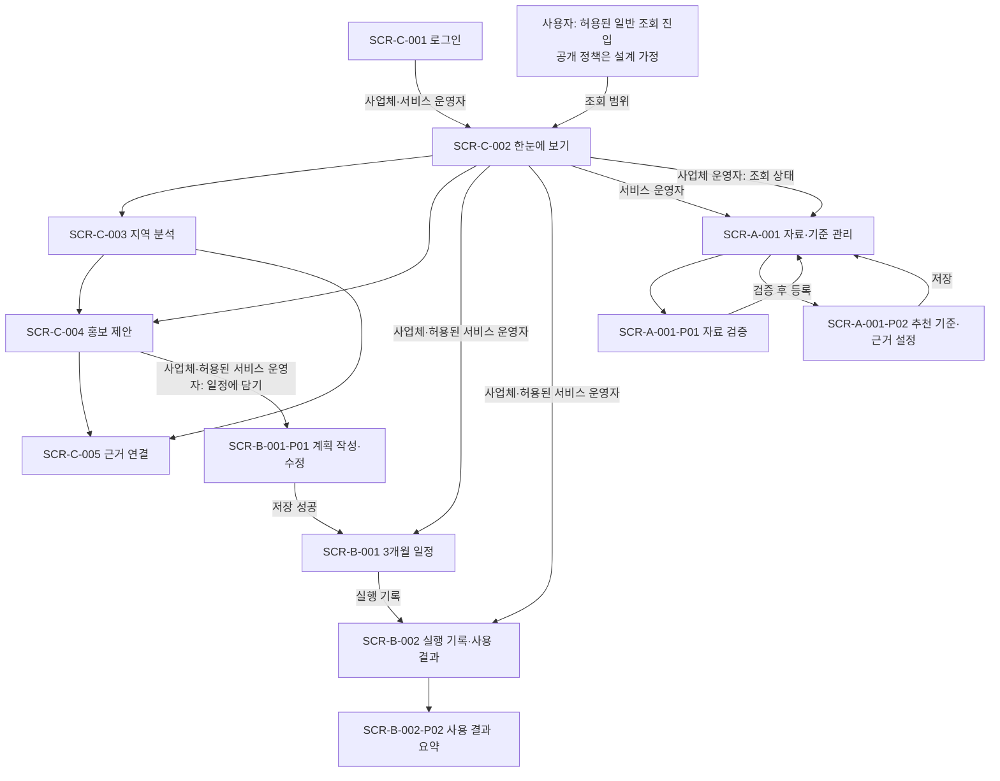

# Red 화면설계서

## 표지와 작성 상태

| 항목 | 내용 |
| --- | --- |
| 프로젝트명 | 제주 비수기 상권 마케팅 캘린더 — 제주 지역별 방문·소비 데이터를 활용한 소상공인 비수기 마케팅 의사결정 지원 및 적용 사례 |
| 화면 표시명 | 제주 비수기 상권 마케팅 캘린더 — 공식 프로젝트명을 줄여 표시하는 이름 |
| 팀 | Red · 이승보·김예원·김혜원 |
| 작성일 | 2026-09-26 |
| 문서 상태 | **설계 검토 초안 · Figma 연결·캡처·공유 검증 전이므로 제출 준비 미완료** |
| 기준 문서 | [Red_PROJECT.md](Red_PROJECT.md) · [Red_USECASE.md](Red_USECASE.md) · [StarUML 원본](Red_USECASE.mdj) |
| 편집 원고 | 이 문서와 [화면·UC 대응 자료](../02_제품/화면설계/requirements.json) |
| 최종 제출 형식 | `Red_SCREEN.pdf` + 팀 Figma 공유 링크 |
| 화면 수 | 주요 화면 8개 · 주요 팝업·패널 6개 · 선택 기능은 부록에 구분 |

이 문서는 실제로 만들 서비스의 화면 구조·입력·처리·이동을 정의하는 설계 원고임 로컬 시안의 동작, 실제 서버 구현, Figma 산출물의 준비 상태는 서로 구분함 문서에 기능을 정의했다는 이유로 실제 구현이나 검증이 끝난 것으로 표시하지 않음

### Figma 공유와 캡처 상태

| 항목 | 현재 상태 |
| --- | --- |
| 제출용 Figma Design 공유 링크 | 미확보 · URL 없음 |
| Figma 계정 연결 | 현재 연결된 계정이 없어 생성·수정 작업 대기 |
| Figma 원본 프레임 | 이번 설계의 Screen ID가 적용된 프레임 생성 전 |
| Figma 화면 캡처 | 미확보 · 로컬 웹 캡처를 사용하는 경우 반드시 ‘웹 시안 캡처’로 표시 |
| 공유 권한 | 제출 후 열람 가능 여부 미검증 |
| Prototype 이동 연결 | 화면 간 이동은 아래 문서에 정의함 Figma Prototype 연결은 미완료 |
| 기존 참고 링크 | [기존 Figma Make 참고 화면](https://www.figma.com/make/ht6YcsQUeSLSFoc1haRNFe/Apply-AI-Agent-design-reference) — 이번 제출용 Design 링크가 아니며 접근 권한 확인을 대신하지 않음 |

최종 제출 전에 ① Figma 계정 연결 → ② 아래 Screen ID로 Design 프레임 생성 → ③ PDF의 웹 시안 이미지를 Figma 프레임 캡처로 교체 → ④ 이 문서와 PDF 표지에 팀 공유 링크 기재 → ⑤ 비로그인 환경에서 공유 링크와 주요 프레임 열람 확인을 완료해야 함

## 1. 요구사항과 구현 범위

### 1.1 기준 기능

| ID | 기능명 | 화면설계 범위 |
| --- | --- | --- |
| F01 | 지역별로 방문객이 많고 적은 시기 살펴보기 | 필수 · 지역·기간 선택, 지도·월별 그래프, 성수기·비수기 비교 |
| F02 | 방문·소비 자료 비교와 실행 방법 제안 | 필수 · 방문·소비, 내외국인, 시간대 비교와 시기·대상·상품·주변 관광지 활용 제안 |
| F03 | 3개월 홍보 일정표와 사용 기록 관리 | 필수 · 작성·수정·저장·조회, 계획 소요 시간·추천 채택·실행 결과, 비교·요약 |
| F04 | 근거를 바탕으로 설명과 보고서 작성 돕기 | 선택·검토 중 · UC06-1·UC06-2를 부록에 연결하며 구현 확정 기능으로 표시하지 않음 |
| 운영 지원 | CSV 등록·다섯 검증·추천 기준·근거 관리 | F01·F02에 필요한 서비스 운영자 화면 |
| 공통 접근·표시 | 로그인, 메뉴 조절, 화면 이동, 출처 표시 | 로그인·메뉴 조절은 사용자 요청에 따른 보조 UI임 UC10 출처 표시는 정본의 필수 공통 처리 |

정본의 32개 UC 중 UC06의 두 선택 기능을 제외한 30개는 필수 기능·운영 지원·공통 포함 처리에 대응함 UC를 세분화한 수만큼 화면을 만들지 않으며, 관련 입력과 검증은 같은 화면 또는 팝업에 묶음

로그인은 최신 사용자 요청을 반영한 보조 화면임 정본 Use Case에서 구체적인 인증 방식은 미정이므로 임의로 로그인 UC ID를 만들지 않음 실제 인증 정책은 후속 구현에서 정하되 로컬 시안의 체험 계정 검증과 구분함 회원가입·비밀번호 재설정·결제·예약 대행 등의 기능은 추가하지 않음

### 1.2 설계·시안·서비스의 구분

| 구분 | 해석 |
| --- | --- |
| 이 문서의 화면·처리 명세 | 실제 서비스에서 필요한 사용자 흐름과 상태를 정의한 목표 |
| 로컬 화면 시안 | 예시 자료와 브라우저 저장으로 입력·전환을 체험하는 검토용 결과 최신 동작 검증은 [시안 검증 기록](../06_증빙/화면시안/검증.md)에서 별도 확인 |
| 실제 서비스 | 실제 통계·서버 인증·사업체 접근 통제·CSV 적재·LLM·온톨로지 추론 연결 전 |
| Figma·PDF | 이 원고를 바탕으로 만들 시각 산출물 Figma 링크·캡처·공유 검증을 끝내기 전에는 제출 완료로 표시하지 않음 |

예시 지역·업종·기간은 화면 검토 조건임 시범 지역·업종·사업체가 확정되었다는 뜻이 아님 지역 방문 집계를 가게의 손님 수로, 과거 분석을 미래의 확정 예측으로 표현하지 않음 클릭·예약·쿠폰 미확보는 실제 0건과 구분함

## 2. Actor와 화면구성도

| Actor | 주요 메뉴·허용 범위 | 제한 |
| --- | --- | --- |
| 사용자 | 공개 범위의 한눈에 보기, 지역 분석, 홍보 제안, 공개 근거 확인 | 정본의 일반 조회 **설계 가정**임 실제 공개 서비스 도입·접근 정책은 미정 비공개 일정·기록과 운영 관리 제외 |
| 사업체 운영자 | 한눈에 보기, 지역 분석, 홍보 제안, 3개월 일정, 실행 기록, 근거 연결, 자료 둘러보기 | 본인 사업체의 계획·기록 이용 |
| 서비스 운영자 | 공통 조회·허용된 사업체 흐름, 자료·기준 관리 | 비공개 사업체 계획·기록은 권한 또는 동의 범위로 제한 |

현재 시안과 캡처는 사업체 운영자·서비스 운영자 두 역할의 예시임 일반 사용자의 읽기 전용 화면은 정본에 따른 설계 상태이며 구현·검증되지 않음 로그인 없는 시안 체험은 실제 익명 접근 권한이나 공개 서비스 제공을 뜻하지 않음

화살표는 이용 가능한 화면 이동을 뜻함 분석을 매번 다시 실행해야 일정을 볼 수 있다는 필수 순서를 뜻하지 않음 사용자 Actor의 메인에는 비공개 계획 수·실행 기록·운영 관리 진입을 표시하지 않음

## 3. 화면 목록

| Screen ID | 화면명 | Actor | 관련 Use Case | 화면 경로 |
| --- | --- | --- | --- | --- |
| SCR-C-001 | 로그인 | 사업체 운영자·서비스 운영자 | 공통 접근 보조 화면 · 별도 UC 없음 | 최초 진입 > 로그인 |
| SCR-C-002 | 한눈에 보기 | 사용자·사업체 운영자·서비스 운영자 | UC01-1·UC02-4·UC03-4의 진입·요약 | 로그인 또는 허용된 조회 진입 > 한눈에 보기 |
| SCR-C-003 | 지역 분석 | 사용자·사업체 운영자·서비스 운영자 | UC01-1·UC01-2·UC02-1·UC02-2·UC02-3·UC10 | 한눈에 보기 > 지역 분석 |
| SCR-C-004 | 홍보 제안 | 사용자·사업체 운영자·서비스 운영자 | UC02-4·UC02-5·UC02-6·UC02-7·UC10 / UC06-1은 선택 부록 | 한눈에 보기 > 홍보 제안 |
| SCR-B-001 | 3개월 일정 | 사업체 운영자·허용된 서비스 운영자 | UC03-1·UC03-2·UC03-3·UC03-4 | 한눈에 보기 > 3개월 일정 |
| SCR-B-002 | 실행 기록·사용 결과 | 사업체 운영자·허용된 서비스 운영자 | UC04-1부터 UC04-6·UC05-1·UC05-2 / UC06-2는 선택 부록 | 한눈에 보기 > 실행 기록 |
| SCR-C-005 | 근거 연결 | 사용자·사업체 운영자·서비스 운영자 | UC10의 보조 표현 | 지역 분석 또는 홍보 제안 > 근거 연결 |
| SCR-A-001 | 자료·기준 관리 | 서비스 운영자 / 사업체 운영자는 자료 조회 상태 | UC07·UC08-1부터 UC08-5·UC09-1·UC09-2 | 한눈에 보기 > 자료·기준 관리 또는 자료 둘러보기 |

일반 사용자의 조회 범위는 UC01·UC02 및 포함된 UC10으로 제한함 표의 공통 메인·근거 화면도 해당 범위 안에서만 내용을 표시함 근거 연결 화면은 UC10 이해를 돕는 보조 화면이며 별도의 필수 업무 UC를 추가한 것이 아님

### 팝업·패널·상태 화면 식별자

접미사 P는 팝업 또는 화면 안의 결과 패널을 뜻함 모든 P 항목을 별도 화면으로 이동시키지 않음

| ID | 이름 | 부모 화면·호출 조건 | 관련 UC |
| --- | --- | --- | --- |
| SCR-B-001-P01 | 계획 작성·수정 | 일정의 추가·수정 또는 제안의 일정에 담기 | UC03-1·UC03-2·UC03-3 |
| SCR-B-002-P01 | 사용·실행 기록 입력 | 기록 입력·수정 | UC04-1부터 UC04-6 |
| SCR-B-002-P02 | 사용 결과 요약 | 사용 결과 요약 보기 | UC05-1·UC05-2 · 필수 기능 |
| SCR-C-004-P01 | 추천 근거 상세 | 추천 근거 보기 | UC02-4부터 UC02-7·UC10 |
| SCR-A-001-P01 | CSV 검증 결과 패널 | 자료 검증 실행 | UC08-1부터 UC08-5 |
| SCR-A-001-P02 | 추천 기준·근거 설정 | 추천 기준 설정·수정 | UC09-1·UC09-2 |

## 4. Use Case 대응표

정본의 ID·명칭·필수/선택 구분을 유지함 하나의 화면에서 여러 UC를 처리하는 것은 누락이 아니며, 필수 입력·검증·결과 요소가 아래 Storyboard에 표현되어야 함

| Use Case | 기능 | 화면·화면 내 기능 | 구현 범위 |
| --- | --- | --- | --- |
| UC01-1 월별 방문 추이 조회 | F01 | SCR-C-003 | 필수 |
| UC01-2 성수기·비수기 비교 | F01 | SCR-C-003 | 필수 |
| UC02-1 방문·소비 비교 | F02 | SCR-C-003 | 필수 |
| UC02-2 내국인·외국인 소비 비교 | F02 | SCR-C-003 | 필수 |
| UC02-3 시간대별 소비 조회 | F02 | SCR-C-003 | 필수 |
| UC02-4 홍보 시기 제안 조회 | F02 | SCR-C-004 | 필수 |
| UC02-5 홍보 대상 제안 조회 | F02 | SCR-C-004 | 필수 |
| UC02-6 상품 후보 제안 조회 | F02 | SCR-C-004 | 필수 |
| UC02-7 주변 관광지 활용 제안 조회 | F02 | SCR-C-004 | 필수 |
| UC03-1 3개월 일정표 작성 | F03 | SCR-B-001 | 필수 |
| UC03-2 3개월 일정표 수정 | F03 | SCR-B-001 | 필수 |
| UC03-3 3개월 일정표 저장 | F03 | SCR-B-001 | 필수 |
| UC03-4 저장한 일정표 조회 | F03 | SCR-B-001 | 필수 |
| UC04-1 계획 소요 시간 기록 | F03 | SCR-B-002 | 필수 |
| UC04-2 추천 채택 여부 기록 | F03 | SCR-B-002 | 필수 |
| UC04-3 실행 활동·날짜 기록 | F03 | SCR-B-002 | 필수 |
| UC04-4 클릭 결과 기록 | F03 | SCR-B-002 | 필수 |
| UC04-5 예약 결과 기록 | F03 | SCR-B-002 | 필수 |
| UC04-6 쿠폰 사용 결과 기록 | F03 | SCR-B-002 | 필수 |
| UC05-1 계획·실행 결과 비교 | F03 | SCR-B-002 | 필수 |
| UC05-2 사용 결과 요약 조회 | F03 | SCR-B-002 | 필수 |
| UC06-1 추천 이유 설명 초안 작성 | F04 | SCR-C-004 | 선택·검토 중 — 구현 확정 범위에서 제외, 부록에만 연결 |
| UC06-2 보고서 초안 작성 | F04 | SCR-B-002 | 선택·검토 중 — 구현 확정 범위에서 제외, 부록에만 연결 |
| UC07 CSV 자료 등록 | F01·F02 운영 지원 | SCR-A-001 | 필수 기능을 위한 운영 지원 |
| UC08-1 자료 기간 검증 | F01·F02 운영 지원 | SCR-A-001 | CSV 등록에 필수 포함 |
| UC08-2 집계 기준 검증 | F01·F02 운영 지원 | SCR-A-001 | CSV 등록에 필수 포함 |
| UC08-3 지역 코드 검증 | F01·F02 운영 지원 | SCR-A-001 | CSV 등록에 필수 포함 |
| UC08-4 누락값 검증 | F01·F02 운영 지원 | SCR-A-001 | CSV 등록에 필수 포함 |
| UC08-5 제공 기준 일관성 검증 | F01·F02 운영 지원 | SCR-A-001 | CSV 등록에 필수 포함 |
| UC09-1 추천 기준 설정 | F02 운영 지원 | SCR-A-001 | 필수 기능을 위한 운영 지원 |
| UC09-2 추천 근거 기록 | F02 운영 지원 | SCR-A-001 | 필수 기능을 위한 운영 지원 |
| UC10 자료 출처·기준 표시 | F01·F02 공통 | SCR-C-003, SCR-C-004 | 분석·제안 조회에 필수 포함 |

### 필수 포함 관계

- UC01-1·UC01-2·UC02-1부터 UC02-7까지의 9개 조회 → UC10 출처·기준기간·집계 기준 **상시 표시** 상세 팝업만 제공하는 것으로 대신하지 않음
- UC03-1 작성·UC03-2 수정 → UC03-3 저장 성공을 완료 조건으로 사용함 실패하면 입력 유지와 재시도를 표시함
- UC07 CSV 등록 → UC08-1부터 UC08-5까지의 다섯 검증을 모두 수행한 결과를 제시함

## 5. Storyboard 작성 형식

PDF는 원칙적으로 주요 화면 하나를 한 페이지에 배치함 상단에는 Screen ID·화면명·Actor·관련 UC·경로, 왼쪽에는 번호가 붙은 화면 캡처, 오른쪽에는 같은 번호의 Description을 배치함 중요한 팝업은 해당 부모 화면과 함께 보여 주거나 별도 상태 페이지로 추가하되 부모 ID를 보존함

아래 ①부터 ⑥까지는 화면 위에 표시할 설명 번호이며 메뉴 순서나 필수 처리 순서를 뜻하지 않음 각 항목은 **사용자 행위 → 시스템 처리 → 결과/이동 화면**으로 작성함 화면 시안의 버튼명과 번호가 다르면 최종 캡처에 맞춰 문서와 프레임을 함께 수정함

**현재 캡처 기준:** Figma 캡처 미확보 상태임 PDF 제작에 로컬 웹 화면을 먼저 사용하더라도 이를 Figma 캡처라고 표시하지 않으며 제출 전에 교체해야 함 아래 처리 설명은 설계 목표이고 서버 구현·테스트 통과 기록이 아님

### SCR-C-001 / 로그인

**Actor:** 사업체 운영자·서비스 운영자 · **관련 UC:** 공통 접근 보조, 별도 UC 없음 · **경로:** 최초 진입 > 로그인

| 번호·요소 | Description |
| --- | --- |
| ① 역할 선택 | 사업체 운영자 또는 서비스 운영자 선택 → 해당 체험 계정과 진입 안내 표시 → 같은 화면에서 입력 계속 실제 서비스 권한은 서버의 계정 권한으로 결정하며 역할 버튼만으로 부여하지 않음 |
| ② 이메일 입력 | 이메일 입력 → 필수값·이메일 형식 검사 → 잘못된 경우 해당 입력에 오류 표시하고 입력값 유지 |
| ③ 비밀번호·표시 전환 | 비밀번호 입력 또는 보기 선택 → 비밀번호 필수값 검사·표시 방식 전환 → 같은 화면에서 확인하며 시안 입력값을 저장하거나 전송하지 않음 |
| ④ 로그인 | 로그인 선택 → 입력값과 계정 확인 → 성공 시 SCR-C-002 / 실패 시 계정 확인 오류를 표시하고 재입력 현재 시안은 공개된 체험 계정만 검증 |
| ⑤ 체험 계정 채우기 | 체험 계정 채우기 선택 → 현재 역할의 예시 이메일·비밀번호 입력 → 로그인 버튼으로 이동하여 사용자가 실행 |
| ⑥ 시안 조회 진입 | 제공된 조회 체험 진입 선택 → 체험 범위 안내와 해당 화면 구성 적용 → SCR-C-002 실제 공개 서비스의 접근 허용을 뜻하지 않음 |

**주요 상태:** 초기 입력 / 필수값 누락 / 잘못된 이메일 / 계정 불일치 / 로그인 성공 / 세션 저장 불가 안내

**메시지 설계:** “이메일을 입력해 주세요” · “이메일 형식을 확인해 주세요” · “비밀번호를 입력해 주세요” · “체험 계정을 확인해 주세요”

### SCR-C-002 / 한눈에 보기

**Actor:** 사용자·사업체 운영자·서비스 운영자 · **관련 UC:** UC01-1·UC02-4·UC03-4 진입·요약 · **경로:** 로그인 또는 허용된 조회 진입 > 한눈에 보기

| 번호·요소 | Description |
| --- | --- |
| ① 메뉴·너비 조절 | 메뉴 선택 또는 너비 조절·접기 → 선택 메뉴 이동과 화면 배치 갱신, 메뉴 설정 저장 → 해당 Screen ID 또는 같은 화면 모바일에서는 접이식 메뉴 사용 |
| ② 지역·분석 기준 | 지역·기간 조건 선택 → 조회 가능한 범위 확인 → 지역 흐름·추천 요약 갱신 분석 기준기간과 앞으로의 계획 기간을 따로 표시 |
| ③ 지역 흐름 | 지역 흐름 자세히 보기 → 현재 조회 조건 전달 → SCR-C-003 지도·비교 그래프 확인 |
| ④ 홍보 제안 | 모든 제안 또는 제안 근거 선택 → 조건에 맞는 제안·근거 표시 → SCR-C-004 또는 SCR-C-004-P01 |
| ⑤ 저장 일정 요약 | 일정 보기 선택 → 허용된 사업체의 저장 계획 조회 → SCR-B-001 일반 사용자 화면에는 비공개 일정 수와 이 버튼을 표시하지 않음 |
| ⑥ 역할·계정 상태 | 계정 변경 또는 로그아웃 선택 → 체험 세션 종료/진입 화면 표시 → SCR-C-001 기존 계획 삭제와 로그아웃을 같은 처리로 묶지 않음 |

**주요 상태:** 조회 가능 / 자료 없음 / 일부 누락 / 계획 없음 / 메뉴 접힘·펼침 / 저장 환경 사용 불가

AI 계획 도우미 시연이 표시되면 ‘확장 검토·고정 예시·실제 AI 미연결’임을 명시함 필수 기능 완료나 확정된 F04 기능으로 집계하지 않음

### SCR-C-003 / 지역 분석

**Actor:** 사용자·사업체 운영자·서비스 운영자 · **관련 UC:** UC01-1·UC01-2·UC02-1·UC02-2·UC02-3·UC10 · **경로:** 한눈에 보기 > 지역 분석

| 번호·요소 | Description |
| --- | --- |
| ① 조회 조건 | 지역·기간·업종 선택 후 조회 → 사용할 자료와 기간 겹침·비교 조건 확인 → 같은 화면의 지도·그래프·표 갱신 |
| ② 지도·계절 비교 | 지역 또는 비교 시기 선택 → 월별 방문 추이와 방문이 많은/적은 시기 계산 → 선택 지역 강조와 같은 기준의 월별 비교 결과 표시 |
| ③ 방문·소비 비교 | 방문·소비 비교 선택 → 같은 기간의 서로 다른 집계자료 확인 → 방문과 소비를 각각의 단위로 표시 두 자료를 나눈 구매전환율·실제 1인당 소비액은 만들지 않음 |
| ④ 내외국인·시간대 | 내국인·외국인 또는 시간대 보기 선택 → 해당 구분으로 월별 집계된 소비 조회 → 비중·시간대별 결과와 누락 상태 표시 실시간 소비로 표현하지 않음 |
| ⑤ 출처·기준 | 결과 조회 → 시스템이 출처·기준기간·집계 기준·단위를 함께 표시 → 별도 클릭 없이 해석 가능 상세 보기에서는 자료 버전·제한을 추가 확인 |
| ⑥ 제안 연결 | 홍보 제안 보기 선택 → 현재 지역·조회 조건 전달 → SCR-C-004의 시기·대상·상품·관광지 활용 제안 확인 |

**주요 상태:** 정상 결과 / 조회 결과 없음 / 일부 월 미수집 / 제공 기준 불일치 / 비교 불가 / 조회 실패

**복구:** 자료 없으면 조건 변경 안내, 비교 불가면 사유와 가능한 조회 범위 표시, 실패하면 선택 조건을 유지하고 재시도 제공 지도와 그래프에는 표 형태의 동등한 결과를 함께 제공

### SCR-C-004 / 홍보 제안

**Actor:** 사용자·사업체 운영자·서비스 운영자 · **관련 UC:** UC02-4·UC02-5·UC02-6·UC02-7·UC10 · **경로:** 한눈에 보기 > 홍보 제안

| 번호·요소 | Description |
| --- | --- |
| ① 조건·제안 결과 | 지역·업종·기간 확인 → 사용할 분석 근거 확인 → 조건에 맞는 제안을 같은 화면에 표시 |
| ② 홍보 시기·대상 | 제안 조회 → 홍보할 달과 내국인·외국인 대상의 판단 이유 표시 → 시기·대상 후보를 비교하여 선택 가능 |
| ③ 상품·관광지 활용 | 상품 후보와 주변 관광지 활용안 확인 → 실제 판매·운영 조건의 미확인 항목 표시 → 적용 전 확인할 조건을 알 수 있음 관광지 방문·예약 실행을 대행하지 않음 |
| ④ 근거·출처 | 추천 근거 선택 → 분석값·출처·판단 이유·조건을 연결해 표시 → SCR-C-004-P01 카드에서도 핵심 이유·출처·기간·집계 기준은 항상 보임 |
| ⑤ 일정에 담기 | 허용된 운영자가 일정에 담기 선택 → 제안 내용을 편집 폼에 반영하고 기존 추가 여부 확인 → SCR-B-001-P01에서 확인·수정 후 저장 일반 사용자는 쓰기 행동 제외 |
| ⑥ 근거 관계 | 근거 연결 보기 선택 → 공개 범위 또는 허용된 사업체 관계 조회 → SCR-C-005 |

**주요 상태:** 제안 있음 / 근거 부족으로 제안 없음 / 운영 조건 확인 필요 / 이미 일정에 담김 / 적용 권한 없음

UC06-1의 ‘추천 이유 설명 초안 작성’은 선택 부록임 필수로 제공하는 추천 이유 표시와 혼동하지 않음

### SCR-B-001 / 3개월 일정

**Actor:** 사업체 운영자·허용된 서비스 운영자 · **관련 UC:** UC03-1·UC03-2·UC03-3·UC03-4 · **경로:** 한눈에 보기 > 3개월 일정

| 번호·요소 | Description |
| --- | --- |
| ① 계획 기간·저장 상태 | 일정 화면 열기 → 허용된 사업체·3개월 기간의 저장 계획 조회 → 월별 목록과 저장 상태 표시 조회만으로 계획을 수정하거나 다시 저장하지 않음 |
| ② 직접 계획 추가 | 직접 추가 또는 월별 추가 선택 → 선택 월을 기본값으로 편집 폼 표시 → SCR-B-001-P01 |
| ③ 계획 수정 | 기존 계획 수정 선택 → 해당 저장값을 폼에 불러옴 → SCR-B-001-P01에서 편집 |
| ④ 추천에서 작성 | 홍보 제안 보기 선택 → 현재 사업체·지역 조건 유지 → SCR-C-004에서 후보 선택 |
| ⑤ 실행 기록 연결 | 계획의 실행 기록 선택 → 해당 계획 식별자와 현재 기록 조회 → SCR-B-002-P01 또는 SCR-B-002 |
| ⑥ 저장 결과 | 편집 팝업에서 저장 선택 → 입력 검사 후 저장 요청 → 성공하면 목록 갱신, 실패하면 입력을 유지하고 저장 실패·재시도 표시 |

**주요 상태:** 월별 계획 있음 / 일부 월 비어 있음 / 전체 계획 없음 / 수정 중 / 입력 오류 / 저장 성공 / 저장 실패 / 접근 불가

삭제 기능을 제공하면 대상과 함께 삭제되는 기록을 먼저 설명하고 확인 후 처리함 일정 조회에 분석·추천 실행을 강제하지 않음

### SCR-B-002 / 실행 기록·사용 결과

**Actor:** 사업체 운영자·허용된 서비스 운영자 · **관련 UC:** UC04-1부터 UC04-6·UC05-1·UC05-2 · **경로:** 한눈에 보기 > 실행 기록

| 번호·요소 | Description |
| --- | --- |
| ① 계획·기록 목록 | 실행 기록 화면 열기 → 허용된 계획과 기록을 연결해 조회 → 계획별 기록 있음·미기록 상태 표시 미기록을 실패로 해석하지 않음 |
| ② 기록 입력·수정 | 기록 입력 또는 수정 선택 → 현재 계획·기록 값을 불러옴 → SCR-B-002-P01 |
| ③ 계획 시간·채택 | 소요 시간과 추천 선택 상태 확인 → 기록된 시간·채택 여부·선택 내용을 조회 → 계획 수립 결과와 미측정 항목 표시 |
| ④ 계획·실행 비교 | 계획별 비교 선택 → 예정 활동·날짜와 실제 활동·날짜 연결 → 차이와 실행 상태·확보한 클릭·예약·쿠폰 결과 표시 |
| ⑤ 사용 결과 요약 | 사용 결과 요약 보기 선택 → 입력된 소요 시간·채택·실행·확보 결과 집계 → SCR-B-002-P02 실제 수집되지 않은 수치는 만들지 않음 |
| ⑥ 빈 상태에서 일정 작성 | 계획 없음 안내의 일정 작성 선택 → 일정 작성 화면 표시 → SCR-B-001에서 직접 추가 |

**주요 상태:** 기록 있음 / 기록 없음 / 계획 없음 / 미측정·미확보 / 실제 0건 / 입력 오류 / 저장 실패 / 저장 완료

UC05-2는 AI 없이 제공하는 필수 사용 결과 요약임 UC06-2의 선택 보고서 초안 작성과 명칭·버튼·완료 상태를 구분함

### SCR-C-005 / 근거 연결

**Actor:** 사용자·사업체 운영자·서비스 운영자 · **관련 UC:** UC10 보조 · **경로:** 지역 분석 또는 홍보 제안 > 근거 연결

| 번호·요소 | Description |
| --- | --- |
| ① 관계 선택 | 자료·관측값·추천 등 관계 항목 선택 → 허용된 정보와 연결 의미 조회 → 같은 화면 설명 영역 갱신 |
| ② 자료 버전 | 자료 버전 선택 → 출처·기준기간·집계 기준 확인 → 선택한 관측값의 출처 표시 |
| ③ 운영 조건 | 상품·운영 조건 선택 → 확인된 내용과 미확인 내용을 구분 → 판매 가능 여부·휴무·예산 등 확인할 조건 안내 |
| ④ 일정 관계 | 허용된 운영자가 일정 관계 선택 → 본인 또는 동의 범위의 일정만 조회 → SCR-B-001 또는 관계 설명 일반 사용자는 비공개 관계 제외 |
| ⑤ 관계 목록 | 글로 읽는 관계 확인 → 그래프와 같은 정보를 목록으로 제공 → 키보드·보조 기술로 의미 확인 |
| ⑥ 추천으로 돌아가기 | 추천 상세 또는 제안 보기 선택 → 기존 선택 유지 → SCR-C-004-P01 또는 SCR-C-004 |

**주요 상태:** 공개 관계 / 권한 있는 사업체 관계 / 연결 자료 없음 / 운영 조건 미확인 / 관계 조회 실패

연결이 있다는 사실을 인과관계·매출 효과로 설명하지 않음 화면 그래프만으로 실제 온톨로지 적재·검증·추론이 구현되었다고 표시하지 않음

### SCR-A-001 / 자료·기준 관리

**Actor:** 서비스 운영자 / 사업체 운영자는 자료 조회 상태 · **관련 UC:** UC07·UC08-1부터 UC08-5·UC09-1·UC09-2 · **경로:** 한눈에 보기 > 자료·기준 관리 또는 자료 둘러보기

| 번호·요소 | Description |
| --- | --- |
| ① 자료 목록·검색 | 자료 종류·지역·기간 검색 → 허용된 자료 목록 조회 → 값·단위·기준기간·누락 상태 표시 검색 결과가 없으면 조건 변경 안내 |
| ② CSV 선택·정보 | 서비스 운영자가 CSV와 출처·기간 정보를 입력 → 필수 입력·파일 형식 확인 → 검증 가능한 등록 대기 상태 표시 실제 파일 처리와 예시 파일 시연을 구분 |
| ③ 검증 실행 | 검증 선택 → 기간·집계·지역 코드·누락값·제공 기준의 다섯 검사 → 같은 화면의 SCR-A-001-P01 결과 패널 표시 |
| ④ 검증 후 등록 | 검사 결과를 확인하고 등록 선택 → 등록 가능 조건과 입력 자료 저장 여부 확인 → 성공 시 목록 갱신, 실패 시 등록 실패 표시 검증 전 등록 완료로 표시하지 않음 |
| ⑤ 추천 기준·근거 | 추천 기준 설정 또는 수정 선택 → 기존 기준·분석 결과·출처·판단 이유 조회 → SCR-A-001-P02 |
| ⑥ 조회·관리 권한 | 화면 진입 → 실제 서비스에서는 서버 권한 확인 → 사업체 운영자는 읽기 전용, 서비스 운영자는 허용된 등록·기준 관리 동작 표시 |

**주요 상태:** 자료 있음 / 검색 결과 없음 / 파일 미선택 / 필수 정보 누락 / 검증 실패·일부 사용 가능 / 등록 실패 / 등록 완료 / 관리 권한 없음

## 6. 팝업·패널 Storyboard

### SCR-B-001-P01 / 계획 작성·수정

**Actor:** 사업체 운영자·허용된 서비스 운영자 · **UC:** UC03-1·UC03-2·UC03-3 · **경로:** SCR-B-001 또는 SCR-C-004 > 계획 편집

| 번호·요소 | Description |
| --- | --- |
| ① 활동·상품·준비 내용 | 내용 입력 → 필수 활동명과 길이 확인, 미확인 상품·운영 조건 표시 → 폼에 입력 유지 |
| ② 날짜·채널 | 날짜·홍보 채널 선택 → 계획 대상 3개월 범위·필수값 확인 → 오류면 해당 항목 안내 |
| ③ 저장 | 저장 선택 → 입력 검증 후 지속 저장 요청 → 성공 시 SCR-B-001 갱신, 실패 시 폼과 입력을 유지하며 재시도 |
| ④ 취소·닫기 | 취소 선택 → 저장하지 않은 입력을 적용하지 않고 닫음 → 호출 화면과 버튼으로 돌아감 |

**상태:** 신규·기존값 편집 / 이름 누락 / 날짜 범위 오류 / 저장 중 / 저장 성공 / 저장 실패 ‘작성 완료’와 ‘화면에만 반영됨’을 구분

### SCR-B-002-P01 / 사용·실행 기록 입력

**Actor:** 사업체 운영자·허용된 서비스 운영자 · **UC:** UC04-1부터 UC04-6 · **경로:** SCR-B-002 또는 SCR-B-001 > 기록 입력

| 번호·요소 | Description |
| --- | --- |
| ① 계획 소요 시간 | 걸린 시간 입력 또는 미측정 유지 → 0 이상 값·단위 확인 → 소요 시간 기록 빈칸을 0분으로 바꾸지 않음 |
| ② 추천 채택 | 채택·미채택·확인 중과 선택 내용 입력 → 연결 제안과 기록 값 확인 → 채택 여부·선택 내용 저장 대상 구성 |
| ③ 실행 활동·날짜 | 실행 여부와 실제 활동·날짜 입력 → 실행함이면 필요한 활동·날짜 검사 → 누락 시 항목별 오류 표시 |
| ④ 클릭·예약·쿠폰 | 확보한 건수 입력 또는 빈칸 유지 → 음수·소수 등 유효하지 않은 건수 검사 → 미확보와 실제 0건을 구분해 저장 대상 구성 |
| ⑤ 수집 방법·저장 | 수집 방법 입력 후 저장 → 유효한 입력을 저장 → 성공 시 SCR-B-002 갱신, 실패 시 입력 유지·재시도 |
| ⑥ 취소 | 취소 선택 → 변경값을 저장하지 않음 → 호출 화면과 버튼으로 복귀 |

**상태:** 신규·수정 / 미실행 / 확인 중 / 실행 날짜 누락 / 미확보 / 0건 / 잘못된 건수 / 저장 완료·실패

### SCR-B-002-P02 / 사용 결과 요약

**Actor:** 사업체 운영자·허용된 서비스 운영자 · **UC:** UC05-1·UC05-2 · **경로:** SCR-B-002 > 사용 결과 요약

| 번호·요소 | Description |
| --- | --- |
| ① 집계 범위 | 요약 열기 → 선택한 사업체·계획 기간과 기록 범위 확인 → 포함한 기간·계획 수 표시 |
| ② 계획·실행 비교 | 비교 항목 확인 → 계획과 실제 활동·날짜·채택 상태 연결 → 실행·미실행·미기록 차이 표시 |
| ③ 사용 결과 | 결과 확인 → 측정된 시간과 실제 확보한 클릭·예약·쿠폰만 집계 → 단위·포함 건수·미확보 건수 함께 표시 |
| ④ 닫기·보완 | 닫기 또는 기록 보완 선택 → 기존 값 유지 → SCR-B-002 또는 해당 SCR-B-002-P01 |

**상태:** 요약 가능 / 계획 없음 / 기록 없음 / 일부 지표 미확보 필수 규칙 기반 요약이며 AI 보고서 초안 완료로 표시하지 않음

### SCR-C-004-P01 / 추천 근거 상세

**Actor:** 사용자·사업체 운영자·서비스 운영자 · **UC:** UC02-4부터 UC02-7·UC10 · **경로:** SCR-C-004 > 추천 근거

| 번호·요소 | Description |
| --- | --- |
| ① 제안·이유 | 근거 보기 선택 → 선택 제안의 시기·대상·상품·관광지 활용 이유 확인 → 실제 분석 사실과 운영 제안을 구분하여 표시 |
| ② 자료·기준 | 출처 상세 확인 → 출처·기준기간·집계 기준·단위 표시 → 제안의 근거와 한계 확인 |
| ③ 운영 조건 | 조건 확인 → 판매 상품·휴무·예산 등 확인 여부 표시 → 아직 확인하지 않은 값을 확인됨으로 바꾸지 않음 |
| ④ 일정·관계 연결 | 허용된 운영자가 일정에 담기 선택 → 편집 가능한 계획 후보 구성 → SCR-B-001-P01 / 근거 연결 선택 시 SCR-C-005 |

**상태:** 근거 있음 / 자료 부족 / 비교 불가 / 운영 조건 미확인 / 조회 전용 사용자 별도 초안 생성 없이도 필수 추천 이유를 제공

### SCR-A-001-P01 / CSV 검증 결과 패널

**Actor:** 서비스 운영자 · **UC:** UC08-1부터 UC08-5 · **경로:** SCR-A-001 > 자료 검증 · **형태:** 자료 화면 안의 `#csv-validation` 결과 패널

| 번호·요소 | Description |
| --- | --- |
| ① 검사 목록 | 검증 실행 → 기간·집계 기준·지역 코드·누락값·제공 기준 검사 → 다섯 결과 각각 통과·주의·실패와 사유 표시 |
| ② 오류 상세 | 오류 항목 선택 → 해당 행·필드·기준과 수정 방법 확인 → 원본을 수정할 수 있는 정보 제공 누락값 임의 보간 금지 |
| ③ 사용 가능 범위 | 제한 내용 확인 → 비교 가능한 기간과 제외 자료 구분 → 일부 사용 가능 또는 사용 불가 명시 |
| ④ 돌아가기·재검증 | 돌아가기 또는 수정 파일 재검증 선택 → 입력 정보 유지·새 검증 실행 → SCR-A-001 또는 갱신된 결과 등록 성공은 별도 저장 결과로 확인 |

**상태:** 검증 중 / 통과 / 일부 사용 가능 / 기준 불일치 / 지역 코드 미연결 / 잘못된 값 / 처리 실패

### SCR-A-001-P02 / 추천 기준·근거 설정

**Actor:** 서비스 운영자 · **UC:** UC09-1·UC09-2 · **경로:** SCR-A-001 > 추천 기준 설정·수정

| 번호·요소 | Description |
| --- | --- |
| ① 기준·적용 조건 | 기준명과 적용 지역·기간·업종 등 조건 입력 → 필수값과 조건 형식 확인 → 저장 대상 기준 구성 |
| ② 분석 결과·출처 | 검증한 분석 결과와 출처 선택·기록 → 기준기간·자료 버전·비교 가능 여부 확인 → 근거 연결 구성 |
| ③ 판단 이유 | 추천 판단 이유 입력 → 근거 누락 또는 확인되지 않은 결과 여부 확인 → 보완이 필요하면 오류와 수정 항목 표시 |
| ④ 저장·취소 | 저장 선택 → 기준과 근거 기록 저장 → 성공 시 SCR-A-001 갱신 / 실패 시 입력 유지 취소는 기존 기준 유지 후 닫기 |

**상태:** 신규·수정 / 필수값 누락 / 근거 없음 / 비교 불가 자료 선택 / 저장 실패 / 저장 완료

## 7. 선택 기능과 확장 검토 부록

| 항목 | 대응 화면 | 현재 결정·표현 방식 |
| --- | --- | --- |
| UC06-1 추천 이유 설명 초안 작성 | SCR-C-004의 `#optional-explanation` 영역 | F04 선택·검토 중 구현 확정 범위에서 제외 필수 추천 이유·출처 표시는 계속 제공 |
| UC06-2 보고서 초안 작성 | SCR-B-002의 `#optional-report` 영역 | F04 선택·검토 중 구현 확정 범위에서 제외 필수 UC05-2 사용 결과 요약과 분리 |
| AI 계획 도우미 | SCR-C-002·SCR-C-004·SCR-B-001의 시연 패널 | 사용자 추가 요청에 따른 확장 검토 시연 가게 조건 질문·계획 생성·수정은 현재 정본 UC에 추가되지 않음 고정 예시 시연과 실제 에이전트 구현을 구분 |
| 온톨로지 표현 | SCR-C-005 | UC10을 이해하기 위한 관계 표현 실제 데이터 적재·추론 완료를 뜻하지 않음 |
| 일정·보고서 파일 내보내기 | 관련 기능 내부의 선택 행동 | PROJECT의 선택 범위로 유지 실제 구현하기로 정한 범위만 후속 반영 |

선택 기능을 실제 구현하기로 정하면 결정 내용·범위·날짜를 먼저 기록하고 PROJECT·Use Case·화면설계서·Figma를 함께 갱신함 확정되지 않은 기능에 완료 배지나 실제 결과를 붙이지 않음

## 8. 제출 전 일관성·검증 확인표

| 확인 항목 | 현재 기록 | 완료 판정에 필요한 근거 |
| --- | --- | --- |
| PROJECT의 필수·선택 범위 | 문서에 구분 | F01부터 F03·운영 지원과 F04 부록이 화면에서 동일하게 구분됨 |
| Use Case 누락·추가 | 32개 ID를 대응 자료에 기록 | 정본 32개와 화면 기능을 대조하고 선택 2개는 보류 상태로 확인 |
| Actor·화면 구조 | 3 Actor·8 주요 화면·6 팝업·패널 정의 | 일반 조회·사업체·서비스 권한별 메뉴와 공개·비공개 상태 확인 |
| Storyboard | 화면별 번호·동작·상태·이동 정의 | 캡처의 번호와 Description 일치, 상단 Screen ID·Actor·UC·경로 확인 |
| 상태·입력 오류 | 설계 목표 기록 | 빈 결과·잘못된 입력·사용 불가·처리 실패·처리 완료 캡처와 동작 확인 |
| 실제 구현 범위 표현 | 시안·서비스·F04 구분 | 실제 서버·AI·자료 연동 완료로 오인할 문구 없음 |
| Figma Design | 연결 대기 | 편집 가능한 프레임·UI 요소·화면명이 문서와 일치 |
| Figma 캡처 | 미확보 | 각 주요 화면을 Figma에서 캡처해 PDF에 삽입 |
| 팀 공유 링크 | 미확보 | 이 문서·PDF에 동일한 제출용 Figma URL 첨부 |
| 공유 권한 | 미검증 | 비로그인 환경에서 제출 이후에도 링크·주요 프레임 열람 가능함을 확인 |
| Prototype 이동 | 문서 이동 정의 완료·Figma 미연결 | 로그인·메인·제안·일정·기록 흐름 연결 권장 |
| PDF | 제작·렌더링 검증 대기 | 한 페이지에 주요 화면 하나, 읽을 수 있는 번호·설명, 잘림·링크·표 확인 |

문서 구조·ID 검사는 실제 화면 표시 검사와 구분함 최종 PDF와 Figma를 직접 열어 보지 않은 항목은 확인 완료로 바꾸지 않음 필수 제출 항목의 실제 확인이 끝나면 첫 페이지의 ‘제출 준비 미완료’를 갱신함
