# Red 화면설계서

## 표지와 작성 상태

| 항목 | 내용 |
| --- | --- |
| 프로젝트명 | 제주 비수기 상권 마케팅 캘린더 — 제주 지역별 방문·소비 데이터를 활용한 소상공인 비수기 마케팅 의사결정 지원 및 적용 사례 |
| 화면 표시명 | 제주 마케팅 캘린더 — 화면 폭을 고려한 공식 프로젝트명의 축약 표시 |
| 팀 | Red · 이승보·김예원·김혜원 |
| 작성일 | 2026-09-26 |
| 문서 상태 | **설계 검토 초안 · Figma 연결·캡처·공유 검증 전이므로 제출 준비 미완료** |
| 기준 문서 | [Red_PROJECT.md](Red_PROJECT.md) · [Red_USECASE.md](Red_USECASE.md) · [StarUML 원본](Red_USECASE.mdj) |
| 편집 원고 | 이 문서와 [화면·UC 대응 자료](../02_제품/화면설계/requirements.json) |
| 최종 제출 형식 | [Red_SCREEN.pdf 검토본](Red_SCREEN.pdf) 32쪽 + 팀 Figma 공유 링크(미확보) |
| 화면 수 | 주요 화면 8개 · 주요 팝업·패널 6개 · 선택 기능은 부록에 구분 |

이 문서는 실제로 만들 서비스의 화면 구조·입력·처리·이동을 정의하는 설계 원고임 로컬 시안의 동작, 실제 서버 구현, Figma 산출물의 준비 상태는 서로 구분함 문서에 기능을 정의했다는 이유로 실제 구현이나 검증이 끝난 것으로 표시하지 않음

### Figma 공유와 캡처 상태

| 항목 | 현재 상태 |
| --- | --- |
| 제출용 Figma Design 공유 링크 | 미확보 · URL 없음 |
| Figma 계정 연결 | 현재 연결된 계정이 없어 생성·수정 작업 대기 |
| Figma 원본 프레임 | 이번 설계의 Screen ID가 적용된 프레임 생성 전 |
| Figma 화면 캡처 | 미확보 · 로컬 웹 캡처를 사용하는 경우 반드시 ‘웹 시안 캡처’로 표시 |
| 공유 권한 | 제출 후 열람 가능 여부 미검증 |
| Prototype 이동 연결 | 화면 간 이동은 아래 문서에 정의함 Figma Prototype 연결은 미완료 |
| 기존 참고 링크 | [기존 Figma Make 참고 화면](https://www.figma.com/make/ht6YcsQUeSLSFoc1haRNFe/Apply-AI-Agent-design-reference) — 이번 제출용 Design 링크가 아니며 접근 권한 확인을 대신하지 않음 |

최종 제출 전에 ① Figma 계정 연결 → ② 아래 Screen ID로 Design 프레임 생성 → ③ PDF의 웹 시안 이미지를 Figma 프레임 캡처로 교체 → ④ 이 문서와 PDF 표지에 팀 공유 링크 기재 → ⑤ 비로그인 환경에서 공유 링크와 주요 프레임 열람 확인을 완료해야 함

## 1. 요구사항과 구현 범위

### 1.1 기준 기능

| ID | 기능명 | 화면설계 범위 |
| --- | --- | --- |
| F01 | 지역별로 방문객이 많고 적은 시기 살펴보기 | 필수 · 지역·기간 선택, 지도·월별 그래프, 성수기·비수기 비교 |
| F02 | 방문·소비 자료 비교와 실행 방법 제안 | 필수 · 방문·소비, 내외국인, 시간대 비교와 시기·대상·상품·주변 관광지 활용 제안 |
| F03 | 3개월 홍보 일정표와 사용 기록 관리 | 필수 · 작성·수정·저장·조회, 계획 소요 시간·추천 채택·실행 결과, 비교·요약 |
| F04 | 근거를 바탕으로 설명과 보고서 작성 돕기 | 선택·검토 중 · UC06-1·UC06-2를 부록에 연결하며 구현 확정 기능으로 표시하지 않음 |
| 운영 지원 | CSV 등록·다섯 검증·추천 기준·근거 관리 | F01·F02에 필요한 서비스 운영자 화면 |
| 공통 접근·표시 | 로그인, 메뉴 조절, 화면 이동, 출처 표시 | 로그인·메뉴 조절은 사용자 요청에 따른 보조 UI임 UC10 출처 표시는 정본의 필수 공통 처리 |

정본의 32개 UC 중 UC06의 두 선택 기능을 제외한 30개는 필수 기능·운영 지원·공통 포함 처리에 대응함 UC를 세분화한 수만큼 화면을 만들지 않으며, 관련 입력과 검증은 같은 화면 또는 팝업에 묶음

로그인은 최신 사용자 요청을 반영한 보조 화면임 정본 Use Case에서 구체적인 인증 방식은 미정이므로 임의로 로그인 UC ID를 만들지 않음 실제 인증 정책은 후속 구현에서 정하되 로컬 시안의 체험 계정 검증과 구분함 회원가입·비밀번호 재설정·결제·예약 대행 등의 기능은 추가하지 않음

### 1.2 설계·시안·서비스의 구분

| 구분 | 해석 |
| --- | --- |
| 이 문서의 화면·처리 명세 | 실제 서비스에서 필요한 사용자 흐름과 상태를 정의한 목표 |
| 로컬 화면 시안 | 예시 자료와 브라우저 저장으로 입력·전환을 체험하는 검토용 결과 최신 동작 검증은 [시안 검증 기록](../06_증빙/화면시안/검증.md)에서 별도 확인 |
| 실제 서비스 | 실제 통계·서버 인증·사업체 접근 통제·CSV 적재·LLM·온톨로지 추론 연결 전 |
| Figma·PDF | PDF 32쪽 검토본 제작·표시 확인 완료 Figma 링크·캡처·공유 검증을 끝내기 전에는 제출 완료로 표시하지 않음 |

예시 지역·업종·기간은 화면 검토 조건임 시범 지역·업종·사업체가 확정되었다는 뜻이 아님 지역 방문 집계를 가게의 손님 수로, 과거 분석을 미래의 확정 예측으로 표현하지 않음 클릭·예약·쿠폰 미확보는 실제 0건과 구분함

## 2. Actor와 화면구성도

| Actor | 주요 메뉴·허용 범위 | 제한 |
| --- | --- | --- |
| 사용자 | 공개 범위의 한눈에 보기, 지역 분석, 홍보 제안, 공개 근거 확인 | 정본의 일반 조회 **설계 가정**임 실제 공개 서비스 도입·접근 정책은 미정 비공개 일정·기록과 운영 관리 제외 |
| 사업체 운영자 | 한눈에 보기, 지역 분석, 홍보 제안, 3개월 일정, 실행 기록, 근거 연결, 자료 둘러보기 | 본인 사업체의 계획·기록 이용 |
| 서비스 운영자 | 공통 조회·허용된 사업체 흐름, 자료·기준 관리 | 비공개 사업체 계획·기록은 권한 또는 동의 범위로 제한 |

현재 시안과 캡처는 사업체 운영자·서비스 운영자 두 역할의 예시임 일반 사용자의 읽기 전용 화면은 정본에 따른 설계 상태이며 구현·검증되지 않음 로그인 없는 시안 체험은 실제 익명 접근 권한이나 공개 서비스 제공을 뜻하지 않음

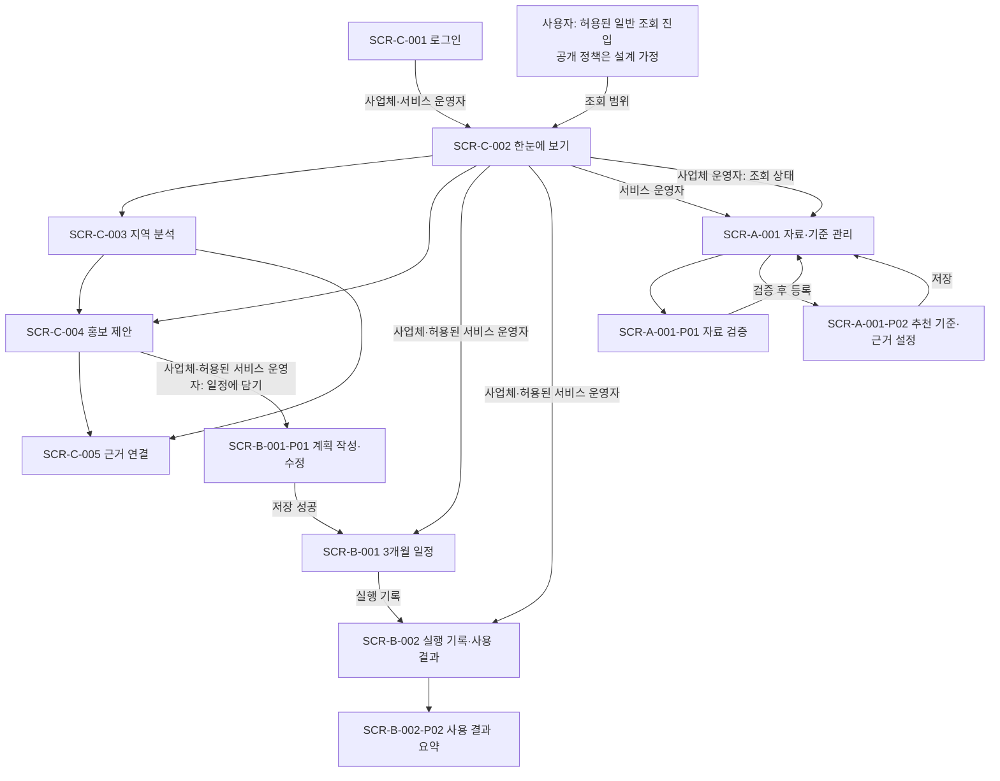
```mermaid
flowchart TD
    L[SCR-C-001 로그인] -->|사업체·서비스 운영자| M[SCR-C-002 한눈에 보기]
    G["사용자: 허용된 일반 조회 진입<br/>공개 정책은 설계 가정"] -->|조회 범위| M
    M --> A[SCR-C-003 지역 분석]
    M --> R[SCR-C-004 홍보 제안]
    A --> R
    A --> E[SCR-C-005 근거 연결]
    R --> E
    R -->|사업체·허용된 서비스 운영자: 일정에 담기| P[SCR-B-001-P01 계획 작성·수정]
    P -->|저장 성공| C[SCR-B-001 3개월 일정]
    M -->|사업체·허용된 서비스 운영자| C
    C -->|실행 기록| B[SCR-B-002 실행 기록·사용 결과]
    M -->|사업체·허용된 서비스 운영자| B
    B --> S[SCR-B-002-P02 사용 결과 요약]
    M -->|서비스 운영자| D[SCR-A-001 자료·기준 관리]
    M -->|사업체 운영자: 조회 상태| D
    D --> V[SCR-A-001-P01 자료 검증]
    D --> K[SCR-A-001-P02 추천 기준·근거 설정]
    V -->|검증 후 등록| D
    K -->|저장| D
```

화살표는 이용 가능한 화면 이동을 뜻함 분석을 매번 다시 실행해야 일정을 볼 수 있다는 필수 순서를 뜻하지 않음 사용자 Actor의 메인에는 비공개 계획 수·실행 기록·운영 관리 진입을 표시하지 않음

## 3. 화면 목록

| Screen ID | 화면명 | Actor | 관련 Use Case | 화면 경로 |
| --- | --- | --- | --- | --- |
| SCR-C-001 | 로그인 | 사업체 운영자·서비스 운영자 | 공통 접근 보조 화면 · 별도 UC 없음 | 최초 진입 > 로그인 |
| SCR-C-002 | 한눈에 보기 | 사용자·사업체 운영자·서비스 운영자 | UC01-1·UC02-4·UC03-4의 진입·요약 | 로그인 또는 허용된 조회 진입 > 한눈에 보기 |
| SCR-C-003 | 지역 분석 | 사용자·사업체 운영자·서비스 운영자 | UC01-1·UC01-2·UC02-1·UC02-2·UC02-3·UC10 | 한눈에 보기 > 지역 분석 |
| SCR-C-004 | 홍보 제안 | 사용자·사업체 운영자·서비스 운영자 | UC02-4·UC02-5·UC02-6·UC02-7·UC10 / UC06-1은 선택 부록 | 한눈에 보기 > 홍보 제안 |
| SCR-B-001 | 3개월 일정 | 사업체 운영자·허용된 서비스 운영자 | UC03-1·UC03-2·UC03-3·UC03-4 | 한눈에 보기 > 3개월 일정 |
| SCR-B-002 | 실행 기록·사용 결과 | 사업체 운영자·허용된 서비스 운영자 | UC04-1부터 UC04-6·UC05-1·UC05-2 / UC06-2는 선택 부록 | 한눈에 보기 > 실행 기록 |
| SCR-C-005 | 근거 연결 | 사용자·사업체 운영자·서비스 운영자 | UC10의 보조 표현 | 지역 분석 또는 홍보 제안 > 근거 연결 |
| SCR-A-001 | 자료·기준 관리 | 서비스 운영자 / 사업체 운영자는 자료 조회 상태 | UC07·UC08-1부터 UC08-5·UC09-1·UC09-2 | 한눈에 보기 > 자료·기준 관리 또는 자료 둘러보기 |

일반 사용자의 조회 범위는 UC01·UC02 및 포함된 UC10으로 제한함 표의 공통 메인·근거 화면도 해당 범위 안에서만 내용을 표시함 근거 연결 화면은 UC10 이해를 돕는 보조 화면이며 별도의 필수 업무 UC를 추가한 것이 아님

### 팝업·패널·상태 화면 식별자

접미사 P는 팝업 또는 화면 안의 결과 패널을 뜻함 모든 P 항목을 별도 화면으로 이동시키지 않음

| ID | 이름 | 부모 화면·호출 조건 | 관련 UC |
| --- | --- | --- | --- |
| SCR-B-001-P01 | 계획 작성·수정 | 일정의 추가·수정 또는 제안의 일정에 담기 | UC03-1·UC03-2·UC03-3 |
| SCR-B-002-P01 | 사용·실행 기록 입력 | 기록 입력·수정 | UC04-1부터 UC04-6 |
| SCR-B-002-P02 | 사용 결과 요약 | 사용 결과 요약 보기 | UC05-1·UC05-2 · 필수 기능 |
| SCR-C-004-P01 | 추천 근거 상세 | 추천 근거 보기 | UC02-4부터 UC02-7·UC10 |
| SCR-A-001-P01 | CSV 검증 결과 패널 | 자료 검증 실행 | UC08-1부터 UC08-5 |
| SCR-A-001-P02 | 추천 기준·근거 설정 | 추천 기준 설정·수정 | UC09-1·UC09-2 |

## 4. Use Case 대응표

정본의 ID·명칭·필수/선택 구분을 유지함 하나의 화면에서 여러 UC를 처리하는 것은 누락이 아니며, 필수 입력·검증·결과 요소가 아래 Storyboard에 표현되어야 함

| Use Case | 기능 | 화면·화면 내 기능 | 구현 범위 |
| --- | --- | --- | --- |
| UC01-1 월별 방문 추이 조회 | F01 | SCR-C-003 | 필수 |
| UC01-2 성수기·비수기 비교 | F01 | SCR-C-003 | 필수 |
| UC02-1 방문·소비 비교 | F02 | SCR-C-003 | 필수 |
| UC02-2 내국인·외국인 소비 비교 | F02 | SCR-C-003 | 필수 |
| UC02-3 시간대별 소비 조회 | F02 | SCR-C-003 | 필수 |
| UC02-4 홍보 시기 제안 조회 | F02 | SCR-C-004 | 필수 |
| UC02-5 홍보 대상 제안 조회 | F02 | SCR-C-004 | 필수 |
| UC02-6 상품 후보 제안 조회 | F02 | SCR-C-004 | 필수 |
| UC02-7 주변 관광지 활용 제안 조회 | F02 | SCR-C-004 | 필수 |
| UC03-1 3개월 일정표 작성 | F03 | SCR-B-001 | 필수 |
| UC03-2 3개월 일정표 수정 | F03 | SCR-B-001 | 필수 |
| UC03-3 3개월 일정표 저장 | F03 | SCR-B-001 | 필수 |
| UC03-4 저장한 일정표 조회 | F03 | SCR-B-001 | 필수 |
| UC04-1 계획 소요 시간 기록 | F03 | SCR-B-002 | 필수 |
| UC04-2 추천 채택 여부 기록 | F03 | SCR-B-002 | 필수 |
| UC04-3 실행 활동·날짜 기록 | F03 | SCR-B-002 | 필수 |
| UC04-4 클릭 결과 기록 | F03 | SCR-B-002 | 필수 |
| UC04-5 예약 결과 기록 | F03 | SCR-B-002 | 필수 |
| UC04-6 쿠폰 사용 결과 기록 | F03 | SCR-B-002 | 필수 |
| UC05-1 계획·실행 결과 비교 | F03 | SCR-B-002 | 필수 |
| UC05-2 사용 결과 요약 조회 | F03 | SCR-B-002 | 필수 |
| UC06-1 추천 이유 설명 초안 작성 | F04 | SCR-C-004 | 선택·검토 중 — 구현 확정 범위에서 제외, 부록에만 연결 |
| UC06-2 보고서 초안 작성 | F04 | SCR-B-002 | 선택·검토 중 — 구현 확정 범위에서 제외, 부록에만 연결 |
| UC07 CSV 자료 등록 | F01·F02 운영 지원 | SCR-A-001 | 필수 기능을 위한 운영 지원 |
| UC08-1 자료 기간 검증 | F01·F02 운영 지원 | SCR-A-001 | CSV 등록에 필수 포함 |
| UC08-2 집계 기준 검증 | F01·F02 운영 지원 | SCR-A-001 | CSV 등록에 필수 포함 |
| UC08-3 지역 코드 검증 | F01·F02 운영 지원 | SCR-A-001 | CSV 등록에 필수 포함 |
| UC08-4 누락값 검증 | F01·F02 운영 지원 | SCR-A-001 | CSV 등록에 필수 포함 |
| UC08-5 제공 기준 일관성 검증 | F01·F02 운영 지원 | SCR-A-001 | CSV 등록에 필수 포함 |
| UC09-1 추천 기준 설정 | F02 운영 지원 | SCR-A-001 | 필수 기능을 위한 운영 지원 |
| UC09-2 추천 근거 기록 | F02 운영 지원 | SCR-A-001 | 필수 기능을 위한 운영 지원 |
| UC10 자료 출처·기준 표시 | F01·F02 공통 | SCR-C-003, SCR-C-004 | 분석·제안 조회에 필수 포함 |

### 필수 포함 관계

- UC01-1·UC01-2·UC02-1부터 UC02-7까지의 9개 조회 → UC10 출처·기준기간·집계 기준 **상시 표시** 상세 팝업만 제공하는 것으로 대신하지 않음
- UC03-1 작성·UC03-2 수정 → UC03-3 저장 성공을 완료 조건으로 사용함 실패하면 입력 유지와 재시도를 표시함
- UC07 CSV 등록 → UC08-1부터 UC08-5까지의 다섯 검증을 모두 수행한 결과를 제시함

## 5. 화면별 Storyboard

[PDF 검토본](Red_SCREEN.pdf)은 주요 화면 또는 주요 상태 하나를 한 페이지에 배치함 상단 Screen ID·화면명·Actor·관련 UC·경로, 왼쪽 번호가 붙은 화면 캡처, 오른쪽 같은 번호의 Description을 포함함

8개 주요 화면의 탭·팝업·예외를 21개 Storyboard로 설명함 상태가 달라도 부모 Screen ID를 유지하며 새 독립 화면으로 세지 않음 화면 위 원형 숫자는 아래 ①, ② 등의 설명 번호와 같음

아래 설명과 PDF는 [동일한 Storyboard 자료](../02_제품/화면설계/storyboards.json)에서 생성함 현재 이미지는 **로컬 웹 시안 캡처**이며 Figma 캡처로 교체하기 전인 검토본임 입력·전환·저장은 시안의 동작이고 실제 서버 인증·권한·자료 적재는 후속 구현 범위임

### 5.1 SCR-C-001 / 로그인

**Actor:** 사업체 운영자·서비스 운영자 · **관련 UC:** 공통 접근 보조 · 별도 UC 없음 · **경로:** 최초 진입

**범위:** 최신 사용자 요청에 따른 공통 접근 화면 · 별도 UC ID 없음

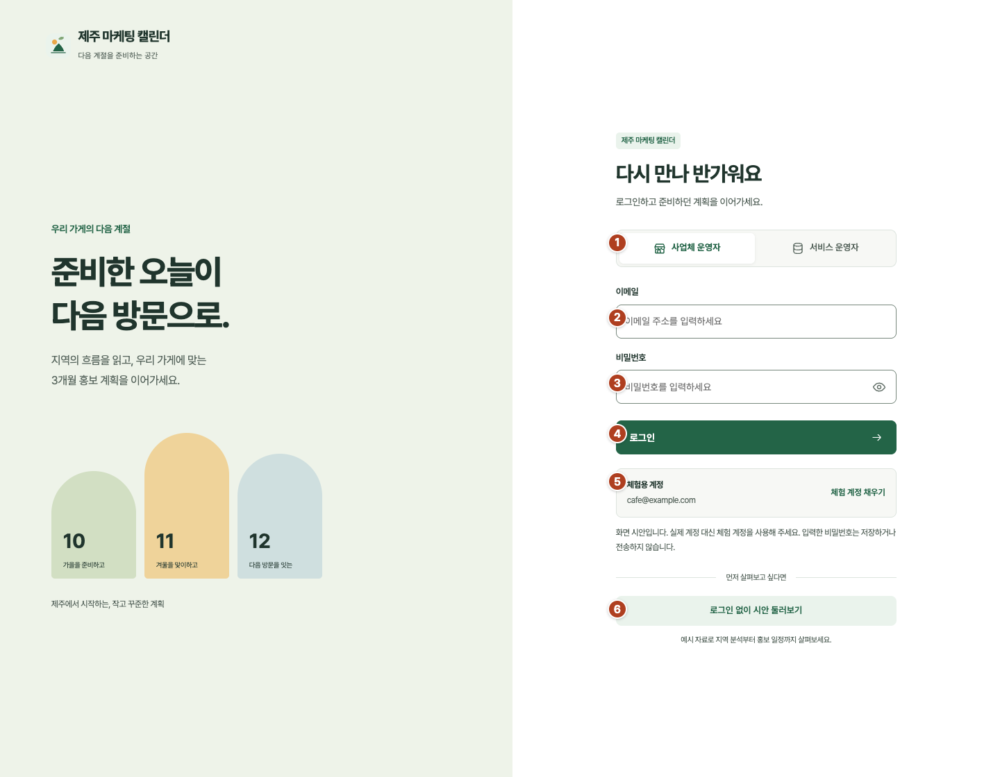

로컬 웹 시안 캡처 · 인위적 예시 자료 · Figma 캡처로 교체 전

| 번호·요소 | Description — 사용자 행위 → 시스템 처리 → 결과 | 이동·연결 |
| --- | --- | --- |
| ① 로그인 역할 | 사업체 또는 서비스 운영자 선택 → 선택한 체험 역할과 계정 안내 갱신 → 이메일·비밀번호 입력 준비 | 현재 화면 |
| ② 이메일 | 이메일 입력 → 형식·빈칸 검사 → 입력 오류는 해당 필드에 안내 | 현재 화면 |
| ③ 비밀번호 | 비밀번호 입력 또는 보기 선택 → 표시 상태만 전환하고 입력값 유지 → 값을 전송·저장하지 않음 | 현재 화면 |
| ④ 로그인 실행 | 로그인 클릭 → 선택 역할의 공개 체험 계정 검사 → 성공 시 메인으로 이동 | SCR-C-002 |
| ⑤ 체험 계정 | 체험 계정 채우기 클릭 → 선택한 역할의 공개 예시 값 입력 → 로그인 버튼으로 확인 | 현재 화면 |
| ⑥ 시안 둘러보기 | 로그인 없이 시안 둘러보기 클릭 → 선택한 운영자 역할의 시안 시작 → 실제 서비스의 인증 우회 기능이 아님 | SCR-C-002 |

**주요 상태·예외 처리**

- 정상: 체험 계정 확인 후 메인 이동
- 오류: 입력 유지·이메일/비밀번호 메시지 표시
- 실제 서버 인증·권한 보호는 후속 구현

### 5.2 SCR-C-002 / 한눈에 보기

**Actor:** 사업체 운영자·서비스 운영자 · **관련 UC:** UC01-1·UC02-4·UC03-4·UC10 · **경로:** 로그인 > 한눈에 보기

**범위:** 필수 기능의 화면 시안

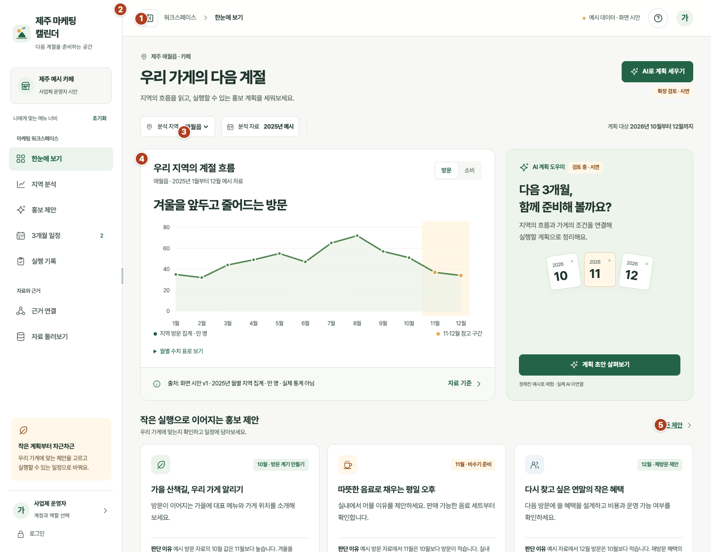

로컬 웹 시안 캡처 · 인위적 예시 자료 · Figma 캡처로 교체 전

| 번호·요소 | Description — 사용자 행위 → 시스템 처리 → 결과 | 이동·연결 |
| --- | --- | --- |
| ① 메뉴 접기 | 접기·펼치기 클릭 → 메뉴를 76px 아이콘 형태 또는 저장된 폭으로 변경 → 본문 너비 재배치 | 현재 화면 |
| ② 메뉴 너비 | 경계선을 드래그 또는 방향키 입력 → 216px부터 360px까지 조절하고 기기에 저장 → 다시 열어도 너비 유지 | 현재 화면 |
| ③ 지역 선택 | 분석 지역 선택 → 선택 지역의 예시 결과 갱신 → 분석·제안에서 같은 지역 사용 | 현재 화면 |
| ④ 월별 흐름 | 방문·소비 지표 선택 → 선택 지표의 그래프와 단위 갱신 → 자세한 비교는 지역 분석 메뉴 | SCR-C-003 |
| ⑤ 제안 더 보기 | 모든 제안 클릭 → 선택 지역 유지 → 홍보 제안으로 이동 | SCR-C-004 |

**주요 상태·예외 처리**

- 새로 방문: 기본 메뉴 248px
- 모바일: 너비 조절 대신 스크롤 가능한 서랍 메뉴
- AI 계획 도우미는 확장 검토용 고정 예시 시연

### 5.3 SCR-C-003 / 지역 분석 · 방문과 계절

**Actor:** 사용자(조회 가정)·사업체 운영자·서비스 운영자 · **관련 UC:** UC01-1·UC01-2·UC10 · **경로:** 로그인 > 한눈에 보기 > 지역 분석 > 방문과 계절

**범위:** 필수 기능의 화면 시안

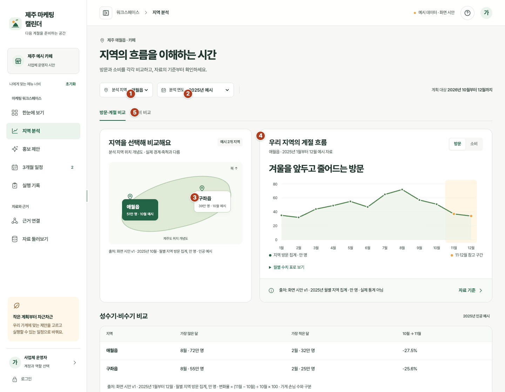

로컬 웹 시안 캡처 · 인위적 예시 자료 · Figma 캡처로 교체 전

| 번호·요소 | Description — 사용자 행위 → 시스템 처리 → 결과 | 이동·연결 |
| --- | --- | --- |
| ① 분석 조건 | 지역 선택 → 월별 방문 자료와 지역 비교 갱신 → 같은 기간의 결과 표시 | 현재 화면 |
| ② 자료 기간 | 분석 연도 선택 → 자료 보유 여부 확인 → 자료가 없으면 조회 결과 없음 안내 | 현재 화면 |
| ③ 지역 지도 | 도식 지도에서 지역 선택 → 선택 지역과 월별 그래프 연결 → 지도는 정확한 행정 경계가 아닌 시안 도식 | 현재 화면 |
| ④ 성수기·비수기 | 월별 추이와 비교 결과 확인 → 같은 집계 기준의 많은 달·적은 달 비교 → 지역 방문 집계로 해석 | 현재 화면 |
| ⑤ 소비 비교 | 소비 비교 탭 클릭 → 같은 연도·지역 조건 유지 → 방문·소비 및 고객 구분 비교 | SCR-C-003 / 소비 비교 상태 |

**주요 상태·예외 처리**

- 2025년: 인위적으로 만든 화면용 예시
- 2023년·2024년: 자료 없음
- UC10 출처·기간·집계 기준은 결과와 함께 상시 표시

### 5.4 SCR-C-003 / 지역 분석 · 소비 비교

**Actor:** 사용자(조회 가정)·사업체 운영자·서비스 운영자 · **관련 UC:** UC02-1·UC02-2·UC02-3·UC10 · **경로:** 로그인 > 한눈에 보기 > 지역 분석 > 소비 비교

**범위:** 필수 기능의 화면 시안

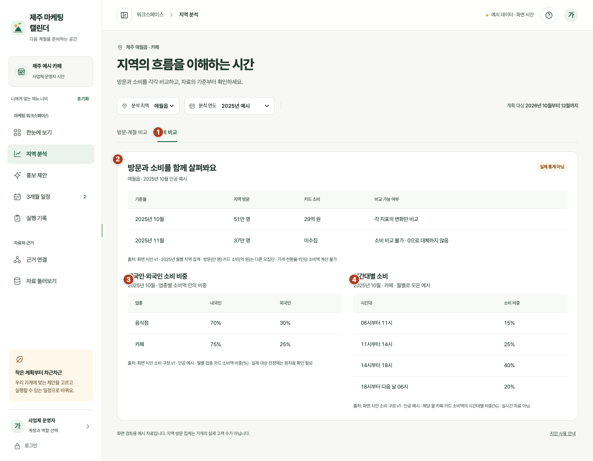

로컬 웹 시안 캡처 · 인위적 예시 자료 · Figma 캡처로 교체 전

| 번호·요소 | Description — 사용자 행위 → 시스템 처리 → 결과 | 이동·연결 |
| --- | --- | --- |
| ① 소비 비교 상태 | 소비 비교 탭 선택 → 분석 조건에 맞는 예시 표 조회 → 방문·소비를 단위별로 따로 표시 | 현재 화면 |
| ② 방문·소비 비교 | 동일 월의 두 지표 확인 → 기간 겹침·누락 여부 표시 → 실제 구매전환율이나 1인당 소비액으로 계산하지 않음 | 현재 화면 |
| ③ 내국인·외국인 비교 | 업종별 두 비중 확인 → 같은 월·업종 소비액 기준으로 비교 → 분모·출처를 확인하고 실제 대상 선정은 원자료 확인 | 현재 화면 |
| ④ 시간대별 소비 | 시간대별 표 확인 → 월별로 집계한 분포 제공 → 실시간 혼잡도 또는 개인 기록을 표시하지 않음 | 현재 화면 |

**주요 상태·예외 처리**

- 내국인·외국인 비중: 예시 집계값과 단위 표시
- 소비 미수집: 0원으로 바꾸지 않음
- 공급사·집계 기준이 다르면 비교 제한

### 5.5 SCR-C-004 / 홍보 제안

**Actor:** 사용자(조회 가정)·사업체 운영자·서비스 운영자 · **관련 UC:** UC02-4·UC02-5·UC02-6·UC02-7·UC10 · **경로:** 로그인 > 한눈에 보기 > 홍보 제안

**범위:** 필수 기능의 화면 시안

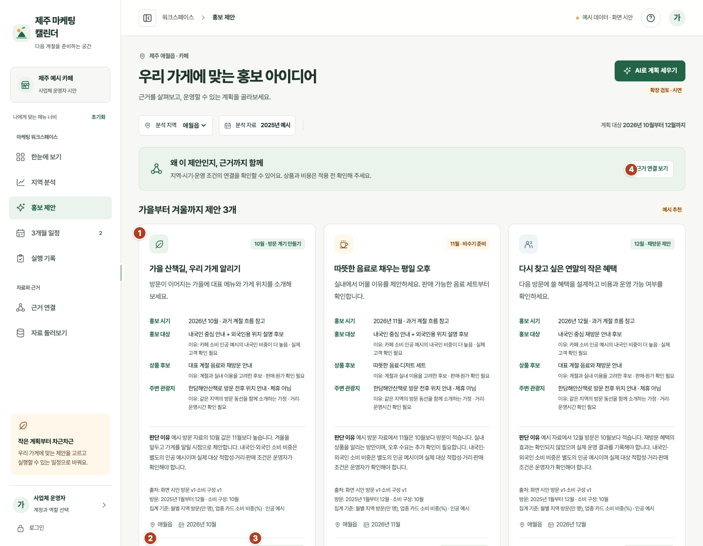

로컬 웹 시안 캡처 · 인위적 예시 자료 · Figma 캡처로 교체 전

| 번호·요소 | Description — 사용자 행위 → 시스템 처리 → 결과 | 이동·연결 |
| --- | --- | --- |
| ① 시기·대상·상품·관광지 | 제안과 판단 이유 확인 → 사용한 출처·기간·조건을 함께 제시 → 상품 판매 가능성은 사업체가 확인 | 현재 화면 |
| ② 추천 근거 | 추천 근거 클릭 → 선택 제안의 이유와 미확인 운영 조건 조회 → 근거 상세 패널 표시 | SCR-C-004-P01 |
| ③ 일정에 담기 | 일정에 담기 클릭 → 제안 제목·날짜를 편집 폼에 반영 → 수정 후 명시적으로 저장 | SCR-B-001-P01 |
| ④ 근거 연결 | 근거 연결 보기 클릭 → 자료·관측값·계획 간 관계 표시 → 관계 설명 화면으로 이동 | SCR-C-005 |

**주요 상태·예외 처리**

- 일반 조회 Actor: 일정 저장·비공개 데이터 접근 없음(설계 가정)
- F04 설명 초안: 선택·도입 검토 중, 비활성 상태
- 근거 부족·운영 조건 미확인은 해당 제안에 표시

### 5.6 SCR-B-001 / 3개월 일정

**Actor:** 사업체 운영자·서비스 운영자 · **관련 UC:** UC03-1·UC03-2·UC03-3·UC03-4 · **경로:** 로그인 > 한눈에 보기 > 3개월 일정

**범위:** 필수 기능의 화면 시안

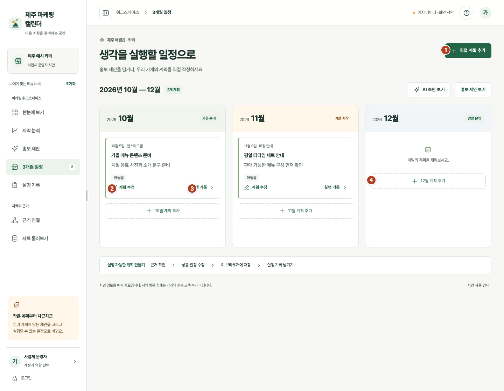

로컬 웹 시안 캡처 · 인위적 예시 자료 · Figma 캡처로 교체 전

| 번호·요소 | Description — 사용자 행위 → 시스템 처리 → 결과 | 이동·연결 |
| --- | --- | --- |
| ① 직접 작성 | 직접 계획 추가 클릭 → 빈 계획 입력 폼 표시 → 제목·예정 날짜·채널·운영 조건 입력 | SCR-B-001-P01 |
| ② 계획 수정 | 계획 수정 클릭 → 저장된 값 불러오기 → 수정 폼에서 저장 또는 취소 | SCR-B-001-P01 |
| ③ 실행 기록 | 실행 기록 클릭 → 선택한 계획과 연결해 기록 폼 표시 → 실제 수행 내용과 결과 입력 | SCR-B-002-P01 |
| ④ 빈 달 | 12월 계획 추가 클릭 → 해당 월로 날짜를 미리 설정 → 계획 없는 달에도 직접 작성 가능 | SCR-B-001-P01 |

**주요 상태·예외 처리**

- 정상: 저장한 계획을 월별로 표시
- 빈 상태: 해당 월 계획 추가 제공
- 저장 실패: 입력 보존·재시도, 작성 완료로 표시하지 않음

### 5.7 SCR-B-001-P01 / 계획 작성·수정 팝업

**Actor:** 사업체 운영자·서비스 운영자 · **관련 UC:** UC03-1·UC03-2·UC03-3 · **경로:** 로그인 > 한눈에 보기 > 3개월 일정 > 계획 작성·수정 팝업

**범위:** 필수 기능의 화면 시안

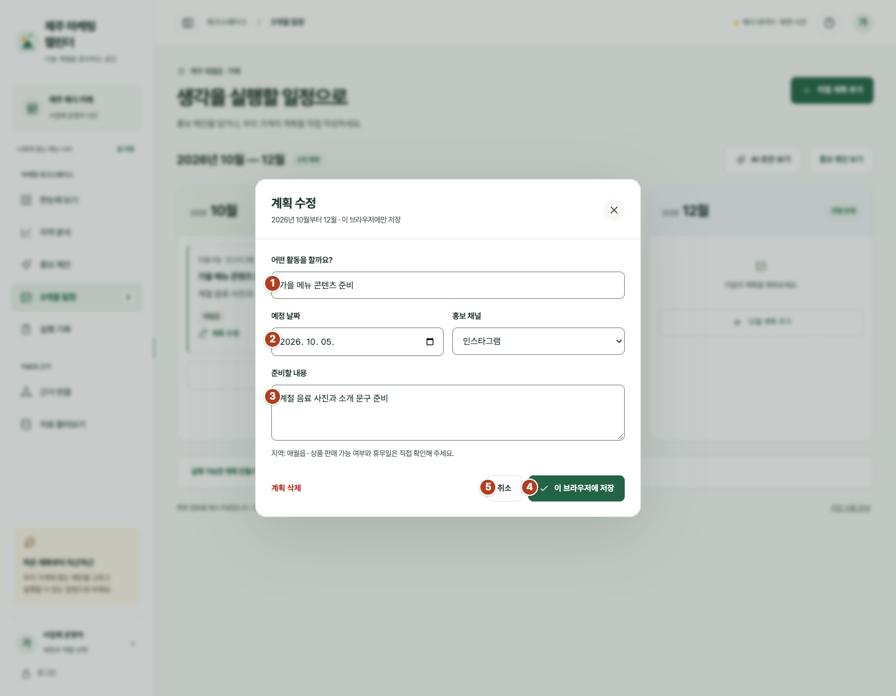

로컬 웹 시안 캡처 · 인위적 예시 자료 · Figma 캡처로 교체 전

| 번호·요소 | Description — 사용자 행위 → 시스템 처리 → 결과 | 이동·연결 |
| --- | --- | --- |
| ① 활동 제목 | 제목 입력 → 공백·최대 길이 검사 → 오류는 입력 필드에 안내 | 현재 화면 |
| ② 예정 날짜 | 날짜 선택 → 3개월 계획 범위인지 확인 → 범위를 벗어나면 저장 차단 | 현재 화면 |
| ③ 상품·운영 조건 | 실행할 상품과 준비사항 입력 → 작성 내용을 계획에 포함 → 미확인 조건은 실제 적용 전에 확인 | 현재 화면 |
| ④ 저장 | 저장 클릭 → 입력 검사 후 브라우저 저장 시도 → 저장 성공 때만 팝업 닫고 목록 갱신 | SCR-B-001 |
| ⑤ 취소 | 취소 클릭 → 변경을 저장하지 않고 닫기 → 이전 화면·호출 버튼으로 복귀 | SCR-B-001 |

**주요 상태·예외 처리**

- 필수값 오류: 폼 안에 원인 표시
- 저장 실패: 원래 저장본 유지, 입력한 수정본으로 재시도
- 저장 성공: 목록 갱신과 완료 안내

### 5.8 SCR-B-002 / 실행 기록·사용 결과

**Actor:** 사업체 운영자·서비스 운영자 · **관련 UC:** UC04-1·UC04-2·UC04-3·UC04-4·UC04-5·UC04-6·UC05-1·UC05-2 · **경로:** 로그인 > 한눈에 보기 > 실행 기록

**범위:** 필수 기능의 화면 시안

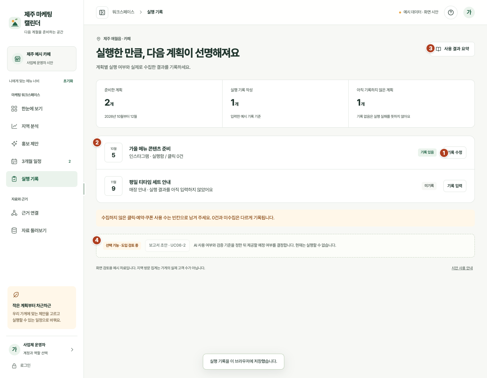

로컬 웹 시안 캡처 · 인위적 예시 자료 · Figma 캡처로 교체 전

| 번호·요소 | Description — 사용자 행위 → 시스템 처리 → 결과 | 이동·연결 |
| --- | --- | --- |
| ① 사용 기록 입력 | 기록 입력·수정 클릭 → 해당 계획에 연결된 기록 불러오기 → 소요 시간·채택·실행·결과 입력 | SCR-B-002-P01 |
| ② 계획과 실제 비교 | 계획별 기록 확인 → 예정 활동·날짜와 실제 활동·날짜 구분 → 미기록은 실행 실패로 간주하지 않음 | 현재 화면 |
| ③ 필수 사용 결과 요약 | 사용 결과 요약 클릭 → 입력한 기록만 집계 → 소요 시간·채택·실행 및 확보한 결과 요약 | SCR-B-002-P02 |
| ④ 선택 보고서 기능 | 도입 상태 확인 → 검토 중인 F04 보고서 초안은 비활성 표시 → 필수 사용 결과 요약은 계속 이용 가능 | 현재 화면 |

**주요 상태·예외 처리**

- 빈 상태: 먼저 계획을 만들도록 일정 이동 제공
- 숫자 0: 실제 확인한 0건, 빈칸: 미수집
- F04 보고서 초안은 도입 검토 중, 필수 요약과 분리

### 5.9 SCR-B-002-P01 / 사용·실행 기록 입력 팝업

**Actor:** 사업체 운영자·서비스 운영자 · **관련 UC:** UC04-1·UC04-2·UC04-3·UC04-4·UC04-5·UC04-6 · **경로:** 로그인 > 한눈에 보기 > 실행 기록 > 사용·실행 기록 입력 팝업

**범위:** 필수 기능의 화면 시안

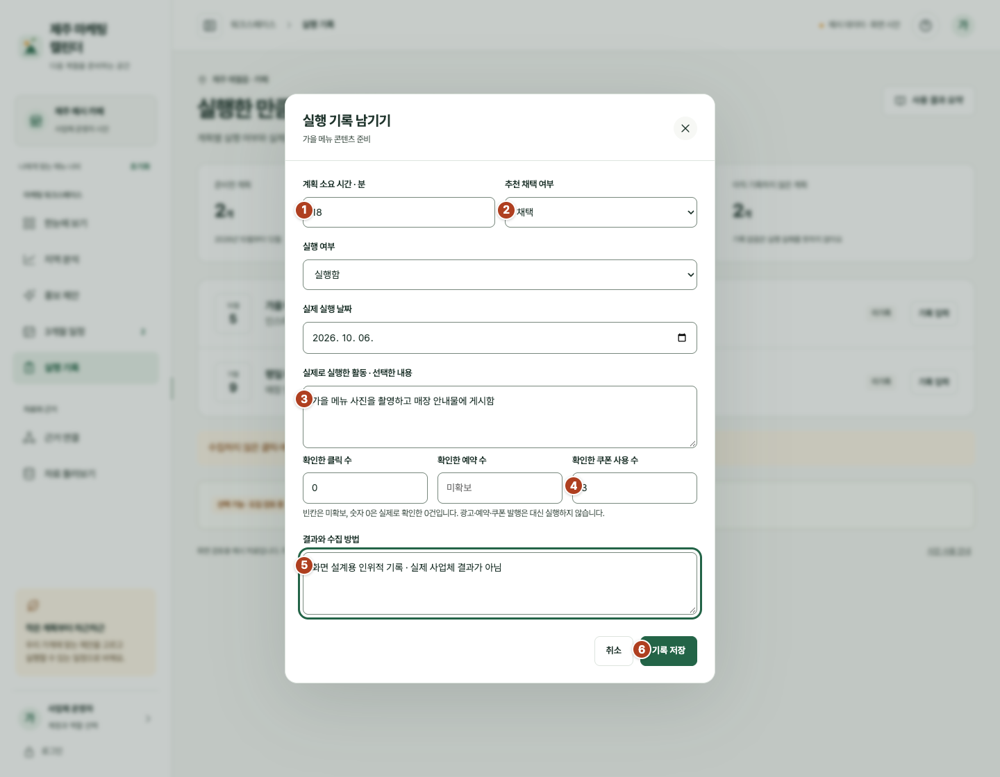

로컬 웹 시안 캡처 · 인위적 예시 자료 · Figma 캡처로 교체 전

| 번호·요소 | Description — 사용자 행위 → 시스템 처리 → 결과 | 이동·연결 |
| --- | --- | --- |
| ① 계획 소요 시간 | 소요 시간을 분 단위로 입력 → 음수·유효 범위 검사, 빈칸은 미측정 → 계획별 시간 보관 | 현재 화면 |
| ② 추천 채택 여부 | 채택·미채택·확인 중 선택 → 선택 내용과 연결해 저장 → 채택 여부를 자동 추정하지 않음 | 현재 화면 |
| ③ 실제 활동 | 실제 활동·실행 날짜 입력 → 실행했다고 선택한 경우 날짜 검사 → 예정 활동과 실제 활동을 따로 보관 | 현재 화면 |
| ④ 활동 결과 | 클릭·예약·쿠폰 사용 건수 입력 → 비음수 정수 검사, 빈칸은 null 유지 → 미수집과 실제 0건 구분 | 현재 화면 |
| ⑤ 수집 방법 | 결과 출처·확인 방법 입력 → 기록과 함께 보관 → 이후 사용 결과 해석에 활용 | 현재 화면 |
| ⑥ 기록 저장 | 기록 저장 클릭 → 입력 검증 후 저장, 실패 시 입력 유지 → 성공 시 기록 비교 목록 갱신 | SCR-B-002 |

**주요 상태·예외 처리**

- 미실행: 실제 실행 날짜 필수 아님
- 결과 미확보: 빈칸 허용·0 자동 입력 금지
- 수집값 오류·저장 오류: 입력 내용 유지

### 5.10 SCR-B-002-P02 / 사용 결과 요약 팝업

**Actor:** 사업체 운영자·서비스 운영자 · **관련 UC:** UC05-1·UC05-2 · **경로:** 로그인 > 한눈에 보기 > 실행 기록 > 사용 결과 요약 팝업

**범위:** 필수 기능의 화면 시안

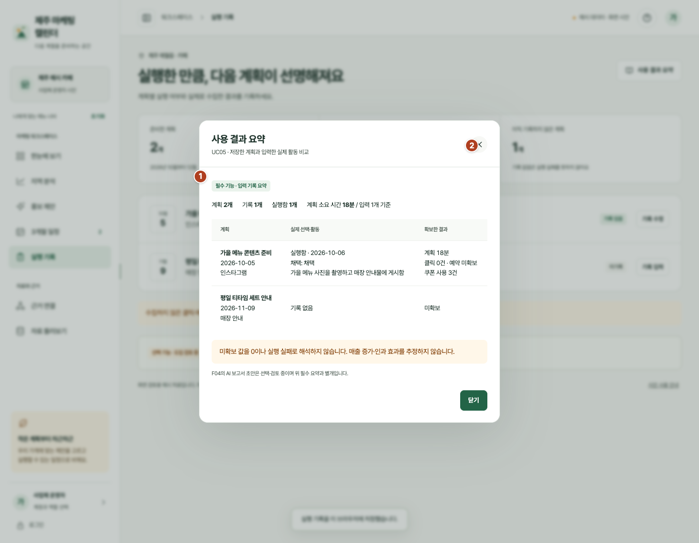

로컬 웹 시안 캡처 · 인위적 예시 자료 · Figma 캡처로 교체 전

| 번호·요소 | Description — 사용자 행위 → 시스템 처리 → 결과 | 이동·연결 |
| --- | --- | --- |
| ① 기록 기반 요약 | 사용 결과 요약 조회 → 저장한 계획·채택·시간·결과와 미확보 상태 집계 → 매출 증가나 인과 효과를 추정하지 않음 | 현재 화면 |
| ② 기록으로 돌아가기 | 닫기 클릭 → 요약 팝업 닫기 → 이전 기록 화면으로 복귀 | SCR-B-002 |

**주요 상태·예외 처리**

- 기록 없음: 미기록 안내
- 미확보 결과: 요약에서도 미확보로 유지
- 규칙 기반 필수 요약이며 선택 AI 보고서와 구분

### 5.11 SCR-C-005 / 근거 연결

**Actor:** 사업체 운영자·서비스 운영자 · **관련 UC:** UC10 · **경로:** 로그인 > 한눈에 보기 > 근거 연결

**범위:** UC10의 보조 표현 · 새 독립 필수 UC를 추가하지 않음

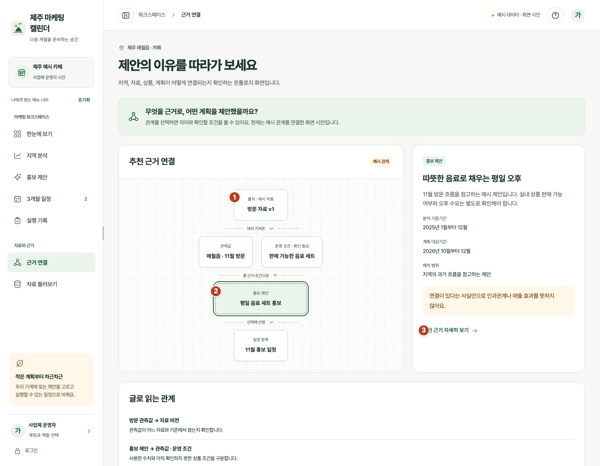

로컬 웹 시안 캡처 · 인위적 예시 자료 · Figma 캡처로 교체 전

| 번호·요소 | Description — 사용자 행위 → 시스템 처리 → 결과 | 이동·연결 |
| --- | --- | --- |
| ① 자료 버전 | 자료 버전 선택 → 해당 관계의 출처·기간 설명 표시 → 우측 설명 갱신 | 현재 화면 |
| ② 제안과 관측값 | 홍보 제안 관계 선택 → 사용한 수치와 확인할 운영 조건 표시 → 상관관계를 인과효과로 해석하지 않음 | 현재 화면 |
| ③ 근거 상세 | 추천 근거 자세히 보기 클릭 → 선택한 제안의 판단 과정 조회 → 추천 근거 패널 | SCR-C-004-P01 |

**주요 상태·예외 처리**

- 현재 관계는 고정 예시이며 실제 온톨로지 추론 아님
- 일반 조회 상태에는 비공개 상품·일정·기록 연결 제외
- 그래프와 동등한 글로 읽는 관계 제공

### 5.12 SCR-C-004-P01 / 추천 근거 상세 패널

**Actor:** 사업체 운영자·서비스 운영자 · **관련 UC:** UC02-4·UC02-5·UC02-6·UC02-7·UC10 · **경로:** 로그인 > 한눈에 보기 > 홍보 제안 > 추천 근거 상세 패널

**범위:** 필수 기능의 화면 시안

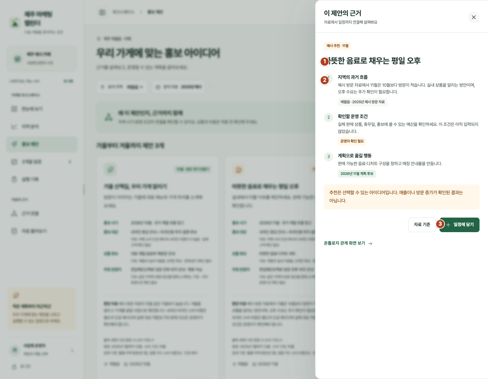

로컬 웹 시안 캡처 · 인위적 예시 자료 · Figma 캡처로 교체 전

| 번호·요소 | Description — 사용자 행위 → 시스템 처리 → 결과 | 이동·연결 |
| --- | --- | --- |
| ① 선택한 제안 | 추천 근거 열기 → 선택한 제안의 제목·시기 표시 → 이유·조건을 같은 제안 단위로 확인 | 현재 화면 |
| ② 근거·미확인 조건 | 자료와 운영 조건 확인 → 관측값·출처·상품 조건을 분리해 표시 → 확인하지 않은 상품·예산을 확정하지 않음 | 현재 화면 |
| ③ 계획에 적용 | 일정에 담기 클릭 → 선택 제안을 수정 폼에 반영 → 명시적 저장 전까지 일정 미변경 | SCR-B-001-P01 |

**주요 상태·예외 처리**

- 중복 담기: 새 항목 대신 기존 계획 수정으로 연결
- 닫기/Escape: 이전 화면과 호출 버튼 복귀

### 5.13 SCR-A-001 / 자료 둘러보기 · 조회 상태

**Actor:** 사업체 운영자·서비스 운영자 · **관련 UC:** UC10 · **경로:** 로그인 > 한눈에 보기 > 자료 둘러보기 > 조회 상태

**범위:** 자료·기준 관리의 조회 상태 · UC10 보조

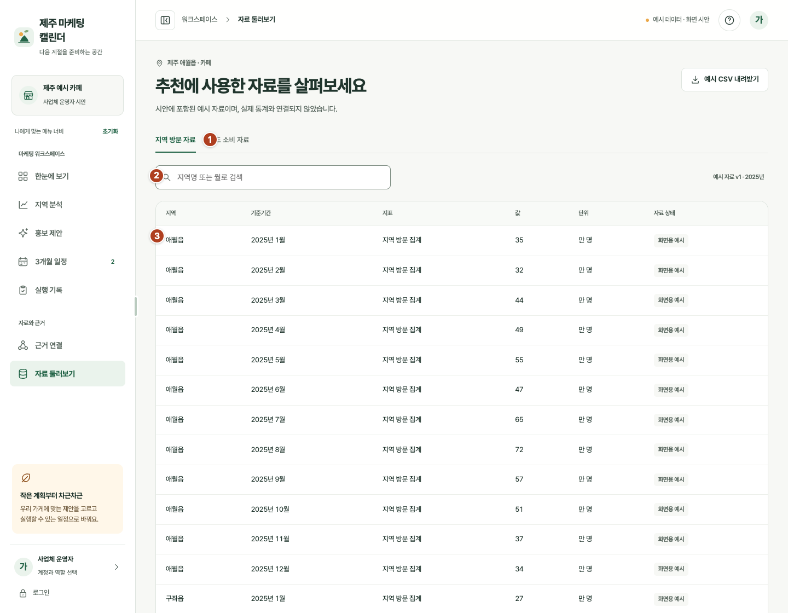

로컬 웹 시안 캡처 · 인위적 예시 자료 · Figma 캡처로 교체 전

| 번호·요소 | Description — 사용자 행위 → 시스템 처리 → 결과 | 이동·연결 |
| --- | --- | --- |
| ① 자료 종류 | 방문 또는 카드 소비 선택 → 선택 지표의 단위와 행 갱신 → 동일한 자료 기준 표시 | 현재 화면 |
| ② 자료 검색 | 지역명·월 입력 → 현재 지표의 예시 행 필터링 → 검색 결과 또는 결과 없음 표시 | 현재 화면 |
| ③ 조회 결과 | 값·단위·자료 상태 확인 → 누락값을 미수집으로 표시 → 0으로 임의 보정하지 않음 | 현재 화면 |

**주요 상태·예외 처리**

- 사업체 운영자: 읽기 화면, 등록·기준 변경 없음
- 검색 결과 없음: 검색 조건 수정 안내

### 5.14 SCR-A-001 / 자료·기준 관리

**Actor:** 서비스 운영자 · **관련 UC:** UC07·UC08-1·UC08-2·UC08-3·UC08-4·UC08-5·UC09-1·UC09-2 · **경로:** 로그인 > 한눈에 보기 > 자료·기준 관리

**범위:** 필수 기능의 화면 시안

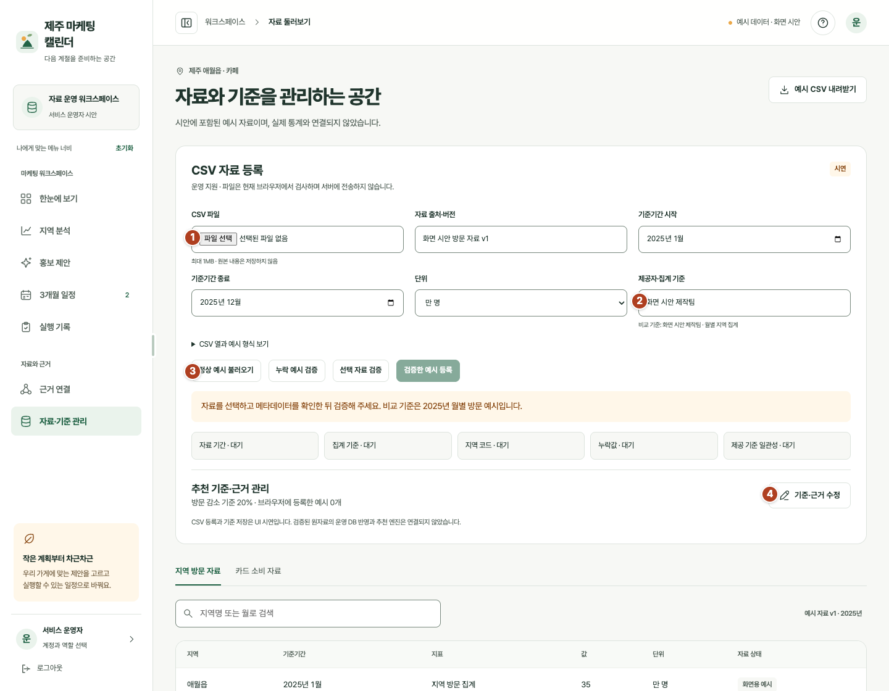

로컬 웹 시안 캡처 · 인위적 예시 자료 · Figma 캡처로 교체 전

| 번호·요소 | Description — 사용자 행위 → 시스템 처리 → 결과 | 이동·연결 |
| --- | --- | --- |
| ① 자료 선택 | CSV 파일 선택 → 파일·출처·기간·단위·제공 기준 확인 준비 → 시안은 실제 서버에 업로드하지 않음 | 현재 화면 |
| ② 제공 기준 | 공급사·기준 정보 입력 → 기존 자료와 비교 가능성 검사에 사용 → 불일치는 정상 비교 자료에서 제외 | 현재 화면 |
| ③ 검증 시연 | 통과 예시 확인 → 기간·집계·지역 코드·누락·제공 기준 5개 검사 → 검증 결과 표시 | SCR-A-001-P01 |
| ④ 추천 기준·근거 | 추천 기준 편집 클릭 → 현재 기준과 근거 불러오기 → 조건·출처·판단 이유 편집 | SCR-A-001-P02 |

**주요 상태·예외 처리**

- 자료 검증은 등록의 필수 선행 처리
- 검증 실패·미확인 항목: 등록 차단
- 등록·기준 편집은 브라우저 시연이며 서버 처리 미연결

### 5.15 SCR-A-001-P01 / CSV 검증 결과

**Actor:** 서비스 운영자 · **관련 UC:** UC07·UC08-1·UC08-2·UC08-3·UC08-4·UC08-5 · **경로:** 로그인 > 한눈에 보기 > 자료·기준 관리 > CSV 검증 결과

**범위:** 필수 기능의 화면 시안

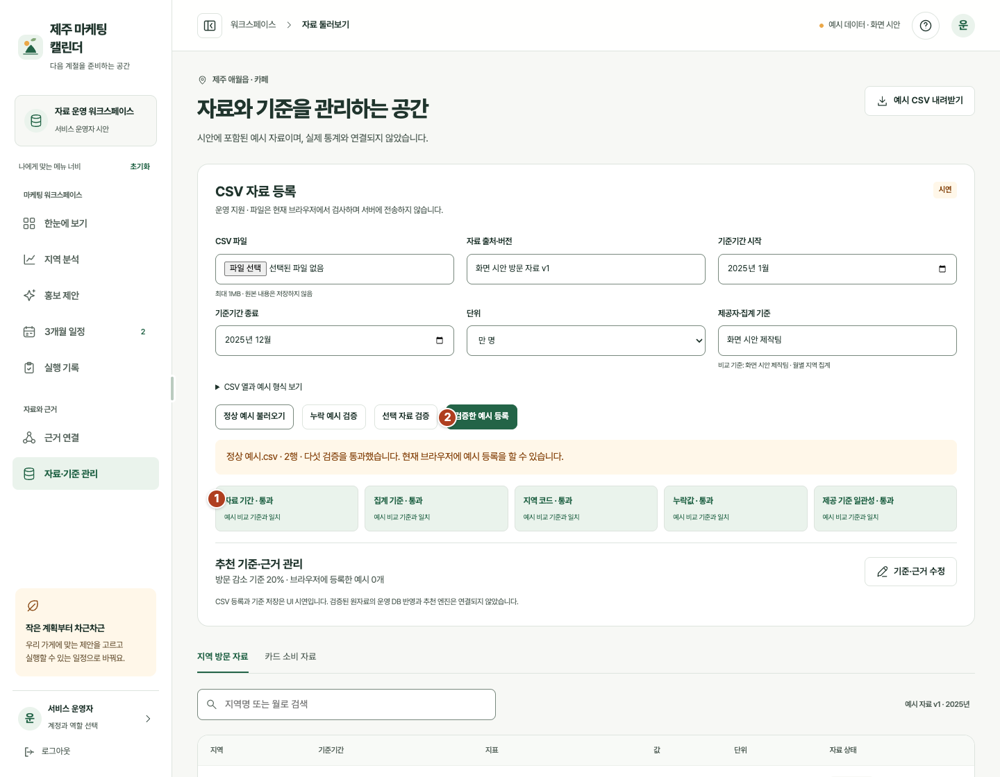

로컬 웹 시안 캡처 · 인위적 예시 자료 · Figma 캡처로 교체 전

| 번호·요소 | Description — 사용자 행위 → 시스템 처리 → 결과 | 이동·연결 |
| --- | --- | --- |
| ① 다섯 검증 | 통과 예시 검증 요청 → 기간·집계 기준·지역 코드·누락값·제공 기준을 각각 검사 → 각 결과와 비교 가능한 범위를 표시 | 현재 화면 |
| ② 등록 시연 | 등록 시연 클릭 → 다섯 검증 완료 여부 확인 → 예시 등록 상태만 변경, 실자료 서버 저장 아님 | SCR-A-001 |

**주요 상태·예외 처리**

- 일부 누락: 제외 여부와 사용 가능 범위 명시
- 실패·미확인: 등록 비활성
- 검증 이후 파일·기준 변경: 이전 통과 상태 무효화

### 5.16 SCR-A-001-P01 / CSV 검증 · 등록 불가 상태

**Actor:** 서비스 운영자 · **관련 UC:** UC08-1·UC08-2·UC08-3·UC08-4·UC08-5 · **경로:** 로그인 > 한눈에 보기 > 자료·기준 관리 > CSV 검증 · 등록 불가 상태

**범위:** 필수 기능의 화면 시안

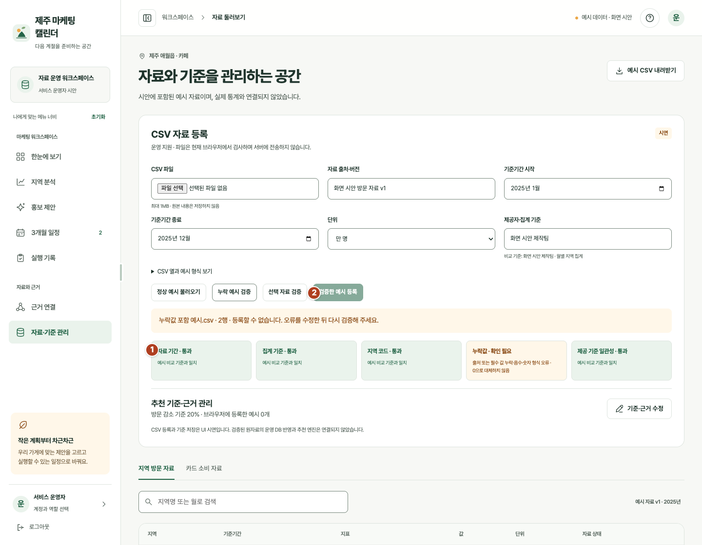

로컬 웹 시안 캡처 · 인위적 예시 자료 · Figma 캡처로 교체 전

| 번호·요소 | Description — 사용자 행위 → 시스템 처리 → 결과 | 이동·연결 |
| --- | --- | --- |
| ① 문제 확인 | 실패 예시 검증 요청 → 누락 정보·기준 불일치를 항목별로 표시 → 자료를 수정하거나 통과 예시로 다시 검증 | 현재 화면 |
| ② 등록 차단 | 실패한 자료 등록 시도 → 필수 검증 통과 전 등록 불허 → 검증 오류를 수정한 후 다시 검사 | SCR-A-001-P01 |

**주요 상태·예외 처리**

- 검증 오류를 성공으로 표시하지 않음
- 없는 수치를 만들어 보완하지 않음

### 5.17 SCR-A-001-P02 / 추천 기준·근거 편집

**Actor:** 서비스 운영자 · **관련 UC:** UC09-1·UC09-2 · **경로:** 로그인 > 한눈에 보기 > 자료·기준 관리 > 추천 기준·근거 편집

**범위:** 필수 기능의 화면 시안

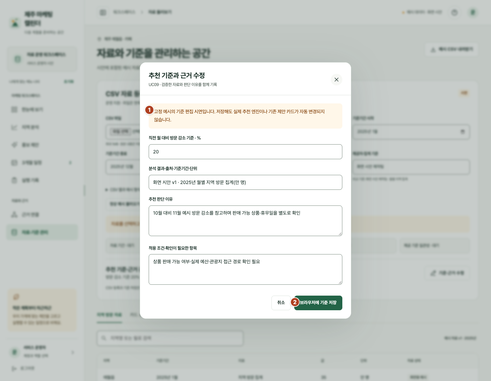

로컬 웹 시안 캡처 · 인위적 예시 자료 · Figma 캡처로 교체 전

| 번호·요소 | Description — 사용자 행위 → 시스템 처리 → 결과 | 이동·연결 |
| --- | --- | --- |
| ① 기준과 근거 | 추천 기준·조건·분석 결과 입력 → 출처·판단 이유를 함께 검사 → 근거가 빠지면 저장 차단 | 현재 화면 |
| ② 기준 저장 | 기준 저장 클릭 → 입력한 기준·근거를 브라우저에 저장 → 설정 시연이며 추천 엔진 자동 적용은 아님 | SCR-A-001 |

**주요 상태·예외 처리**

- 실제 분석 결과·CSV 확보 후 운영 기준 확정
- 근거 필수값 누락: 오류 안내
- 저장 실패: 입력 보존·재시도

### 5.18 SCR-C-001 / 로그인 · 입력 오류 상태

**Actor:** 사업체 운영자·서비스 운영자 · **관련 UC:** 공통 접근 보조 · 별도 UC 없음 · **경로:** 최초 진입 > 로그인 오류

**범위:** 공통 접근 보조 화면

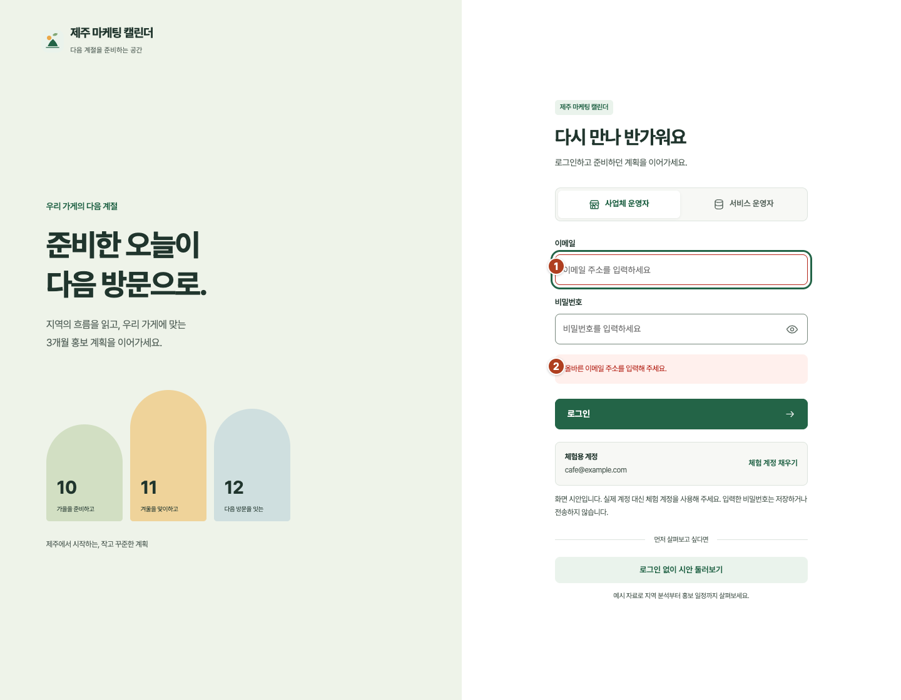

로컬 웹 시안 캡처 · 인위적 예시 자료 · Figma 캡처로 교체 전

| 번호·요소 | Description — 사용자 행위 → 시스템 처리 → 결과 | 이동·연결 |
| --- | --- | --- |
| ① 이메일 오류 | 빈 이메일로 로그인 클릭 → 필수값 검사 실패 → 이메일로 초점 이동, 오류 안내 | 현재 화면 |
| ② 오류 메시지 | 오류 내용 확인 후 수정 → 입력한 다른 값은 유지 → 다시 로그인 시도 | 현재 화면 |

**주요 상태·예외 처리**

- 연결 오류·서버 오류는 실인증 도입 시 추가 검증 필요

### 5.19 SCR-C-003 / 지역 분석 · 자료 없음 상태

**Actor:** 사용자(조회 가정)·사업체 운영자·서비스 운영자 · **관련 UC:** UC01-1·UC01-2·UC10 · **경로:** 로그인 > 한눈에 보기 > 지역 분석 > 자료 없음 상태

**범위:** 필수 기능의 화면 시안

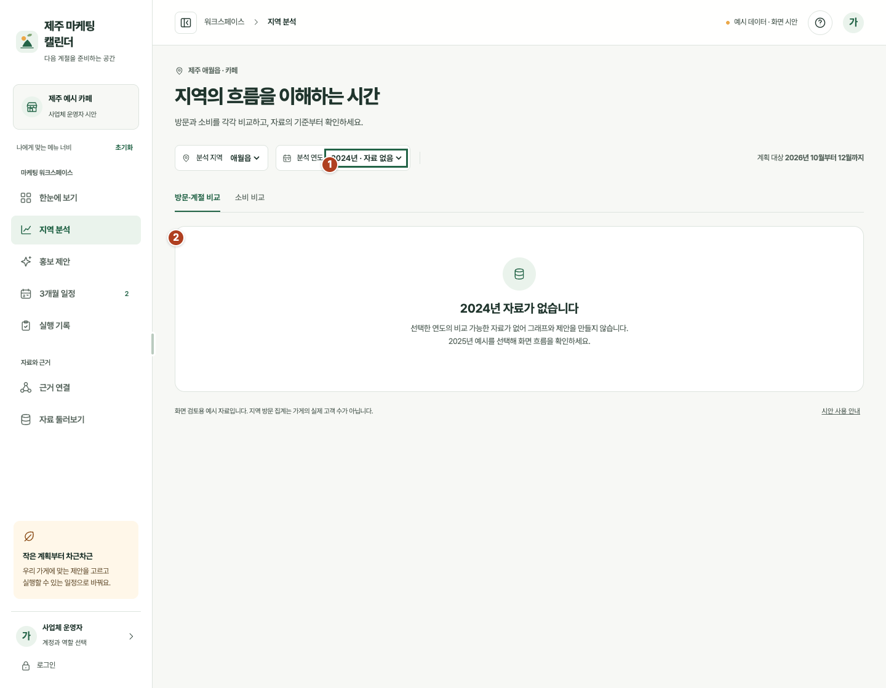

로컬 웹 시안 캡처 · 인위적 예시 자료 · Figma 캡처로 교체 전

| 번호·요소 | Description — 사용자 행위 → 시스템 처리 → 결과 | 이동·연결 |
| --- | --- | --- |
| ① 자료 없는 기간 | 2024년 선택 → 선택한 기간의 자료 보유 여부 확인 → 예시 수치로 임의 대체하지 않음 | 현재 화면 |
| ② 조회 결과 없음 | 안내 내용 확인 → 자료가 없다는 원인과 다음 행동 제시 → 2025년 예시 또는 다른 조건 선택 | 현재 화면 |

**주요 상태·예외 처리**

- 자료 미확보는 실제 0명·0원과 다름

### 5.20 SCR-B-001-P01 / 계획 작성 · 저장 실패 상태

**Actor:** 사업체 운영자·서비스 운영자 · **관련 UC:** UC03-1·UC03-3 · **경로:** 로그인 > 한눈에 보기 > 3개월 일정 > 계획 작성 · 저장 실패 상태

**범위:** 필수 기능의 화면 시안

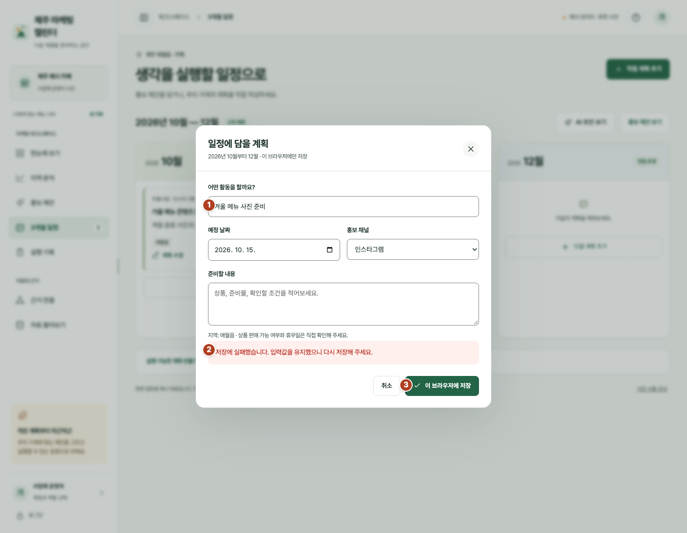

로컬 웹 시안 캡처 · 인위적 예시 자료 · Figma 캡처로 교체 전

| 번호·요소 | Description — 사용자 행위 → 시스템 처리 → 결과 | 이동·연결 |
| --- | --- | --- |
| ① 입력 유지 | 계획을 입력하고 저장 클릭 → 브라우저 저장 거부 감지 → 입력값과 편집 폼 유지 | 현재 화면 |
| ② 저장 실패 안내 | 오류 확인 → 작성 완료로 처리하지 않고 원래 저장본 유지 → 저장 가능 상태에서 재시도 | 현재 화면 |
| ③ 재시도 | 저장 버튼 다시 클릭 → 같은 입력을 다시 검증·저장 시도 → 성공할 때만 목록 갱신 | SCR-B-001 |

**주요 상태·예외 처리**

- 저장 실패 상태 재현은 테스트용 브라우저에서만 수행
- 일정 작성·수정의 완료 조건은 저장 성공

### 5.21 SCR-A-001 / 자료 둘러보기 · 검색 결과 없음

**Actor:** 사업체 운영자·서비스 운영자 · **관련 UC:** UC10 · **경로:** 로그인 > 한눈에 보기 > 자료 둘러보기 > 검색 결과 없음

**범위:** 조회 상태

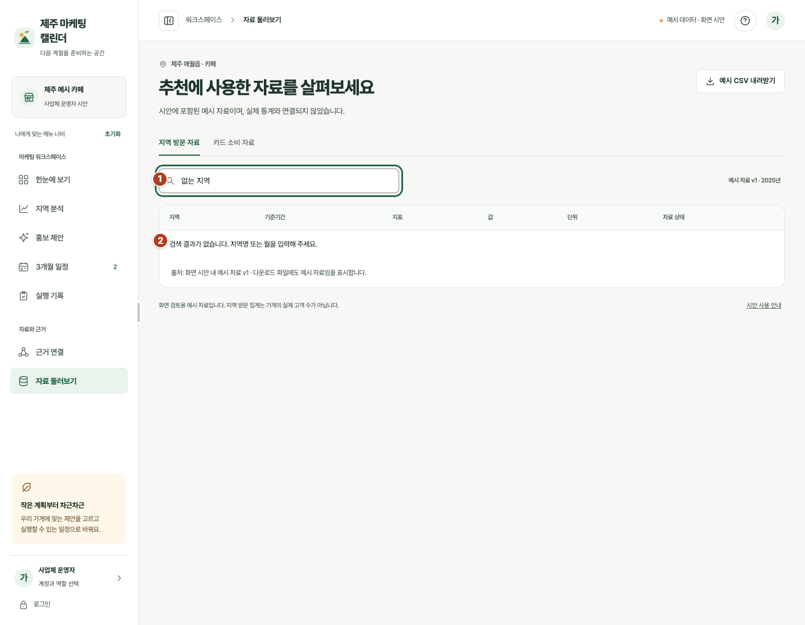

로컬 웹 시안 캡처 · 인위적 예시 자료 · Figma 캡처로 교체 전

| 번호·요소 | Description — 사용자 행위 → 시스템 처리 → 결과 | 이동·연결 |
| --- | --- | --- |
| ① 조회 조건 | 존재하지 않는 지역명 검색 → 일치하는 자료 행 없음 확인 → 검색어는 그대로 유지 | 현재 화면 |
| ② 빈 결과 안내 | 검색 결과 없음 확인 → 조건 수정 방법 표시 → 검색어 수정 후 결과 재조회 | 현재 화면 |

**주요 상태·예외 처리**

- 빈 표만 보여주지 않고 검색어 수정 안내 제공

## 6. 선택 기능과 확장 검토 부록

| 항목 | 대응 화면 | 현재 결정·표현 방식 |
| --- | --- | --- |
| UC06-1 추천 이유 설명 초안 작성 | SCR-C-004의 `#optional-explanation` 영역 | F04 선택·검토 중 구현 확정 범위에서 제외 필수 추천 이유·출처 표시는 계속 제공 |
| UC06-2 보고서 초안 작성 | SCR-B-002의 `#optional-report` 영역 | F04 선택·검토 중 구현 확정 범위에서 제외 필수 UC05-2 사용 결과 요약과 분리 |
| AI 계획 도우미 | SCR-C-002·SCR-C-004·SCR-B-001의 시연 패널 | 사용자 추가 요청에 따른 확장 검토 시연 가게 조건 질문·계획 생성·수정은 현재 정본 UC에 추가되지 않음 고정 예시 시연과 실제 에이전트 구현을 구분 |
| 온톨로지 표현 | SCR-C-005 | UC10을 이해하기 위한 관계 표현 실제 데이터 적재·추론 완료를 뜻하지 않음 |
| 일정·보고서 파일 내보내기 | 관련 기능 내부의 선택 행동 | PROJECT의 선택 범위로 유지 실제 구현하기로 정한 범위만 후속 반영 |

선택 기능을 실제 구현하기로 정하면 결정 내용·범위·날짜를 먼저 기록하고 PROJECT·Use Case·화면설계서·Figma를 함께 갱신함 확정되지 않은 기능에 완료 배지나 실제 결과를 붙이지 않음

## 7. 제출 전 일관성·검증 확인표

| 확인 항목 | 현재 상태 | 근거·남은 확인 |
| --- | --- | --- |
| PROJECT·Use Case 기반 화면 대응 | 정본·화면 대응 검증 완료 | StarUML 원본의 3 Actor·32 UC와 명칭 대조 통과; 주요 화면 8개·Storyboard 21개로 연결 |
| 필수·선택 구현 범위 구분 | 범위 구분 완료 | 필수·운영 지원 30개와 선택 UC06-1·UC06-2 2개를 구분; F04는 비활성·검토 중으로 표시 |
| Actor별 화면구성도·화면 목록 | 구성도·목록 반영 완료 | 3 Actor 흐름·8 주요 Screen ID·6 팝업·패널 ID·경로 기록; 일반 사용자 조회는 설계 가정 |
| 화면별 번호와 행동→처리→결과 Description | 번호·동작 설명 대조 완료 | 캡처 21개·설명 번호 73개; PDF와 Markdown이 동일한 Storyboard 자료를 사용 |
| 입력 오류·빈 결과·불가·실패·완료 상태 | 시안 상태 검증 완료 | 빈 결과·입력 오류·CSV 등록 불가·저장 실패·성공 동작 확인; 실제 서버 오류는 후속 검증 |
| Figma 활용 화면 설계 | 미완료·계정 연결 필요 | 현재 계정 연결이 없어 Figma Design 생성·수정 미실행; 기존 Make 링크는 참고용 |
| Figma 캡처 삽입 | 미완료 | 로컬 웹 캡처는 검토용 대체 자료이며 Figma 프레임 캡처로 교체해야 함 |
| 팀 Figma 공유 링크 첨부 | 미완료 | 제출용 공유 URL 미확보; null 상태이며 참고 Make 링크를 제출 링크로 사용하지 않음 |
| 제출 후 열람 가능한 공유 권한 | 미검증 | Figma 생성·공유 후 계정 비로그인 환경에서 실제 프레임 열람 확인 필요 |
| Figma Prototype 화면 이동 | 미완료·권장 항목 | 문서에 화면 ID별 이동을 정의했으나 Figma Prototype 연결은 계정 연결 후 진행 |
| PPT 또는 PDF 화면설계서 | PDF 검토본 제작·표시 확인 | Red_SCREEN.pdf 32쪽; 21개 화면 이미지·한글 글꼴 로드·페이지 넘침 검사와 실제 렌더링 확인 |
| PROJECT→UC→화면설계서→Figma 최종 일관성 | 문서·웹 시안 완료 / Figma 대기 | 정본 32 UC·명칭·필수/선택·화면 이동 대조 완료; Figma 프레임·캡처·공유 권한 대조는 남음 |

문서 구조·ID 검사와 실제 화면 표시 검사는 [화면설계 검증 기록](../06_증빙/화면설계/검증.md)에 구분함 Figma 필수 제출 항목을 실제로 확인한 뒤 표지의 ‘제출 준비 미완료’를 갱신함
