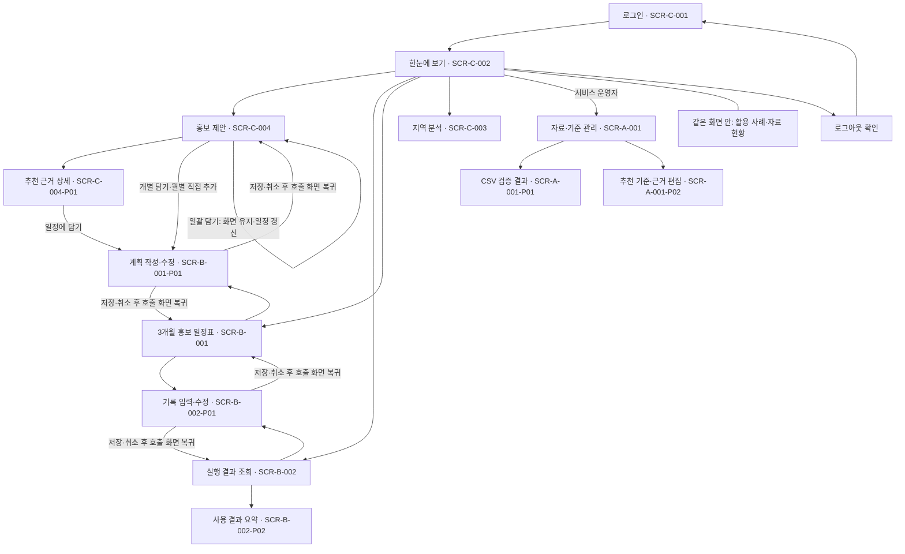

# Red 화면설계서

## 제출본과 기준

| 항목 | 내용 |
| --- | --- |
| 프로젝트 | 제주 비수기 상권 마케팅 캘린더 |
| 최신 수정일 | 2026-10-02 |
| 제출본 | [PowerPoint](Red%20%ED%99%94%EB%A9%B4%EC%84%A4%EA%B3%84%EC%84%9C_20260927.pptx) · [PDF](Red%20%ED%99%94%EB%A9%B4%EC%84%A4%EA%B3%84%EC%84%9C_20260927.pdf) |
| 화면 구성 | 32쪽 · 고유 Screen ID 14개 · 주요 화면·상태 Storyboard 21쪽 · 설명 번호 141개 |
| Figma Make | [편집 파일](https://www.figma.com/make/AlZOwKZXABo7G6BkUhTG03/Start-Task) · [최신 시안 실행](https://www.figma.com/make/AlZOwKZXABo7G6BkUhTG03/Start-Task?preview-route=%2F%23overview) |
| 확인한 버전 | Figma Make Version 8 · 2026-10-02 확인 |
| 공유 확인 | 2026-10-02 비로그인 열람과 Make 미리보기의 메뉴·버튼 이동 확인. 별도 Figma Design Prototype 연결은 미확인 |
| 양식 | 기존 화면설계서의 마스터·테마·레이아웃·폰트·표 구조 유지 |
| UC 기준 | [Use Case 다이어그램 수정 가이드](../02_%EC%A0%9C%ED%92%88/%ED%99%94%EB%A9%B4%EC%84%A4%EA%B3%84/Use_Case_%EB%8B%A4%EC%9D%B4%EC%96%B4%EA%B7%B8%EB%9E%A8_%EC%88%98%EC%A0%95_%EA%B0%80%EC%9D%B4%EB%93%9C.md)의 대표 UC 11개. 원본 다이어그램·PROJECT 최종 대조는 남아 있음 |

기존 제출 파일을 갱신했다. 파일명에 남은 20260927은 기존 문서와 링크를 유지하기 위한 이름이며, 본문과 검증 기록의 최신 수정일은 2026-10-02이다.

## 이번 수정 내용

| 수정 항목 | 화면설계 반영 | PPT 쪽 |
| --- | --- | --- |
| 월별 홍보 제안 | 10월·11월·12월 목록, 월별 직접 추가, 제안 카드 상세 | 18·19 |
| 제안 일괄 담기 | 미추가 제안만 일정에 저장, 중복 방지, 완료·실패 안내 | 13·18·21 |
| 기록 자동 채움 | 계획 날짜·채널·준비 내용과 추천 채택 기본값을 제공하고 실제 실행 내용 확인 | 24·25 |
| 활용 사례·결과 | 한눈에 보기와 홍보 제안 안에 표시. 검증 전 예시임을 명시 | 14·18 |
| 데이터 반영 현황 | 자료별 상태, 등록 건수·행 수, 표시 비율의 한계 | 14·31 |
| 메뉴·이동 | 홍보 제안 → 실행 결과 조회 → 3개월 홍보 일정표 → 지역 분석 순서, 호출 화면 복귀 | 3부터 5까지·12·22부터 26까지 |
| UC 연결 | 소비 비교를 UC01에 연결하고 UC11·UC12를 기존 화면 안의 기능으로 추가 | 6부터 9까지·14·16 |

## Actor와 이동 구조

- **사업체 운영자:** 본인 사업체의 계획·기록과 분석·제안·사례·자료 현황 조회
- **서비스 운영자:** 자료·기준 관리와 권한을 받은 사업체의 계획·기록 처리
- 별도의 상위 Actor는 두지 않는다.
- 미로그인 직접 접근은 로그인으로 이동한다. 사업체 운영자의 관리 화면 직접 접근은 한눈에 보기로 이동한다.
- Screen ID의 C는 공통 화면, B는 사업체 계획·기록 업무군, A는 자료·기준 관리, Pnn은 팝업·패널을 뜻한다. B 화면의 서비스 운영자 접근은 권한을 받은 사업체로 제한한다.

```mermaid
flowchart TD
 L["로그인 · SCR-C-001"] --> M["한눈에 보기 · SCR-C-002"]
 M --> R["홍보 제안 · SCR-C-004"]
 M --> H["실행 결과 조회 · SCR-B-002"]
 M --> C["3개월 홍보 일정표 · SCR-B-001"]
 M --> A["지역 분석 · SCR-C-003"]
 M -->|서비스 운영자| D["자료·기준 관리 · SCR-A-001"]
 M --- V["같은 화면 안: 활용 사례·자료 현황"]
 R --> E["추천 근거 상세 · SCR-C-004-P01"]
 R -->|개별 담기·월별 직접 추가| P["계획 작성·수정 · SCR-B-001-P01"]
 E -->|일정에 담기| P
 C --> P
 P -->|저장·취소 후 호출 화면 복귀| R
 P -->|저장·취소 후 호출 화면 복귀| C
 R -->|일괄 담기: 화면 유지·일정 갱신| R
 C --> F["기록 입력·수정 · SCR-B-002-P01"]
 H --> F
 F -->|저장·취소 후 호출 화면 복귀| C
 F -->|저장·취소 후 호출 화면 복귀| H
 H --> S["사용 결과 요약 · SCR-B-002-P02"]
 D --> X["CSV 검증 결과 · SCR-A-001-P01"]
 D --> K["추천 기준·근거 편집 · SCR-A-001-P02"]
 M --> O["로그아웃 확인"]
 O --> L
```

상단 흐름도는 주요 진입 관계를 나타낸다. 사이드바에서 각 메뉴로 직접 이동할 수 있으며, 자료 입력을 먼저 마쳐야 분석·제안을 조회하는 구조는 아니다. 메인·일정표의 일괄 담기도 현재 화면에서 목록과 요약을 갱신한다.

## 화면 목록

같은 Screen ID를 여러 쪽에 쓴 경우는 상태 또는 화면 내 영역을 나누어 설명한 것이다. 사례·자료 현황과 확대 제안 카드는 별도 서비스 화면을 추가한 것이 아니다.

| PPT 쪽 | Screen ID | 화면명 | Actor | 관련 Use Case | 경로 |
| --- | --- | --- | --- | --- | --- |
| 10 | SCR-C-001 | 로그인 | 사업체 운영자 · 서비스 운영자 | 별도 UC 없음 (공통 접근 보조 화면) | 로그인 |
| 11 | SCR-C-001 | 로그인 · 입력 오류 | 사업체 운영자 · 서비스 운영자 | 별도 UC 없음 (공통 접근 보조 화면) | 로그인 |
| 12 | SCR-C-000 | 공통 레이아웃 (사이드바·상단바) | 사업체 운영자 · 서비스 운영자 | 별도 UC 없음 (로그인 후 공통 영역) | 로그인 후 모든 화면 |
| 13 | SCR-C-002 | 한눈에 보기 · 제안과 일정 | 사업체 운영자 · 서비스 운영자 | UC01·UC02·UC03·UC10·UC11·UC12 | 메인(한눈에 보기) |
| 14 | SCR-C-002 | 한눈에 보기 · 사례와 자료 현황 | 사업체 운영자 · 서비스 운영자 | UC11·UC12 | 메인(한눈에 보기) |
| 15 | SCR-C-003 | 지역 분석 · 방문과 계절 | 사업체 운영자 · 서비스 운영자 | UC01 지역별 방문·소비 분석 조회 · UC10 자료 출처·기준 표시 | 메인 > 지역 분석 > 방문·계절 비교 |
| 16 | SCR-C-003 | 지역 분석 · 소비 비교 | 사업체 운영자 · 서비스 운영자 | UC01 지역별 방문·소비 분석 조회 · UC10 자료 출처·기준 표시 | 메인 > 지역 분석 > 소비 비교 |
| 17 | SCR-C-003 | 지역 분석 · 자료 없음 | 사업체 운영자 · 서비스 운영자 | UC01 지역별 방문·소비 분석 조회 · UC10 자료 출처·기준 표시 | 메인 > 지역 분석 > 방문·계절 비교 |
| 18 | SCR-C-004 | 홍보 제안 · 월별 목록 | 사업체 운영자 · 서비스 운영자 | UC02·UC03·UC10·UC11 | 메인 > 홍보 제안 |
| 19 | SCR-C-004 | 홍보 제안 · 카드 상세 | 사업체 운영자 · 서비스 운영자 | UC02·UC03·UC10 | 메인 > 홍보 제안 |
| 20 | SCR-C-004-P01 | 추천 근거 상세 | 사업체 운영자 · 서비스 운영자 | UC02·UC03·UC10 | 메인 > 홍보 제안 > 추천 근거 상세 |
| 21 | SCR-B-001 | 3개월 홍보 일정표 | 사업체 운영자 · 서비스 운영자 | UC03 3개월 홍보 일정표 관리 · UC04 사용·실행 기록 관리 | 메인 > 3개월 홍보 일정표 |
| 22 | SCR-B-001-P01 | 계획 작성·수정 | 사업체 운영자 · 서비스 운영자 | UC03 3개월 홍보 일정표 관리 | 메인 > 3개월 홍보 일정표 > 계획 작성·수정 |
| 23 | SCR-B-001-P01 | 계획 작성 · 저장 실패 | 사업체 운영자 · 서비스 운영자 | UC03 3개월 홍보 일정표 관리 | 메인 > 3개월 홍보 일정표 > 계획 작성·수정 |
| 24 | SCR-B-002 | 실행 결과 조회 | 사업체 운영자 · 서비스 운영자 | UC04 사용·실행 기록 관리 · UC05 계획 이행·실행 결과 조회 | 메인 > 실행 결과 조회 |
| 25 | SCR-B-002-P01 | 기록 입력·수정 | 사업체 운영자 · 서비스 운영자 | UC04 사용·실행 기록 관리 | 메인 > 실행 결과 조회 > 기록 입력·수정 |
| 26 | SCR-B-002-P02 | 사용 결과 요약 | 사업체 운영자 · 서비스 운영자 | UC05 계획 이행·실행 결과 조회 | 메인 > 실행 결과 조회 > 사용 결과 요약 |
| 27 | SCR-A-001 | 자료·기준 관리 | 서비스 운영자 | UC07 CSV 자료 등록 · UC08 자료 기준·누락값 검증 · UC09 추천 기준·근거 관리 | 메인 > 자료·기준 관리 |
| 28 | SCR-A-001-P01 | CSV 검증 결과 · 통과 | 서비스 운영자 | UC07 CSV 자료 등록 · UC08 자료 기준·누락값 검증 | 메인 > 자료·기준 관리 > CSV 검증 결과 |
| 29 | SCR-A-001-P01 | CSV 검증 결과 · 등록 불가 | 서비스 운영자 | UC08 자료 기준·누락값 검증 | 메인 > 자료·기준 관리 > CSV 검증 결과 |
| 30 | SCR-A-001-P02 | 추천 기준·근거 편집 | 서비스 운영자 | UC09 추천 기준·근거 관리 | 메인 > 자료·기준 관리 > 추천 기준·근거 편집 |

## Use Case와 화면 대응

수정 가이드의 UC ID를 유지했다. 제외한 UC06 뒤의 번호는 다시 매기지 않았다.

| Use Case | 화면 | PPT 쪽 |
| --- | --- | --- |
| UC01 지역별 방문·소비 분석 조회 | SCR-C-002 · SCR-C-003 | 13·15·16·17 |
| UC02 월별 홍보 제안 조회 | SCR-C-002 · SCR-C-004 · SCR-C-004-P01 | 13·18·19·20 |
| UC03 3개월 홍보 일정표 관리 | SCR-C-002 · SCR-C-004 · SCR-C-004-P01 · SCR-B-001 · SCR-B-001-P01 | 13·18·19·20·21·22·23 |
| UC04 사용·실행 기록 관리 | SCR-B-001 · SCR-B-002 · SCR-B-002-P01 | 21·24·25 |
| UC05 계획 이행·실행 결과 조회 | SCR-B-002 · SCR-B-002-P02 | 24·26 |
| UC07 CSV 자료 등록 | SCR-A-001 · SCR-A-001-P01 | 27·28 |
| UC08 자료 기준·누락값 검증 | SCR-A-001 · SCR-A-001-P01 | 27·28·29 |
| UC09 추천 기준·근거 관리 | SCR-A-001 · SCR-A-001-P02 | 27·30 |
| UC10 자료 출처·기준 표시 | SCR-C-002 · SCR-C-003 · SCR-C-004 · SCR-C-004-P01 | 13·15·16·17·18·19·20 |
| UC11 활용 사례·결과 조회 | SCR-C-002 · SCR-C-004 | 13·14·18 |
| UC12 데이터 반영 현황 조회 | SCR-C-002 | 13·14 |

## 화면별 동작

### SCR-C-001 · 로그인

PPT 10쪽 · 로그인

Actor: 사업체 운영자 · 서비스 운영자
관련 UC: 별도 UC 없음 (공통 접근 보조 화면)

| 번호 | 사용자 행위 → 시스템 처리 → 결과 |
| --- | --- |
| ① | 역할 선택 → 계정의 접근 역할 지정 → 이메일·비밀번호 입력 대기 |
| ② | 이메일 입력 → 필수값·형식 검사 → 오류 시 입력란 아래 안내 |
| ③ | 비밀번호 입력 → 필수값 검사 → 로그인 요청 준비 |
| ④ | 보기 아이콘 클릭 → 입력값은 유지하고 표시 전환 → 비밀번호 보기·숨김 |
| ⑤ | 로그인 클릭 → 서버에서 계정·역할 인증 → 성공 시 SCR-C-002 이동 |

**화면 상태:** ■ 정상   □ 결과없음   ■ 오류   □ 처리불가   ■ 완료

**이동:** 로그인 → 계정·역할 인증 → SCR-C-002 한눈에 보기

- 입력 오류·인증 실패 시 입력 화면을 유지하고 원인을 안내
- 인증 완료 후 허용된 메뉴만 표시

### SCR-C-001 · 로그인 · 입력 오류

PPT 11쪽 · 로그인

Actor: 사업체 운영자 · 서비스 운영자
관련 UC: 별도 UC 없음 (공통 접근 보조 화면)

| 번호 | 사용자 행위 → 시스템 처리 → 결과 |
| --- | --- |
| ① | 빈 이메일로 로그인 클릭 → 필수값 검사 실패 → 오류 문구 표시·이메일로 초점 이동 |
| ② | 이메일 수정 후 로그인 클릭 → 입력값 재검사·계정 인증 → 성공 시 SCR-C-002 이동 |

**화면 상태:** □ 정상   □ 결과없음   ■ 오류   □ 처리불가   □ 완료

**이동:** 입력 수정 후 로그인 → 재검사·인증 → SCR-C-002 한눈에 보기

- 입력 오류 시 다른 입력값은 유지
- 인증 실패 시 계정 정보 확인을 안내하고 로그인을 완료하지 않음

### SCR-C-000 · 공통 레이아웃 (사이드바·상단바)

PPT 12쪽 · 로그인 후 모든 화면

Actor: 사업체 운영자 · 서비스 운영자
관련 UC: 별도 UC 없음 (로그인 후 공통 영역)

| 번호 | 사용자 행위 → 시스템 처리 → 결과 |
| --- | --- |
| ① | 접기 클릭 → 메뉴를 아이콘형으로 전환 → 본문 영역 확대 |
| ② | 경계 드래그·방향키 입력 → 메뉴 폭 조절 → 설정 저장·화면 재배치 |
| ③ | 초기화 클릭 → 사용자 메뉴 폭 설정 해제 → 기본 폭 복원 |
| ④ | 한눈에 보기 클릭 → 선택 지역 유지 → SCR-C-002 이동 |
| ⑤ | 홍보 제안 클릭 → 선택 지역 유지 → SCR-C-004 이동 |
| ⑥ | 실행 결과 조회 클릭 → 권한 내 계획·기록 조회 → SCR-B-002 이동 |
| ⑦ | 3개월 홍보 일정표 클릭 → 권한 내 계획 조회 → SCR-B-001 이동 |
| ⑧ | 지역 분석 클릭 → 선택 지역 유지 → SCR-C-003 이동 |
| ⑨ | 계정 영역 클릭 → 로그아웃 의사 확인 → 로그아웃 확인 팝업 표시 |
| ⑩ | 로그아웃 클릭 → 종료 의사 확인 요청 → 로그아웃 확인 팝업 표시 |
| ⑪ | 도움말 클릭 → 이용 방법 조회 → 도움말 표시 |
| ⑫ | 취소·✕ 클릭 → 로그아웃 취소 → 현재 화면 유지 |
| ⑬ | 확인 클릭 → 로그인 세션 해제 → SCR-C-001 로그인 이동 |

**화면 상태:** ■ 정상   □ 결과없음   □ 오류   □ 처리불가   ■ 완료

**이동:** 로그아웃 확인 → 세션 해제 → SCR-C-001 로그인

- 자료·기준 관리(SCR-A-001)는 서비스 운영자에게만 표시
- 계획·기록은 본인 또는 관리 권한을 받은 사업체만 접근
- 모바일에서는 서랍 메뉴로 이동

### SCR-C-002 · 한눈에 보기 · 제안과 일정

PPT 13쪽 · 메인(한눈에 보기)

Actor: 사업체 운영자 · 서비스 운영자
관련 UC: UC01·UC02·UC03·UC10·UC11·UC12

| 번호 | 사용자 행위 → 시스템 처리 → 결과 |
| --- | --- |
| ① | 지역 선택 → 해당 지역 분석·제안 조회 → 같은 조건을 다른 화면에도 적용 |
| ② | 자료 연도 확인 → 분석 기간과 계획 기간을 구분 → 자료 기준 표시 |
| ③ | 방문·소비 선택 → 해당 지표 조회 → 단위에 맞게 그래프 갱신 |
| ④ | 월별 수치 표 클릭 → 그래프 값 조회 → 월별 표 펼침 |
| ⑤ | 자료 기준 클릭 → 출처·기간·단위 조회 → 자료 기준 안내 표시 |
| ⑥ | 제안 한 번에 담기 클릭 → 미추가 제안만 저장 → 일정 수 갱신·완료 알림 |
| ⑦ | 일정 보기 클릭 → 저장 계획 조회 → SCR-B-001 이동·빈 달은 추가 안내 |
| ⑧ | 일괄 담기 완료 → 추가 개수 표시 → 같은 화면 유지·일정표에서 확인 |

**화면 상태:** ■ 정상   ■ 결과없음   ■ 오류   □ 처리불가   ■ 완료

**이동:** 일정 보기 → SCR-B-001 / 홍보 제안 → SCR-C-004

- 제안이 없으면 제안 없음 안내 / 이미 담은 제안은 제외
- 실패 시 추가 전 상태 복구·“저장에 실패했습니다” 안내
- 사례·데이터 현황과 제안 상세 이동은 다음 페이지 참조

### SCR-C-002 · 한눈에 보기 · 사례와 자료 현황

PPT 14쪽 · 메인(한눈에 보기)

Actor: 사업체 운영자 · 서비스 운영자
관련 UC: UC11·UC12

| 번호 | 사용자 행위 → 시스템 처리 → 결과 |
| --- | --- |
| ① | 검증 상태 확인 → 사례의 확인 수준 표시 → 검증 전 예시임을 안내 |
| ② | 사례 카드 확인 → 실행 활동·결과·수집 기준 조회 → 참고 사례 표시 |
| ③ | 자료별 상태 확인 → 예시 자료와 추천 기준 구분 → 자료 준비 현황 표시 |
| ④ | 등록 현황 확인 → 등록 건수·행 수 표시 → 자료 등록 상태 확인 |

**화면 상태:** ■ 정상   □ 결과없음   □ 오류   □ 처리불가   □ 완료

**이동:** 홍보 제안 조회·제안 상세보기 → SCR-C-004 / 같은 메인 화면 하단

- 사례명·성과 수치는 검증 전 예시이며 실제 성과로 인용하지 않음
- 표시 25%는 추천 기준을 포함한 상태 비율이며 실자료 적용률 아님
- 홍보 제안 조회·상세보기 → SCR-C-004 / 별도 사례 상세 화면 없음

### SCR-C-003 · 지역 분석 · 방문과 계절

PPT 15쪽 · 메인 > 지역 분석 > 방문·계절 비교

Actor: 사업체 운영자 · 서비스 운영자
관련 UC: UC01 지역별 방문·소비 분석 조회 · UC10 자료 출처·기준 표시

| 번호 | 사용자 행위 → 시스템 처리 → 결과 |
| --- | --- |
| ① | 지역 선택 → 같은 기간의 방문 자료 조회 → 그래프·지역 비교 갱신 |
| ② | 연도 선택 → 자료 보유 여부 확인 → 결과 또는 자료 없음 안내 표시 |
| ③ | 소비 비교 탭 클릭 → 지역·연도 유지 → 소비 비교 탭 표시 |
| ④ | 지도에서 지역 클릭 → 분석 지역 변경 → 그래프·비교 표 갱신 |
| ⑤ | 월별 추이 확인 → 월별 방문 집계 → 최다·최저 방문 구간 표시 |
| ⑥ | 방문·소비 선택 → 해당 지표 조회 → 단위에 맞춰 그래프 갱신 |
| ⑦ | 수치 표 보기 클릭 → 그래프 값을 표로 변환 → 월별 표 펼침 |
| ⑧ | 자료 출처·기준 클릭 → 출처·기간·집계 기준 조회 → 안내 표시 |
| ⑨ | 비교 표 확인 → 같은 기준으로 계절별 집계 → 지역별 최다·최저 월 표시 |

**화면 상태:** ■ 정상   ■ 결과없음   □ 오류   □ 처리불가   □ 완료

**이동:** 소비 비교 탭 클릭 → 조건 유지 → SCR-C-003 소비 비교

- 지역 방문 집계는 개별 가게의 실제 손님 수가 아님
- 자료가 없는 조건은 자료 없음 상태로 표시
- 지도는 지역 선택을 위한 위치 개념도

### SCR-C-003 · 지역 분석 · 소비 비교

PPT 16쪽 · 메인 > 지역 분석 > 소비 비교

Actor: 사업체 운영자 · 서비스 운영자
관련 UC: UC01 지역별 방문·소비 분석 조회 · UC10 자료 출처·기준 표시

| 번호 | 사용자 행위 → 시스템 처리 → 결과 |
| --- | --- |
| ① | 지역·연도 선택 → 같은 조건의 소비 자료 조회 → 비교 표 갱신 |
| ② | 소비 비교 탭 클릭 → 해당 조건의 자료 조회 → 방문·소비·고객 구분 표 표시 |
| ③ | 방문·소비 표 확인 → 같은 월 지표를 단위별로 표시 → 없는 값은 미확보 표시 |
| ④ | 내·외국인 비교 확인 → 제공자·집계 기준 검사 → 일치 시 비교·불일치 시 비교 제한 |
| ⑤ | 시간대별 표 확인 → 같은 기준의 소비 분포 집계 → 시간대별 비중 표시 |
| ⑥ | 자료 출처·기준 확인 → 출처·기간·단위 표시 → 비교 가능 범위 확인 |

**화면 상태:** ■ 정상   ■ 결과없음   □ 오류   ■ 처리불가   □ 완료

**이동:** 홍보 제안 클릭 → 조건 유지 → SCR-C-004 홍보 제안

- 방문·소비 비교는 UC01에 연결
- 미수집 값은 미확보 표시, 비교 불가 사유 안내
- 모집단이 달라 전환율·1인당 소비액을 계산하지 않음

### SCR-C-003 · 지역 분석 · 자료 없음

PPT 17쪽 · 메인 > 지역 분석 > 방문·계절 비교

Actor: 사업체 운영자 · 서비스 운영자
관련 UC: UC01 지역별 방문·소비 분석 조회 · UC10 자료 출처·기준 표시

| 번호 | 사용자 행위 → 시스템 처리 → 결과 |
| --- | --- |
| ① | 자료가 없는 지역·연도 선택 → 자료 미보유 확인 → 그래프 대신 자료 없음 안내 |
| ② | 자료 없음 안내 확인 → 조회 가능 연도 안내 → 조건 변경 후 SCR-C-003 재조회 |

**화면 상태:** □ 정상   ■ 결과없음   □ 오류   □ 처리불가   □ 완료

**이동:** 조건 변경 → 자료 재조회 → SCR-C-003 지역 분석

- 자료 미확보를 실제 0명·0원으로 바꾸지 않음
- 없는 수치를 생성하지 않고 조건 변경을 안내

### SCR-C-004 · 홍보 제안 · 월별 목록

PPT 18쪽 · 메인 > 홍보 제안

Actor: 사업체 운영자 · 서비스 운영자
관련 UC: UC02·UC03·UC10·UC11

| 번호 | 사용자 행위 → 시스템 처리 → 결과 |
| --- | --- |
| ① | 지역 선택 → 해당 지역 자료·추천 기준 적용 → 월별 제안 갱신 |
| ② | 월별 목록 확인 → 10월·11월·12월로 묶음 → 해당 월 제안과 개수 표시 |
| ③ | 남은 제안 한 번에 담기 클릭 → 미추가 제안 저장 → 완료 알림·중복 방지 |
| ④ | 제안이 없는 달 확인 → 기준에 맞는 제안 없음 표시 → 직접 작성 버튼 유지 |
| ⑤ | N월 마케팅 제안 직접 추가 클릭 → 해당 월 날짜 준비 → SCR-B-001-P01 표시 |
| ⑥ | 제안 카드 확인 → 시기·대상·상품·관광지 표시 → 다음 페이지에서 상세 설명 |

**화면 상태:** ■ 정상   ■ 결과없음   ■ 오류   □ 처리불가   ■ 완료

**이동:** 월별 직접 추가 → SCR-B-001-P01 / 추천 근거 → SCR-C-004-P01

- 월별 직접 추가는 일정 계획 저장으로 연결
- 전부 담으면 완료 안내, 실패하면 기존 계획 유지
- 하단 사례는 SCR-C-002 사례 영역과 동일한 예시

### SCR-C-004 · 홍보 제안 · 카드 상세

PPT 19쪽 · 메인 > 홍보 제안

Actor: 사업체 운영자 · 서비스 운영자
관련 UC: UC02·UC03·UC10

| 번호 | 사용자 행위 → 시스템 처리 → 결과 |
| --- | --- |
| ① | 제안 제목·시기 확인 → 해당 월 제안 조회 → 실행할 주제와 시기 표시 |
| ② | 제안 항목 확인 → 대상·상품·관광지 후보 조회 → 항목별 내용과 확인사항 표시 |
| ③ | 판단 이유 확인 → 방문 변화와 추천 기준 조회 → 제안 이유 표시 |
| ④ | 출처·조건 확인 → 자료 기준·미확인 운영 조건 표시 → 적용 전 확인 안내 |
| ⑤ | 추천 근거 클릭 → 선택 제안의 이유·자료 조회 → SCR-C-004-P01 표시 |
| ⑥ | 일정에 담기 클릭 → 계획 정보 자동 입력 → SCR-B-001-P01 작성·수정 표시 |

**화면 상태:** ■ 정상   □ 결과없음   □ 오류   □ 처리불가   □ 완료

**이동:** 추천 근거 → SCR-C-004-P01 / 일정에 담기 → SCR-B-001-P01

- 월별 목록의 제안 카드를 확대한 화면이며 별도 페이지가 아님
- 개별 담기는 저장 전까지 일정 미변경 / 이미 담은 제안은 수정
- 판매 가능 상품·비용·휴무일·접근 경로는 사업체가 확인

### SCR-C-004-P01 · 추천 근거 상세

PPT 20쪽 · 메인 > 홍보 제안 > 추천 근거 상세

Actor: 사업체 운영자 · 서비스 운영자
관련 UC: UC02·UC03·UC10

| 번호 | 사용자 행위 → 시스템 처리 → 결과 |
| --- | --- |
| ① | ✕ 클릭·Esc 입력 → 패널 닫기 → 호출한 추천 근거 버튼으로 초점 복귀 |
| ② | 패널 열기 → 선택 제안 조회 → 제목·홍보 시기 표시 |
| ③ | 과거 흐름 확인 → 관측값·출처 조회 → 해당 지역·기간 자료 표시 |
| ④ | 운영 조건 확인 → 확인된 조건과 미확인 조건 구분 → 추가 확인 항목 표시 |
| ⑤ | 계획 행동 확인 → 제안을 실행 항목으로 정리 → 계획 월·준비 내용 표시 |
| ⑥ | 자료 출처·기준 클릭 → 출처·집계 기준 조회 → 안내 표시 |
| ⑦ | 일정에 담기 클릭 → 권한·기존 계획 확인 → SCR-B-001-P01 작성 또는 수정 표시 |

**화면 상태:** ■ 정상   □ 결과없음   □ 오류   □ 처리불가   □ 완료

**이동:** 일정에 담기 → 권한·기존 계획 확인 → SCR-B-001-P01 계획 작성·수정

- 명시적 저장 전까지 일정은 변경되지 않음
- 이미 담은 제안은 기존 계획 수정으로 연결
- 권한이 없는 사업체에는 일정 작성 기능을 제공하지 않음

### SCR-B-001 · 3개월 홍보 일정표

PPT 21쪽 · 메인 > 3개월 홍보 일정표

Actor: 사업체 운영자 · 서비스 운영자
관련 UC: UC03 3개월 홍보 일정표 관리 · UC04 사용·실행 기록 관리

| 번호 | 사용자 행위 → 시스템 처리 → 결과 |
| --- | --- |
| ① | 직접 계획 추가 클릭 → 기본 날짜의 작성 폼 준비 → SCR-B-001-P01 표시 |
| ② | 홍보 제안 보기 클릭 → 선택 지역 유지 → SCR-C-004 이동 |
| ③ | 월별 계획 카드 확인 → 저장 계획 조회 → 날짜·채널·준비 내용 표시 |
| ④ | 계획 수정 클릭 → 저장된 값 조회 → SCR-B-001-P01 표시 |
| ⑤ | 실행 기록 클릭 → 계획 또는 저장 기록 불러오기 → SCR-B-002-P01 표시 |
| ⑥ | N월 계획 추가 클릭 → 해당 월 날짜 자동 입력 → SCR-B-001-P01 표시 |
| ⑦ | 계획 없는 달 확인 → 빈 목록 확인 → 안내 문구와 추가 버튼 표시 |
| ⑧ | 홍보 제안 자동 채우기 클릭 → 미추가 제안 저장 → 목록 갱신·완료 알림 |

**화면 상태:** ■ 정상   ■ 결과없음   ■ 오류   □ 처리불가   ■ 완료

**이동:** 계획 추가·수정 → 입력 폼 준비 → SCR-B-001-P01 계획 작성·수정

- 일괄 담기는 확인 팝업 없이 미추가 제안만 저장
- 전부 담았으면 안내, 실패 시 기존 계획 유지·재시도 안내
- 계획·기록은 본인 또는 관리 권한을 받은 사업체만 처리

### SCR-B-001-P01 · 계획 작성·수정

PPT 22쪽 · 메인 > 3개월 홍보 일정표 > 계획 작성·수정

Actor: 사업체 운영자 · 서비스 운영자
관련 UC: UC03 3개월 홍보 일정표 관리

| 번호 | 사용자 행위 → 시스템 처리 → 결과 |
| --- | --- |
| ① | ✕ 클릭 → 변경 내용 저장 취소 → 팝업 닫고 호출 화면 복귀 |
| ② | 활동 제목 입력 → 공백·길이 검사 → 오류 시 입력란에 안내 |
| ③ | 날짜 확인·수정 → 3개월 범위 검사 → 월별 추가는 해당 월 날짜로 시작 |
| ④ | 홍보 채널 확인·선택 → 선택값 반영 → 저장 후 일정 카드에 표시 |
| ⑤ | 준비 내용 확인·수정 → 입력값 반영 → 계획에 포함 |
| ⑥ | 계획 삭제 클릭 → 연결 기록 삭제 안내 → 삭제 확인 팝업 표시 |
| ⑦ | 취소 클릭 → 변경 내용 저장 취소 → 호출 화면 복귀 |
| ⑧ | 저장 클릭 → 권한·입력 검사 후 저장 → 호출 화면의 목록·요약 갱신 |
| ⑨ | 삭제 확인 취소·✕ 클릭 → 삭제 취소 → 팝업 닫고 호출 화면 복귀 |
| ⑩ | 삭제 클릭 → 계획과 연결 실행 기록 삭제 → 호출 화면 갱신 |
| ⑪ | 저장 성공 → 완료 메시지 생성 → 계획 저장 완료 알림 표시 |

**화면 상태:** ■ 정상   □ 결과없음   ■ 오류   □ 처리불가   ■ 완료

**이동:** 저장·취소 → 호출 화면(C-004/B-001) / 일정 보기 → SCR-B-001

- 개별 제안 담기: 제목·날짜·채널·준비 내용 자동 입력
- 진입: SCR-C-004 또는 SCR-B-001 / 취소·저장 후 호출 화면 유지
- 오류는 입력을 유지하며 저장 실패는 다음 페이지 참조

### SCR-B-001-P01 · 계획 작성 · 저장 실패

PPT 23쪽 · 메인 > 3개월 홍보 일정표 > 계획 작성·수정

Actor: 사업체 운영자 · 서비스 운영자
관련 UC: UC03 3개월 홍보 일정표 관리

| 번호 | 사용자 행위 → 시스템 처리 → 결과 |
| --- | --- |
| ① | 입력 내용 확인·수정 → 실패 전 입력값 유지 → 계획 작성 폼에서 재시도 준비 |
| ② | 오류 확인 → 기존 저장본 유지 → 저장 실패·재시도 안내 표시 |
| ③ | 다시 저장 클릭 → 입력 재검사 후 저장 → 성공 시 호출 화면 갱신 |

**화면 상태:** □ 정상   □ 결과없음   ■ 오류   □ 처리불가   □ 완료

**이동:** 다시 저장 → 검사·저장 → 호출 화면(C-004/B-001) 갱신

- 서비스 운영자는 관리 권한을 받은 사업체의 계획·기록만 처리
- 실패 시 작성 완료로 표시하지 않고 입력 유지
- 재시도 성공 후에만 목록 갱신·완료 안내

### SCR-B-002 · 실행 결과 조회

PPT 24쪽 · 메인 > 실행 결과 조회

Actor: 사업체 운영자 · 서비스 운영자
관련 UC: UC04 사용·실행 기록 관리 · UC05 계획 이행·실행 결과 조회

| 번호 | 사용자 행위 → 시스템 처리 → 결과 |
| --- | --- |
| ① | 요약 카드 확인 → 계획·기록 수 집계 → 계획·작성·미기록 수 표시 |
| ② | 사용 결과 요약 클릭 → 저장 기록 집계 → SCR-B-002-P02 표시 |
| ③ | 목록 확인 → 일정표의 계획과 기록 조회 → 없으면 일정 작성 안내 |
| ④ | 기록 수정 클릭 → 기존 기록 불러오기 → SCR-B-002-P01 표시 |
| ⑤ | 기록 입력 클릭 → 계획 날짜·활동·채택 기본값 채움 → SCR-B-002-P01 표시 |
| ⑥ | 기록 저장 성공 → 목록·요약 갱신 → 완료 알림 표시 |

**화면 상태:** ■ 정상   ■ 결과없음   □ 오류   □ 처리불가   ■ 완료

**이동:** 기록 입력·수정 → 선택 계획 조회 → SCR-B-002-P01 기록 입력·수정

- 서비스 운영자는 관리 권한을 받은 사업체의 계획·기록만 처리
- 미기록은 실행 실패로 처리하지 않음
- 빈값은 미확보, 숫자 0은 실제 확인한 0건

### SCR-B-002-P01 · 기록 입력·수정

PPT 25쪽 · 메인 > 실행 결과 조회 > 기록 입력·수정

Actor: 사업체 운영자 · 서비스 운영자
관련 UC: UC04 사용·실행 기록 관리

| 번호 | 사용자 행위 → 시스템 처리 → 결과 |
| --- | --- |
| ① | ✕ 클릭 → 입력 저장 취소 → 팝업 닫고 호출 화면 복귀 |
| ② | 계획 소요 시간 입력 → 음수·범위 검사 → 빈칸은 미측정으로 유지 |
| ③ | 추천 채택 여부 확인·수정 → 제안 연결 시 채택 기본값 → 실제 판단으로 저장 |
| ④ | 실행 여부 확인·수정 → 기본 실행함을 실제 상태로 변경 → 날짜 조건 적용 |
| ⑤ | 실제 실행 날짜 확인·수정 → 자동 입력된 예정 날짜 검토 → 오류 시 안내 |
| ⑥ | 실행 활동 확인·수정 → 채널·준비 내용 기본값 수정 → 실제 활동으로 저장 |
| ⑦ | 클릭 수 입력 → 비음수 정수 검사 → 빈칸은 미확보·0은 실제 0건 |
| ⑧ | 예약 수 입력 → 비음수 정수 검사 → 빈칸은 미확보로 유지 |
| ⑨ | 쿠폰 사용 수 입력 → 비음수 정수 검사 → 빈칸은 미확보로 유지 |
| ⑩ | 결과·수집 방법 입력 → 기록과 연결 → 결과 해석에 활용 |
| ⑪ | 취소 클릭 → 입력 저장 취소 → 호출 화면 복귀 |
| ⑫ | 기록 저장 클릭 → 권한·입력 검사 후 저장 → 호출 화면 목록·요약 갱신 |
| ⑬ | 자동 채움 안내 확인 → 계획 값을 기본값으로 제공 → 실제 실행 내용 확인 |

**화면 상태:** ■ 정상   □ 결과없음   ■ 오류   □ 처리불가   ■ 완료

**이동:** 저장·취소 → 호출 화면(SCR-B-001 또는 SCR-B-002) 복귀

- 최초 작성은 계획 값, 수정은 저장된 기록을 불러옴
- 시간·클릭·예약·쿠폰 수는 자동 수집하지 않음
- 오류·저장 실패 시 입력 유지 / 완료 시 저장 알림

### SCR-B-002-P02 · 사용 결과 요약

PPT 26쪽 · 메인 > 실행 결과 조회 > 사용 결과 요약

Actor: 사업체 운영자 · 서비스 운영자
관련 UC: UC05 계획 이행·실행 결과 조회

| 번호 | 사용자 행위 → 시스템 처리 → 결과 |
| --- | --- |
| ① | 요약 열기 → 권한 내 기록을 집계 → 계획·채택·시간·실행 결과 표시 |
| ② | 닫기 클릭 → 요약 팝업 닫기 → SCR-B-002 복귀 |
| ③ | ✕ 클릭 → 요약 팝업 닫기 → SCR-B-002 복귀 |

**화면 상태:** ■ 정상   ■ 결과없음   □ 오류   □ 처리불가   □ 완료

**이동:** 닫기 → 요약 종료 → SCR-B-002 실행 결과 조회

- 본인 또는 관리 권한을 받은 사업체의 기록만 조회
- 기록 없음·미확보 표시 / 계획도 없으면 일정 작성 안내
- 매출 증가·인과 효과를 추정하지 않음

### SCR-A-001 · 자료·기준 관리

PPT 27쪽 · 메인 > 자료·기준 관리

Actor: 서비스 운영자
관련 UC: UC07 CSV 자료 등록 · UC08 자료 기준·누락값 검증 · UC09 추천 기준·근거 관리

| 번호 | 사용자 행위 → 시스템 처리 → 결과 |
| --- | --- |
| ① | CSV 양식 다운로드 클릭 → 등록 양식 제공 → 파일 저장 |
| ② | CSV 파일 선택 → 확장자·크기 검사 → 파일명 또는 오류 표시 |
| ③ | 출처·버전 입력 → 자료 식별 정보 검사 → 검증 정보에 반영 |
| ④ | 시작일 입력 → 날짜 형식 검사 → 기준기간 검증에 반영 |
| ⑤ | 종료일 입력 → 날짜·선후 관계 검사 → 기준기간 검증에 반영 |
| ⑥ | 단위 선택 → 허용 단위 확인 → 집계 기준 검증에 반영 |
| ⑦ | 제공자·집계 기준 입력 → 필수값 확인 → 비교 가능성 검증에 반영 |
| ⑧ | CSV 형식 안내 클릭 → 필수 열·작성 규칙 조회 → 안내 펼침 |
| ⑨ | 자료 검증 클릭 → 선택 파일의 5개 항목 검사 → SCR-A-001-P01 표시 |
| ⑩ | 자료 등록 클릭 → 검증·권한 확인 후 서버 저장 → 등록 자료 수 갱신·완료 알림 |
| ⑪ | 검증 항목 확인 → 기간·집계·지역·누락·제공 기준 판정 → 항목별 상태 표시 |
| ⑫ | 기준·근거 수정 클릭 → 현재 기준 조회 → SCR-A-001-P02 표시 |
| ⑬ | 추천 기준 확인 → 적용 기준·등록 자료 조회 → 현재 기준 요약 표시 |

**화면 상태:** ■ 정상   □ 결과없음   ■ 오류   ■ 처리불가   ■ 완료

**이동:** 자료 검증 → 5개 항목 검사 → SCR-A-001-P01 CSV 검증 결과

- 검증 실패·미확인 항목이 있으면 등록 차단
- 파일·기준 변경 시 이전 검증 결과 무효화
- 등록 실패 시 입력·검증 결과를 유지하고 재시도 안내

### SCR-A-001-P01 · CSV 검증 결과 · 통과

PPT 28쪽 · 메인 > 자료·기준 관리 > CSV 검증 결과

Actor: 서비스 운영자
관련 UC: UC07 CSV 자료 등록 · UC08 자료 기준·누락값 검증

| 번호 | 사용자 행위 → 시스템 처리 → 결과 |
| --- | --- |
| ① | 검증 완료 → 통과 항목 집계 → 등록 가능 안내 표시 |
| ② | 항목별 결과 확인 → 5개 기준 판정 → 통과 여부·사용 가능 범위 표시 |
| ③ | 자료 등록 클릭 → 검증·권한 확인 후 서버 저장 → SCR-A-001 등록 자료 수 갱신 |
| ④ | 등록 성공 → 완료 메시지 생성 → 자료 등록 완료 알림 표시 |

**화면 상태:** ■ 정상   □ 결과없음   □ 오류   □ 처리불가   ■ 완료

**이동:** 자료 등록 → 검증·권한 확인·서버 저장 → SCR-A-001 등록 자료 수 갱신

- 필수 검증 통과 후에만 등록 가능
- 검증 후 파일·입력 기준이 바뀌면 다시 검증

### SCR-A-001-P01 · CSV 검증 결과 · 등록 불가

PPT 29쪽 · 메인 > 자료·기준 관리 > CSV 검증 결과

Actor: 서비스 운영자
관련 UC: UC08 자료 기준·누락값 검증

| 번호 | 사용자 행위 → 시스템 처리 → 결과 |
| --- | --- |
| ① | 오류가 있는 파일 검증 → 실패 항목 판별 → 등록 불가 사유·재검증 안내 |
| ② | 오류 항목 확인 → 실패한 검증 기준 확인 → 수정 후 재검증 안내 |
| ③ | 등록 버튼 확인 → 필수 검증 미통과 확인 → 등록 비활성 유지 |

**화면 상태:** □ 정상   □ 결과없음   ■ 오류   ■ 처리불가   □ 완료

**이동:** 자료 수정 후 검증 → 재검증 → SCR-A-001-P01 결과 갱신

- 없는 수치를 만들어 채우거나 0으로 대체하지 않음
- 자료를 수정한 뒤 다시 검증해야 등록 가능

### SCR-A-001-P02 · 추천 기준·근거 편집

PPT 30쪽 · 메인 > 자료·기준 관리 > 추천 기준·근거 편집

Actor: 서비스 운영자
관련 UC: UC09 추천 기준·근거 관리

| 번호 | 사용자 행위 → 시스템 처리 → 결과 |
| --- | --- |
| ① | ✕ 클릭 → 변경 내용 저장 취소 → SCR-A-001 유지 |
| ② | 적용 안내 확인 → 기준 적용 방식 표시 → 저장 후 제안 재계산 안내 |
| ③ | 방문 감소 기준 입력 → 숫자·범위 검사 → 추천 기준 저장 준비 |
| ④ | 출처·기준 입력 → 필수값 검사 → 제안의 출처·기준에 반영 |
| ⑤ | 추천 판단 이유 입력 → 필수값 검사 → 제안 설명에 반영 |
| ⑥ | 적용 조건 입력 → 필수값 검사 → 제안의 확인 조건에 표시 |
| ⑦ | 취소 클릭 → 변경 내용 저장 취소 → SCR-A-001 복귀 |
| ⑧ | 기준 저장 클릭 → 권한·입력 검사·서버 저장 → 기준·홍보 제안 갱신 |
| ⑨ | 저장 성공 → 완료 메시지 생성 → 추천 기준 저장 완료 알림 표시 |

**화면 상태:** ■ 정상   □ 결과없음   ■ 오류   □ 처리불가   ■ 완료

**이동:** 기준 저장 → 서버 저장·제안 재계산 → SCR-A-001 기준 요약 갱신

- 저장한 기준·근거는 이후 홍보 제안 조회에 반영
- 필수값 오류는 해당 입력란에 표시
- 저장 실패 시 기존 적용 기준과 입력값을 유지

## 구현 범위와 현재 시안의 구분

화면별 Description은 구현할 서비스의 행위·처리·결과를 설명한다. 현재 Make 시안에서 확인한 동작과 서버 구현 완료는 구분한다.

| 항목 | 확인한 범위 |
| --- | --- |
| 필수 기능 | F01 방문 추이, F02 소비 비교·월별 제안, F03 일정·실행 결과, 운영 지원(CSV·추천 기준) |
| 추가 화면 기능 | 제안 일괄 담기, 기록 자동 채움, 활용 사례·결과(UC11), 데이터 반영 현황(UC12) |
| 제외 | F04(UC06 보고서 초안 작성)는 이번 제출의 구현 범위에서 제외 |
| 인증·저장 | Make는 임시 계정과 브라우저 저장으로 시연. 실제 서버 인증·권한·저장은 목표 동작 |
| 월별 직접 추가 | 해당 월의 일정 계획을 작성·저장하는 기능. 홍보 제안 카드를 새로 생성하는 기능으로 설명하지 않음 |
| 일괄 담기 | 미추가 제안만 저장하며 기존 계획 유지. 중복 제외, 실패 시 추가 전 상태 복구 |
| 기록 자동 채움 | 최초 작성은 계획 날짜·채널·준비 내용 등을 기본값으로 제공. 실행 여부·날짜·활동은 운영자가 실제 내용으로 확인·수정 |
| 성과 입력 | 소요 시간·클릭·예약·쿠폰 수는 자동 수집하지 않음. 빈칸은 미확보·미측정, 0은 실제로 확인한 0건 |
| 활용 사례 | 사례명·효과 수치는 고정된 검증 전 예시. 실제 성과로 인용하지 않음. 별도 사례 상세·등록·검색 화면은 없음 |
| 데이터 현황 | 등록 자료가 0건이어도 추천 기준 상태를 포함해 25%가 표시됨. 실자료 적용률로 해석하지 않음. 마지막 확인일 9월 29일은 고정 문구 |
| CSV | 현재 시안은 출처·등록 행 수를 저장하고 그래프는 예시 자료를 표시. CSV 행이 분석에 실제 적재되는 것으로 설명하지 않음 |
| 지표 해석 | 지역 방문 집계를 가게 손님 수로 해석하지 않음. 서로 다른 모집단의 방문·소비 자료로 전환율·1인당 소비를 계산하지 않음 |

## 검증과 남은 대조 항목

검증 기록: [2026-10-02 화면설계 수정 검증](../06_증빙/화면설계/20261002_수정검증.md)

- 원본 PPT의 마스터·테마·레이아웃을 그대로 유지하고 화면 캡처·내용·번호를 갱신했다.
- 최신 Make 미리보기에서 캡처한 이미지 27개를 삽입했다. 작은 빨간 번호 141개와 Description을 대응시켰다.
- PPT 구조·페이지 경계·원본 폰트 검사를 통과했고, PDF 32쪽의 글자·표·캡처 표시를 확인했다.
- PowerPoint 자동 출력은 시간 초과되어 PowerPoint 앱 내 최종 표시는 검증하지 못했다. PDF는 원본 폰트를 지정한 LibreOffice로 생성했다.
- **남은 항목:** 원본 Use Case Diagram과 PROJECT의 최신 기능 범위를 최종 반영·대조해야 한다. PPT 제출 체크리스트는 두 항목을 △로 남겼다.
- 이번 작업은 화면설계서 갱신이다. Figma Make 원본 기능이나 원본 다이어그램을 수정한 작업으로 보고하지 않는다.
