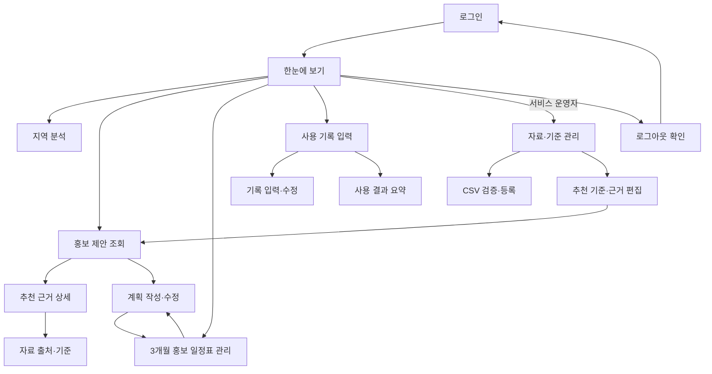

# Red 화면설계서

## 제출본과 기준

| 항목 | 내용 |
| --- | --- |
| 프로젝트 | 제주 비수기 상권 마케팅 캘린더 |
| 작성일 | 2026-09-27 |
| 제출본 | [PowerPoint](Red%20화면설계서_20260927.pptx) · [PDF](Red%20화면설계서_20260927.pdf) |
| 화면 구성 | 30쪽 · 주요 화면·상태 Storyboard 19쪽 · 설명 번호 128개 |
| Figma Make | [편집 파일](https://www.figma.com/make/AlZOwKZXABo7G6BkUhTG03/Start-Task) · [공개 시안](https://blob-silver-16955234.figma.site) |
| 공유 | 누구나 열람 가능 · 편집은 로그인 필요 |
| 기준 | 사용자가 제공한 Red 화면설계서_20260927 (1).pptx의 양식과 UC01부터 UC10까지의 화면 대응을 유지 |

화면의 Description은 구현할 서비스의 사용자 행위·시스템 처리·결과를 설명한다. 현재 Make 시안은 예시 자료와 브라우저 저장으로 동작하며 실제 서버 인증·권한·저장·CSV 적재는 연결하지 않았다. 화면 설계와 서버 구현 완료를 구분한다.

F04(UC06 보고서 초안 작성)는 이번 제출의 구현 범위에서 제외했다. 비활성 안내 영역은 제품 화면에서 제거했고 이후 도입 여부는 별도 결정한다.

## Actor와 이동 구조

- 사용자: 로그인한 사업체 운영자와 서비스 운영자를 묶는 상위 Actor
- 사업체 운영자: 본인 사업체의 계획·기록과 공통 분석·제안 조회
- 서비스 운영자: 자료·기준 관리와 권한을 받은 사업체의 계획·기록 처리
- 미로그인 직접 접근: 로그인으로 이동
- 사업체 운영자의 관리 화면 직접 접근: 한눈에 보기로 이동

```mermaid
flowchart TD
 L[로그인] --> M[한눈에 보기]
 M --> A[지역 분석]
 M --> R[홍보 제안 조회]
 M --> C[3개월 홍보 일정표 관리]
 M --> H[사용 기록 입력]
 M -->|서비스 운영자| D[자료·기준 관리]
 R --> E[추천 근거 상세]
 E --> S[자료 출처·기준]
 R --> P[계획 작성·수정]
 C --> P
 P --> C
 H --> F[기록 입력·수정]
 H --> V[사용 결과 요약]
 D --> X[CSV 검증·등록]
 D --> K[추천 기준·근거 편집]
 K --> R
 M --> O[로그아웃 확인]
 O --> L
```

## 화면 목록

| PPT 쪽 | Screen ID | 화면명 | Actor | 관련 Use Case | 경로 |
| --- | --- | --- | --- | --- | --- |
| 10 | SCR-C-001 | 로그인 | 사용자 | 별도 UC 없음 (공통 접근 보조 화면) | 로그인 |
| 11 | SCR-C-001 | 로그인 · 입력 오류 | 사용자 | 별도 UC 없음 (공통 접근 보조 화면) | 로그인 |
| 12 | SCR-C-000 | 공통 레이아웃 (사이드바·상단바) | 사용자 | 별도 UC 없음 (로그인 후 공통 영역) | 로그인 후 모든 화면 |
| 13 | SCR-C-002 | 한눈에 보기 | 사용자 | UC01·UC02·UC03·UC10 (진입·요약) | 메인(한눈에 보기) |
| 14 | SCR-C-003 | 지역 분석 · 방문과 계절 | 사용자 | UC01 지역별 방문 분석 조회 · UC10 자료 출처·기준 표시 | 메인 > 지역 분석 > 방문·계절 비교 |
| 15 | SCR-C-003 | 지역 분석 · 소비 비교 | 사용자 | UC02 홍보 제안 조회 · UC10 자료 출처·기준 표시 | 메인 > 지역 분석 > 소비 비교 |
| 16 | SCR-C-003 | 지역 분석 · 자료 없음 | 사용자 | UC01 지역별 방문 분석 조회 · UC10 자료 출처·기준 표시 | 메인 > 지역 분석 > 방문·계절 비교 |
| 17 | SCR-C-004 | 홍보 제안 조회 | 사용자 | UC02 홍보 제안 조회 · UC10 자료 출처·기준 표시 | 메인 > 홍보 제안 조회 |
| 18 | SCR-C-004-P01 | 추천 근거 상세 | 사용자 | UC02 홍보 제안 조회 · UC10 자료 출처·기준 표시 | 메인 > 홍보 제안 조회 > 추천 근거 상세 |
| 19 | SCR-B-001 | 3개월 홍보 일정표 관리 | 사업체 운영자 · 서비스 운영자 | UC03 3개월 홍보 일정표 관리 | 메인 > 3개월 홍보 일정표 관리 |
| 20 | SCR-B-001-P01 | 계획 작성·수정 | 사업체 운영자 · 서비스 운영자 | UC03 3개월 홍보 일정표 관리 | 메인 > 3개월 홍보 일정표 관리 > 계획 작성·수정 |
| 21 | SCR-B-001-P01 | 계획 작성 · 저장 실패 | 사업체 운영자 · 서비스 운영자 | UC03 3개월 홍보 일정표 관리 | 메인 > 3개월 홍보 일정표 관리 > 계획 작성·수정 |
| 22 | SCR-B-002 | 사용 기록 입력 | 사업체 운영자 · 서비스 운영자 | UC04 사용 기록 입력 · UC05 계획 이행 확인 | 메인 > 사용 기록 입력 |
| 23 | SCR-B-002-P01 | 기록 입력·수정 | 사업체 운영자 · 서비스 운영자 | UC04 사용 기록 입력 | 메인 > 사용 기록 입력 > 기록 입력·수정 |
| 24 | SCR-B-002-P02 | 사용 결과 요약 | 사업체 운영자 · 서비스 운영자 | UC05 계획 이행 확인 | 메인 > 사용 기록 입력 > 사용 결과 요약 |
| 25 | SCR-A-001 | 자료·기준 관리 | 서비스 운영자 | UC07 CSV 자료 등록 · UC08 자료 기준·누락값 검증 · UC09 추천 기준·근거 관리 | 메인 > 자료·기준 관리 |
| 26 | SCR-A-001-P01 | CSV 검증 결과 · 통과 | 서비스 운영자 | UC07 CSV 자료 등록 · UC08 자료 기준·누락값 검증 | 메인 > 자료·기준 관리 > CSV 검증 결과 |
| 27 | SCR-A-001-P01 | CSV 검증 결과 · 등록 불가 | 서비스 운영자 | UC08 자료 기준·누락값 검증 | 메인 > 자료·기준 관리 > CSV 검증 결과 |
| 28 | SCR-A-001-P02 | 추천 기준·근거 편집 | 서비스 운영자 | UC09 추천 기준·근거 관리 | 메인 > 자료·기준 관리 > 추천 기준·근거 편집 |

## 화면별 동작

### SCR-C-001 · 로그인

PPT 10쪽 · 로그인

| 번호 | 사용자 행위 → 시스템 처리 → 결과 |
| --- | --- |
| ① | 역할 선택 → 계정의 접근 역할 지정 → 이메일·비밀번호 입력 대기 |
| ② | 이메일 입력 → 필수값·형식 검사 → 오류 시 입력란 아래 안내 |
| ③ | 비밀번호 입력 → 필수값 검사 → 로그인 요청 준비 |
| ④ | 보기 아이콘 클릭 → 입력값은 유지하고 표시 전환 → 비밀번호 보기·숨김 |
| ⑤ | 로그인 클릭 → 서버에서 계정·역할 인증 → 성공 시 SCR-C-002 이동 |

### SCR-C-001 · 로그인 · 입력 오류

PPT 11쪽 · 로그인

| 번호 | 사용자 행위 → 시스템 처리 → 결과 |
| --- | --- |
| ① | 빈 이메일로 로그인 클릭 → 필수값 검사 실패 → 오류 문구 표시·이메일로 초점 이동 |
| ② | 이메일 수정 후 로그인 클릭 → 입력값 재검사·계정 인증 → 성공 시 SCR-C-002 이동 |

### SCR-C-000 · 공통 레이아웃 (사이드바·상단바)

PPT 12쪽 · 로그인 후 모든 화면

| 번호 | 사용자 행위 → 시스템 처리 → 결과 |
| --- | --- |
| ① | 접기 클릭 → 메뉴를 아이콘형으로 전환 → 본문 영역 확대 |
| ② | 경계 드래그·방향키 입력 → 메뉴 폭 조절 → 설정 저장·화면 재배치 |
| ③ | 초기화 클릭 → 사용자 메뉴 폭 설정 해제 → 기본 폭 복원 |
| ④ | 한눈에 보기 클릭 → 선택 지역 유지 → SCR-C-002 이동 |
| ⑤ | 지역 분석 클릭 → 선택 지역 유지 → SCR-C-003 이동 |
| ⑥ | 홍보 제안 조회 클릭 → 선택 지역 유지 → SCR-C-004 이동 |
| ⑦ | 3개월 홍보 일정표 관리 클릭 → 권한 내 계획 조회 → SCR-B-001 이동 |
| ⑧ | 사용 기록 입력 클릭 → 권한 내 기록 조회 → SCR-B-002 이동 |
| ⑨ | 계정 영역 클릭 → 로그아웃 의사 확인 → 로그아웃 확인 팝업 표시 |
| ⑩ | 로그아웃 클릭 → 종료 의사 확인 요청 → 로그아웃 확인 팝업 표시 |
| ⑪ | 도움말 클릭 → 이용 방법 조회 → 도움말 표시 |
| ⑫ | 취소·✕ 클릭 → 로그아웃 취소 → 현재 화면 유지 |
| ⑬ | 확인 클릭 → 로그인 세션 해제 → SCR-C-001 로그인 이동 |

### SCR-C-002 · 한눈에 보기

PPT 13쪽 · 메인(한눈에 보기)

| 번호 | 사용자 행위 → 시스템 처리 → 결과 |
| --- | --- |
| ① | 지역 선택 → 해당 지역 분석·제안 조회 → 관련 화면에 같은 조건 적용 |
| ② | 기준 연도 확인 → 조회 자료의 기간 표시 → 결과의 자료 기준 안내 |
| ③ | 방문·소비 선택 → 해당 지표 조회 → 그래프 표시·자료 없으면 안내 |
| ④ | 수치 표 보기 클릭 → 그래프 값을 표로 변환 → 월별 표 펼침 |
| ⑤ | 자료 출처·기준 클릭 → 출처·기간·집계 기준 조회 → 안내 표시 |
| ⑥ | 모든 제안 클릭 → 선택 지역 유지 → SCR-C-004 홍보 제안 조회 이동 |
| ⑦ | 제안 요약 확인 → 지역별 제안 조회 → 시기·대상·판단 이유 표시 |
| ⑧ | 일정 요약 클릭 → 권한 내 계획 조회 → SCR-B-001 이동·계획 없으면 추가 안내 |

### SCR-C-003 · 지역 분석 · 방문과 계절

PPT 14쪽 · 메인 > 지역 분석 > 방문·계절 비교

| 번호 | 사용자 행위 → 시스템 처리 → 결과 |
| --- | --- |
| ① | 지역 선택 → 같은 기간의 방문 자료 조회 → 그래프·지역 비교 갱신 |
| ② | 연도 선택 → 자료 보유 여부 확인 → 결과 또는 자료 없음 안내 표시 |
| ③ | 소비 비교 탭 클릭 → 지역·연도 유지 → 소비 비교 탭 표시 |
| ④ | 지도에서 지역 클릭 → 분석 지역 변경 → 그래프·비교 표 갱신 |
| ⑤ | 월별 추이 확인 → 월별 방문 집계 → 최다·최저 방문 구간 표시 |
| ⑥ | 방문·소비 선택 → 해당 지표 조회 → 단위에 맞춰 그래프 갱신 |
| ⑦ | 수치 표 보기 클릭 → 그래프 값을 표로 변환 → 월별 표 펼침 |
| ⑧ | 자료 출처·기준 클릭 → 출처·기간·집계 기준 조회 → 안내 표시 |
| ⑨ | 비교 표 확인 → 같은 기준으로 계절별 집계 → 지역별 최다·최저 월 표시 |

### SCR-C-003 · 지역 분석 · 소비 비교

PPT 15쪽 · 메인 > 지역 분석 > 소비 비교

| 번호 | 사용자 행위 → 시스템 처리 → 결과 |
| --- | --- |
| ① | 지역·연도 선택 → 같은 조건의 소비 자료 조회 → 비교 표 갱신 |
| ② | 소비 비교 탭 클릭 → 해당 조건의 자료 조회 → 방문·소비·고객 구분 표 표시 |
| ③ | 방문·소비 표 확인 → 같은 월 지표를 단위별로 표시 → 없는 값은 미확보 표시 |
| ④ | 내·외국인 비교 확인 → 제공자·집계 기준 검사 → 일치 시 비교·불일치 시 비교 제한 |
| ⑤ | 시간대별 표 확인 → 같은 기준의 소비 분포 집계 → 시간대별 비중 표시 |
| ⑥ | 자료 출처·기준 확인 → 출처·기간·단위 표시 → 비교 가능 범위 확인 |

### SCR-C-003 · 지역 분석 · 자료 없음

PPT 16쪽 · 메인 > 지역 분석 > 방문·계절 비교

| 번호 | 사용자 행위 → 시스템 처리 → 결과 |
| --- | --- |
| ① | 자료가 없는 지역·연도 선택 → 자료 미보유 확인 → 그래프 대신 자료 없음 안내 |
| ② | 자료 없음 안내 확인 → 조회 가능한 연도 안내 → 조건 변경 후 SCR-C-003에서 다시 조회 |

### SCR-C-004 · 홍보 제안 조회

PPT 17쪽 · 메인 > 홍보 제안 조회

| 번호 | 사용자 행위 → 시스템 처리 → 결과 |
| --- | --- |
| ① | 지역 선택 → 해당 지역 자료·기준으로 제안 조회 → 제안 카드 갱신 |
| ② | 제안 카드 확인 → 시기·대상·상품·관광지 제안 조회 → 항목별 표시 |
| ③ | 판단 이유 확인 → 적용 기준·출처·기간 조회 → 제안의 근거 표시 |
| ④ | 추천 근거 클릭 → 선택 제안의 이유·조건 조회 → SCR-C-004-P01 표시 |
| ⑤ | 일정에 담기 클릭 → 권한 확인·제안 정보 입력 → SCR-B-001-P01 표시 |

### SCR-C-004-P01 · 추천 근거 상세

PPT 18쪽 · 메인 > 홍보 제안 조회 > 추천 근거 상세

| 번호 | 사용자 행위 → 시스템 처리 → 결과 |
| --- | --- |
| ① | ✕ 클릭·Esc 입력 → 패널 닫기 → 호출한 추천 근거 버튼으로 초점 복귀 |
| ② | 패널 열기 → 선택 제안 조회 → 제목·홍보 시기 표시 |
| ③ | 과거 흐름 확인 → 관측값·출처 조회 → 해당 지역·기간 자료 표시 |
| ④ | 운영 조건 확인 → 확인된 조건과 미확인 조건 구분 → 추가 확인 항목 표시 |
| ⑤ | 계획 행동 확인 → 제안을 실행 항목으로 정리 → 계획 월·준비 내용 표시 |
| ⑥ | 자료 출처·기준 클릭 → 출처·집계 기준 조회 → 안내 표시 |
| ⑦ | 일정에 담기 클릭 → 권한·기존 계획 확인 → SCR-B-001-P01 작성 또는 수정 표시 |

### SCR-B-001 · 3개월 홍보 일정표 관리

PPT 19쪽 · 메인 > 3개월 홍보 일정표 관리

| 번호 | 사용자 행위 → 시스템 처리 → 결과 |
| --- | --- |
| ① | 직접 계획 추가 클릭 → 빈 계획 폼 준비 → SCR-B-001-P01 표시 |
| ② | 홍보 제안 조회 클릭 → 선택 지역 유지 → SCR-C-004 이동 |
| ③ | 월별 계획 카드 확인 → 권한 내 저장된 계획 조회 → 날짜·채널·준비 내용 표시 |
| ④ | 계획 수정 클릭 → 저장된 값 조회 → SCR-B-001-P01 표시 |
| ⑤ | 기록 입력 클릭 → 선택 계획 연결 → SCR-B-002-P01 표시 |
| ⑥ | 월 계획 추가 클릭 → 해당 월 날짜 미리 입력 → SCR-B-001-P01 표시 |
| ⑦ | 계획 없는 달 확인 → 빈 목록 확인 → 안내 문구·계획 추가 버튼 표시 |

### SCR-B-001-P01 · 계획 작성·수정

PPT 20쪽 · 메인 > 3개월 홍보 일정표 관리 > 계획 작성·수정

| 번호 | 사용자 행위 → 시스템 처리 → 결과 |
| --- | --- |
| ① | ✕ 클릭 → 변경 내용 저장 취소 → 팝업 닫고 SCR-B-001 유지 |
| ② | 활동 제목 입력 → 공백·길이 검사 → 오류 시 입력란에 안내 |
| ③ | 예정 날짜 선택 → 3개월 범위 검사 → 범위 밖이면 저장 차단 |
| ④ | 홍보 채널 선택 → 선택값 반영 → 저장 후 일정 카드에 표시 |
| ⑤ | 준비 내용 입력 → 상품·준비사항 반영 → 계획에 포함 |
| ⑥ | 계획 삭제 클릭 → 삭제 의사 확인 요청 → 삭제 확인 팝업 표시 |
| ⑦ | 취소 클릭 → 변경 내용 저장 취소 → SCR-B-001 복귀 |
| ⑧ | 저장 클릭 → 권한·입력 검사 후 서버 저장 → 팝업 닫고 목록 갱신 |
| ⑨ | 삭제 확인 취소·✕ 클릭 → 삭제 취소 → 계획 수정 팝업 유지 |
| ⑩ | 삭제 클릭 → 권한 확인 후 계획 삭제 → SCR-B-001 목록 갱신 |
| ⑪ | 저장 성공 → 완료 메시지 생성 → 계획 저장 완료 알림 표시 |

### SCR-B-001-P01 · 계획 작성 · 저장 실패

PPT 21쪽 · 메인 > 3개월 홍보 일정표 관리 > 계획 작성·수정

| 번호 | 사용자 행위 → 시스템 처리 → 결과 |
| --- | --- |
| ① | 입력 내용 확인·수정 → 실패 전 입력값 유지 → 계획 작성 폼에서 재시도 준비 |
| ② | 오류 확인 → 완료 처리 없이 기존 저장본 유지 → 저장 실패·재시도 안내 표시 |
| ③ | 다시 저장 클릭 → 권한·입력 재검사 후 저장 → 성공 시 SCR-B-001 목록 갱신 |

### SCR-B-002 · 사용 기록 입력

PPT 22쪽 · 메인 > 사용 기록 입력

| 번호 | 사용자 행위 → 시스템 처리 → 결과 |
| --- | --- |
| ① | 요약 카드 확인 → 계획·기록 수 집계 → 작성·실행·미기록 수 표시 |
| ② | 사용 결과 요약 클릭 → 권한 내 입력 기록 집계 → SCR-B-002-P02 표시 |
| ③ | 기록 목록 확인 → 계획별 기록 조회 → 없으면 계획 추가 안내 |
| ④ | 기록 수정 클릭 → 저장된 기록 조회 → SCR-B-002-P01 표시 |
| ⑤ | 기록 입력 클릭 → 선택 계획 연결 → 빈 SCR-B-002-P01 표시 |
| ⑥ | 기록 저장 성공 → 목록·요약 갱신 → 완료 알림 표시 |

### SCR-B-002-P01 · 기록 입력·수정

PPT 23쪽 · 메인 > 사용 기록 입력 > 기록 입력·수정

| 번호 | 사용자 행위 → 시스템 처리 → 결과 |
| --- | --- |
| ① | ✕ 클릭 → 입력 저장 취소 → 팝업 닫고 SCR-B-002 유지 |
| ② | 소요 시간 입력 → 음수·범위 검사 → 빈값은 미측정으로 유지 |
| ③ | 채택 여부 선택 → 선택값을 계획과 연결 → 자동 추정 없이 저장 준비 |
| ④ | 실행 여부 선택 → 실행 여부에 맞춰 필수값 설정 → 날짜 입력 조건 변경 |
| ⑤ | 실행 날짜 입력 → 실행한 경우 날짜 검사 → 오류 시 입력란에 안내 |
| ⑥ | 실행 활동 입력 → 예정 활동과 구분 → 실제 실행 기록에 포함 |
| ⑦ | 클릭 수 입력 → 비음수 정수 검사 → 빈값은 미확보·0은 실제 0건 |
| ⑧ | 예약 수 입력 → 비음수 정수 검사 → 빈값은 미확보로 유지 |
| ⑨ | 쿠폰 사용 수 입력 → 비음수 정수 검사 → 빈값은 미확보로 유지 |
| ⑩ | 결과·수집 방법 입력 → 기록과 연결 → 사용 결과 해석에 활용 |
| ⑪ | 취소 클릭 → 입력 저장 취소 → SCR-B-002 복귀 |
| ⑫ | 기록 저장 클릭 → 권한·입력 검사 후 서버 저장 → 성공 시 목록 갱신 |

### SCR-B-002-P02 · 사용 결과 요약

PPT 24쪽 · 메인 > 사용 기록 입력 > 사용 결과 요약

| 번호 | 사용자 행위 → 시스템 처리 → 결과 |
| --- | --- |
| ① | 요약 열기 → 권한 내 기록을 집계 → 계획·채택·시간·실행 결과 표시 |
| ② | 닫기 클릭 → 요약 팝업 닫기 → SCR-B-002 복귀 |
| ③ | ✕ 클릭 → 요약 팝업 닫기 → SCR-B-002 복귀 |

### SCR-A-001 · 자료·기준 관리

PPT 25쪽 · 메인 > 자료·기준 관리

| 번호 | 사용자 행위 → 시스템 처리 → 결과 |
| --- | --- |
| ① | CSV 양식 다운로드 클릭 → 등록 양식 제공 → 파일 저장 |
| ② | CSV 파일 선택 → 확장자·크기 검사 → 파일명 또는 오류 표시 |
| ③ | 출처·버전 입력 → 자료 식별 정보 검사 → 검증 정보에 반영 |
| ④ | 시작일 입력 → 날짜 형식 검사 → 기준기간 검증에 반영 |
| ⑤ | 종료일 입력 → 날짜·선후 관계 검사 → 기준기간 검증에 반영 |
| ⑥ | 단위 선택 → 허용 단위 확인 → 집계 기준 검증에 반영 |
| ⑦ | 제공자·집계 기준 입력 → 필수값 확인 → 비교 가능성 검증에 반영 |
| ⑧ | CSV 형식 안내 클릭 → 필수 열·작성 규칙 조회 → 안내 펼침 |
| ⑨ | 자료 검증 클릭 → 선택 파일의 5개 항목 검사 → SCR-A-001-P01 표시 |
| ⑩ | 자료 등록 클릭 → 검증·권한 재확인 후 서버 저장 → 목록·완료 알림 갱신 |
| ⑪ | 검증 항목 확인 → 기간·집계·지역·누락·제공 기준 판정 → 항목별 상태 표시 |
| ⑫ | 기준·근거 수정 클릭 → 현재 기준 조회 → SCR-A-001-P02 표시 |
| ⑬ | 추천 기준 확인 → 적용 기준·등록 자료 조회 → 현재 기준 요약 표시 |

### SCR-A-001-P01 · CSV 검증 결과 · 통과

PPT 26쪽 · 메인 > 자료·기준 관리 > CSV 검증 결과

| 번호 | 사용자 행위 → 시스템 처리 → 결과 |
| --- | --- |
| ① | 검증 완료 → 통과 항목 집계 → 등록 가능 안내 표시 |
| ② | 항목별 결과 확인 → 5개 기준 판정 → 통과 여부·사용 가능 범위 표시 |
| ③ | 자료 등록 클릭 → 검증·권한 재확인 후 서버 저장 → SCR-A-001 목록 갱신 |
| ④ | 등록 성공 → 완료 메시지 생성 → 자료 등록 완료 알림 표시 |

### SCR-A-001-P01 · CSV 검증 결과 · 등록 불가

PPT 27쪽 · 메인 > 자료·기준 관리 > CSV 검증 결과

| 번호 | 사용자 행위 → 시스템 처리 → 결과 |
| --- | --- |
| ① | 오류가 있는 파일 검증 → 실패 항목 판별 → 등록 불가 사유·재검증 안내 |
| ② | 오류 항목 확인 → 누락값·형식 오류 위치 조회 → 수정할 행·열 표시 |
| ③ | 등록 버튼 확인 → 필수 검증 미통과 확인 → 등록 비활성 유지 |

### SCR-A-001-P02 · 추천 기준·근거 편집

PPT 28쪽 · 메인 > 자료·기준 관리 > 추천 기준·근거 편집

| 번호 | 사용자 행위 → 시스템 처리 → 결과 |
| --- | --- |
| ① | ✕ 클릭 → 변경 내용 저장 취소 → SCR-A-001 유지 |
| ② | 적용 안내 확인 → 기준 적용 방식 표시 → 저장 후 제안 재계산 안내 |
| ③ | 방문 감소 기준 입력 → 숫자·범위 검사 → 추천 기준 저장 준비 |
| ④ | 출처·기준 입력 → 필수값 검사 → 제안의 출처·기준에 반영 |
| ⑤ | 추천 판단 이유 입력 → 필수값 검사 → 제안 설명에 반영 |
| ⑥ | 적용 조건 입력 → 필수값 검사 → 제안의 확인 조건에 표시 |
| ⑦ | 취소 클릭 → 변경 내용 저장 취소 → SCR-A-001 복귀 |
| ⑧ | 기준 저장 클릭 → 권한·입력 검사·서버 저장 → 기준·홍보 제안 갱신 |
| ⑨ | 저장 성공 → 완료 메시지 생성 → 추천 기준 저장 완료 알림 표시 |

## 검증과 남은 대조 항목

최종 검증 기록: [2026-09-27 화면설계 수정 검증](../06_증빙/화면설계/20260927_수정검증.md)

- 원본 PPT의 마스터·테마·레이아웃·폰트 형식과 표 구조를 유지하고, 화면 캡처·내용·번호 위치를 갱신
- 화면에 사용한 캡처는 수정된 공개 Figma Make 사이트에서 수집
- 원본 자료의 지역 방문 집계를 가게의 실제 고객 수로 해석하지 않으며, 미확보 값과 실제 0건을 구분
- 소비 비교는 현재 다이어그램의 UC02 설명에 포함된 방문·소비 비교에 대응
- 최종 Use Case Diagram의 10개 UC 정리 여부는 별도 대조가 필요해 PPT 체크리스트에 △로 표시. 화면설계서 수정을 근거로 다이어그램 수정 완료를 주장하지 않음
