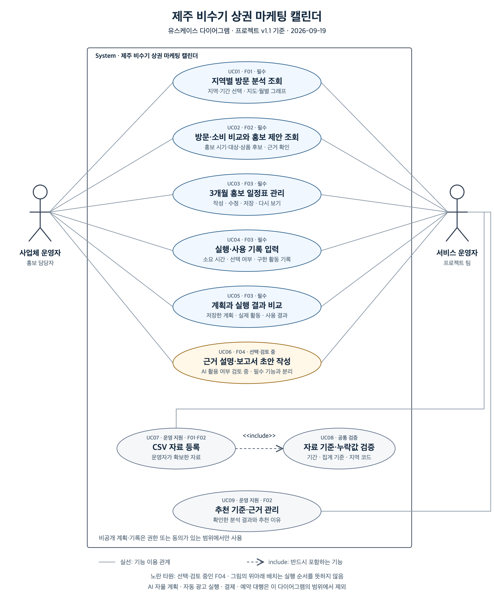

# Red 유스케이스 다이어그램

[프로젝트 기준 문서](Red_PROJECT.md) v1.1의 사용자·기능·범위를 그림으로 정리한 설계 초안임 구현 완료를 뜻하지 않으며, 기존 프로젝트 문서는 수정하지 않음

## 전체 다이어그램

[확대해 볼 수 있는 SVG 원본](assets/Red_USECASE.svg) · [PNG 이미지](assets/Red_USECASE.png)

Obsidian과 GitHub에서 같은 그림을 볼 수 있도록 기본 Markdown 이미지 문법을 사용함 SVG는 도형과 글자를 수정할 수 있는 원본이며, PNG는 같은 SVG에서 만든 표시용 이미지임

## 사용자와 범위

| 액터 | 역할 | 이용 범위 |
| --- | --- | --- |
| 사업체 운영자 | 카페 또는 체험 활동 업체 운영자·홍보 담당자 | UC01부터 UC06까지 이용하며, UC06은 도입할 경우에만 제공함 |
| 서비스 운영자 | 프로젝트 팀의 개발·자료 분석·검증 담당자 | UC01부터 UC06까지와 자료 등록·추천 근거 관리를 이용함 비공개 사업체 계획·기록은 권한 또는 동의가 있는 범위에서만 사용함 |

그림의 실선은 기능 이용 관계이며, 화면 이동이나 처리 순서를 뜻하지 않음 사업체 운영자는 실제 사업 활동을 수행하고 시스템에는 그 기록을 입력함 시스템이 광고 게시·결제·예약을 대신 실행한다는 뜻이 아님

## 기능 대응표

| 유스케이스 | 사용자가 수행하는 일 | 프로젝트 기능 | 구현 범위 |
| --- | --- | --- | --- |
| UC01 | 지역과 기간을 고르고 지역별 방문 분석·지도·월별 그래프를 조회함 | F01 | 필수 |
| UC02 | 지역 방문과 업종별 소비를 비교하고 홍보 시기·대상·상품 후보·주변 관광지 활용 제안을 근거와 함께 조회함 | F02 | 필수 |
| UC03 | 추천 내용을 실제 상품과 운영 조건에 맞게 골라 3개월 홍보 일정표를 작성·수정·저장·다시 보기함 | F03 | 필수 |
| UC04 | 계획 수립에 걸린 시간, 추천을 선택했는지, 실행 날짜와 구할 수 있는 클릭·예약·쿠폰 사용 기록을 입력함 | F03 | 필수 |
| UC05 | 저장한 계획과 실제 활동·사용 결과를 비교하고 짧게 정리한 내용을 조회함 | F03 | 필수 |
| UC06 | 검증한 분석 결과와 사용 기록으로 추천 이유 설명·보고서 초안을 작성함 | F04 | 선택·검토 중 |
| UC07 | 운영자가 확보한 CSV 자료를 시스템에 등록함 자동 수집이나 외부 API 연동을 뜻하지 않음 | F01·F02 운영 지원 | 필수 기능을 위한 자료 준비 |
| UC08 | 등록할 자료의 기간·집계 기준·지역 코드·누락값·제공 기준의 일관성을 검증함 비교할 수 없는 자료는 그 사실을 표시함 | F01·F02 운영 지원 | UC07에 반드시 포함 |
| UC09 | 확인한 분석 결과를 바탕으로 추천 기준과 이유를 관리함 | F02 운영 지원 | 필수 기능을 위한 근거 관리 |

각 조회·추천에는 자료의 출처·기준기간·집계 기준을 함께 제공함 지역 방문객 집계를 개별 가게의 손님 수로 표현하지 않으며, 구하지 못한 실행 기록을 0건으로 바꾸지 않음

## include 관계

`UC07 CSV 자료 등록 → <<include>> → UC08 자료 기준·누락값 검증`

자료를 등록할 때 검증을 반드시 포함한다는 뜻이며, 화살표는 포함되는 기능인 UC08을 향함 검증을 통과하지 못한 자료를 정상적인 비교 자료로 취급하지 않음

F01·F02·F03을 순서대로 include로 연결하지 않음 저장한 일정표를 다시 보거나 수정할 때 모든 분석을 매번 새로 실행해야 한다는 요구사항은 없기 때문임

## 선택 기능과 AI 에이전트

F04는 현재 프로젝트 문서에 있는 선택 기능으로 표시함 선택 구현이라는 이유만으로 `<<extend>>` 관계를 추가하지 않음 실행 중 어떤 조건에서 기존 기능을 확장하는지가 정해져야 해당 관계를 사용할 수 있음

대화에서 제안한 AI 에이전트의 가게 조건 질문·계획 초안 작성·수정은 아직 도입이 확정되지 않아 이번 기준 다이어그램에는 넣지 않음 F04를 AI 에이전트 기반 기능으로 확대하기로 결정하면 프로젝트 문서와 유스케이스 범위를 함께 갱신함

## 이번 그림에 추가하지 않은 내용

- 로그인·회원가입: 접근 권한 보호는 필요하지만 구체적인 인증 방식과 화면은 아직 정하지 않아 별도 기능으로 추가하지 않음
- 외부 데이터 플랫폼 액터: 현재 계획은 운영자가 CSV를 확보해 등록하는 방식이며, 외부 플랫폼과 자동으로 통신하는 구조는 확정되지 않음
- 외부 AI 서비스 액터: AI 사용 여부와 제공 업체·연결 방식이 정해지지 않아 추가하지 않음 시스템 내부 기능을 별도 사용자로 표시하지 않음
- 자동 광고 실행·결제·예약 대행, 실시간 혼잡도, 개인별 이동·결제 추적, 매출 증가 보장: 기존 프로젝트의 제외 범위를 유지함

## 검토 기준

- 실제 액터 두 역할과 F01부터 F04까지의 대응이 프로젝트 기준 문서와 일치하는지 확인함
- 일정표의 작성·수정·저장·다시 보기와 실행 기록·결과 비교가 빠지지 않았는지 확인함
- 필수 기능, 선택 기능, 운영 지원과 제외 범위를 구분함
- 실선 관계와 include 화살표의 방향, 한글 표시와 그림 잘림을 확인함
