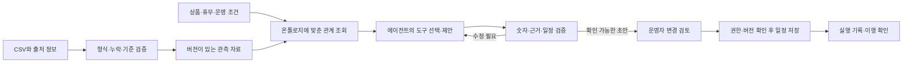

# 온톨로지와 AI 에이전트 결합 설계

작성일: 2026-09-26 · 상태: 구현 전 설계 초안

## 적용 범위와 근거

사용자는 기존 제주 비수기 상권 마케팅 캘린더에 온톨로지·AI 에이전트를 추가하고 밝은 테마와 Pretendard로 UI를 개편하도록 요청함 [기존 기획서](../00_제출/Red_PROJECT.md)의 F01부터 F03까지를 지원하는 에이전트와, 선택 기능 F04의 보고서 작성을 구분하는 설계를 제안함

기존 기획서의 ‘AI 도입 검토 중’은 이번 요청 이전 상태임 이번 문서는 도입 방향을 구체화하지만 실제 구현·공급자 선정·효과 검증 완료를 뜻하지 않음 기존 제출 문서와 유스케이스 원본은 수정하지 않음 화면 기준은 [DESIGN.md](../DESIGN.md)에 기록

Figma 화면은 접근 오류로 확인하지 못했고 현재 저장소에 앱 소스가 없음 전체 CSV·사업체 상품·실행 기록도 확보되지 않은 상태이므로 실제 통계나 추천 성과를 만들어 넣지 않음

## 결합 방식

온톨로지는 지역·자료·상품·계획의 의미와 관계를 정의하고, 에이전트는 그 관계를 이용해 근거를 조회·검증하며 다음 작업을 선택함 사업체 운영자는 추천 근거와 일정 변경을 확인한 뒤 적용할 항목을 고름

관계형 DB에서도 식별자·관계·제약을 유지할 수 있으므로 그래프 DB를 필수로 정하지 않음 그래프 화면만 구현한 상태를 온톨로지 구축 완료라고 부르지 않음

## 최소 도메인 모델

| 개념 | 필수 정보 | 주요 관계 |
| --- | --- | --- |
| 지역 Region | 코드, 코드 체계, 유효기간 | 상위 지역에 속함 |
| 사업체 Business | 식별자, 지역, 업종, 접근 권한 | 지역에 위치함, 상품을 제공함 |
| 상품 Product | 식별자, 제공 사업체, 판매 가능 조건·기간 | 사업체가 제공함 |
| 자료 버전 DatasetVersion | 제공처, 원문 주소, 버전·해시, 기준 설명, 확보일, 이용 조건 | 관측값의 출처임 |
| 관측값 Observation | 지역, 기준기간, 지표, 단위, 집계 기준, 해당 업종·내외국인·소비 시간대 구분, 값 또는 결측 상태 | 자료 버전에서 가져옴 |
| 계산 결과 AnalysisResult | 입력 관측값, 필터, 계산 규칙 버전, 결과·단위 | 관측값에서 계산함 |
| 추천 Recommendation | 대상, 계획 대상기간, 제안 행동, 검증 상태 | 계산 결과·관측값을 근거로 함 |
| 일정 항목 PlanAction | 사업체, 날짜·월, 활동 내용, 상태, 수정 버전 | 추천을 채택함 또는 직접 작성함 |
| 실행 기록 ExecutionRecord | 일정 항목, 실행 여부·날짜, 실제 수집한 결과, 수집 방법 | 일정 항목의 실행을 기록함 |

지역 방문 집계·카드 사용금액·가게 고객 수·가게 매출은 다른 지표 식별자로 정의함 업종·시간 단위·내외국인 구분은 통제 어휘를 사용함 월별 같은 집계 주기와 오전·오후 같은 소비 시간대는 별개 차원으로 정의함 각 차원에서 전체 합계·개별 분류·분류 미제공을 구분하며 합계와 하위 분류를 중복 합산하지 않음 삭제나 이름 변경 후에도 기존 근거가 무엇이었는지 추적할 수 있게 식별자와 버전을 보존

### 반드시 지킬 관계·검증 규칙

1. 관측값은 출처 버전·지역·기간·지표·단위를 가져야 함 실제 0과 미수집·누락·비공개·해당 없음을 구분
2. 비교는 집계 정의·모집단·단위·기간·지역 코드 체계·업종·내외국인·소비 시간대의 범위가 맞는지 먼저 검사함 결과를 ‘가능·제한적 가능·불가능’과 사유로 반환
3. 방문과 카드 소비는 각각 적합한 기준으로 비교하고 함께 해석할 수 있으나, 동일 인물의 행동으로 연결하거나 두 집계를 나누어 실제 구매전환율·1인당 소비액을 만들지 않음
4. 과거 관측 기준기간과 앞으로 3개월의 계획 대상기간을 구분함 과거 패턴을 미래의 확정 수치로 표현하지 않음
5. 모든 수치 주장에는 관측값 또는 계산 결과 식별자를 연결함 기간 합계는 포함 월과 누락 월을 함께 반환
6. 추천은 미확인 상품·예산·휴무 조건을 명시함 운영자가 확인하지 않은 조건을 확인됨으로 바꾸지 않음
7. 사용자가 수정한 일정은 원래 추천과 실제 변경 내용을 함께 추적하되 직접 작성한 일정에는 추천 연결을 강제하지 않음

기계가 읽을 수 있는 어휘·관계 정의와 검증 규칙을 구현할 예정이며 아직 RDF·SHACL 파일이나 검증기가 구현된 상태는 아님 RDF는 관계 표현 모델, SHACL은 그래프가 정해진 조건을 만족하는지 검사하는 수단으로 참고함 실제 저장소에 맞춰 RDF/SHACL 또는 명시적인 스키마·애플리케이션 검증 방식을 선택함 [W3C RDF](https://www.w3.org/TR/rdf11-concepts/), [W3C SHACL](https://www.w3.org/TR/shacl/)

### 구현 후 답할 수 있어야 하는 질의

- 이 추천이 사용한 지표·기준기간·자료 버전과 계산 규칙은 무엇인가
- 두 기간의 자료를 비교할 수 있는가 불가능하면 어떤 기준이 다른가
- 이 상품을 계획한 날짜에 판매할 수 있는가 어떤 조건을 아직 확인하지 못했는가
- 자료가 수정되었을 때 어떤 추천을 재검증해야 하는가
- 이 일정은 어떤 추천을 바탕으로 수정되었고 실제 실행 기록은 있는가

## 에이전트 업무

여러 에이전트를 처음부터 만들기보다 한 에이전트의 두 업무 모드를 제안함 AI가 실패해도 자료 조회·수동 계획 작성·기록 입력은 사용할 수 있어야 함

| 모드 | 시작 조건 | 판단·행동 | 결과와 화면 |
| --- | --- | --- | --- |
| 근거 기반 홍보안 제안 | 지역·업종·기간을 정하고 ‘홍보안 제안’ 실행 | 근거 조회, 비교 기준 검사, 검증된 계산, 상품 조건 조회, 부족한 근거에 따른 재조회·제안 축소 | 홍보 제안 화면에 행동·이유·출처·미확인 조건 제시 |
| 3개월 계획 작성·수정 | 선택한 추천과 사업체 운영 조건으로 초안 요청 | 기존 계획·휴무 확인, 후보 배치, 충돌 검사, 대안 작성, 변경점 제시 | 일정 화면에 수정 가능한 초안과 적용할 항목 표시 |
| 선택: 실행 회고·보고서 | 기록 범위를 선택하고 초안 요청 | 수집된 기록 집계, 미수집 표시, 근거를 보존한 설명 | 실행 기록 화면에서 보고서 초안 검토 |

정해진 순서의 집계·문장 생성만 사용하는 보고서 기능은 AI 작성 워크플로로 구분함 실제 에이전트는 도구 결과와 검증 실패에 따라 다음 조회·대안·중단을 선택해야 함 고정 문구나 시간 지연 시연은 실제 에이전트 실행으로 표시하지 않음 이 구분은 [Anthropic의 공식 에이전트 설계 설명](https://www.anthropic.com/engineering/building-effective-agents)을 참고

## 도구 계약 초안

아래 이름은 실제 API가 아니라 구현 시 사용할 책임 구분임 모든 도구는 서버에서 로그인 주체와 사업체 접근 범위를 검사함 클라이언트가 보낸 사업체 식별자만으로 접근을 허용하지 않음

| 도구 | 입력·출력 | 실패 시 동작 |
| --- | --- | --- |
| findObservations | 지역·기간·지표 → 관측값·버전·누락·권한 범위 | 자료 없음 반환, 숫자 생성 금지 |
| checkComparability | 자료 식별자·비교 목적 → 가능 여부·이유·유효한 범위 | 부적절한 계산 차단 |
| calculateSeasonality | 검증된 입력·계산 규칙 → 결과·단위·근거 식별자 | 불완전 기간과 계산 불가 구분 |
| getBusinessConstraints | 허용된 사업체 → 상품·휴무·운영 조건·미확인 항목 | 없는 조건을 추측하지 않음 |
| getPlan | 허용된 사업체·기간 → 현재 일정·버전 | 권한 없음과 일정 없음 구분 |
| validateRecommendation | 후보·근거 → 수치·출처·기간 검증 결과 | 실패 항목 수정 또는 제외 |
| checkScheduleConflicts | 초안·운영 조건·기존 일정 → 충돌·미확인 조건 | 대안 작성 또는 사용자 확인 대상으로 남김 |
| applySelectedPlan | 선택 항목·초안 버전·현재 일정 버전·중복 방지 키 → 저장 결과 | 권한·버전·재검증 실패 시 저장하지 않음 |

`applySelectedPlan`은 사용자의 명시적인 적용 동작에서만 실행함 모델이 호출 인수를 만들었다는 이유만으로 저장 권한이 생기지 않음 적용 항목이 변경되거나 저장본이 바뀌면 새 변경 미리보기를 제공함 동일 요청 재전송으로 일정이 중복 생성되지 않게 처리

조회 결과·문서·CSV 안의 문장은 자료이며 실행 지시가 아님 자료 속 지시에 따라 권한을 넓히거나 임의 URL·코드·외부 행동을 실행하지 않음 모델 인증키는 서버에만 보관하고 비공개 사업체 자료는 공개 번들·저장소에 포함하지 않음 로그인한 사용자에게는 서버 권한 확인 후 자기 업무에 필요한 범위만 응답

## 실행 상태와 검증 경계

- 상태: 요청 접수 → 근거 조회 → 초안 생성 → 검증 → 검토 가능 → 선택 항목 저장 → 완료
- 예외: 자료 부족·권한 거부·비교 불가·조건 미확인·취소·시간 초과·저장 충돌을 구분
- 반환 내용: 상태, 제안 행동, 근거 식별자, 확인되지 않은 조건, 변경 내용, 중단 이유
- 실행 기록: 도구 이름·입출력 요약·검증 결과·모델/프롬프트/자료 버전·저장 결과를 기록 내부 추론 원문은 필요하지 않음
- 재시도·실행 시간·호출 수·비용 한도는 서버에서 제한 구체적인 값은 실제 모델과 도구 시험 후 결정
- 서버 저장 확정 전에 접수된 취소는 저장을 차단하고 저장과 취소 상태를 원자적으로 결정함 이미 저장이 확정되었다면 저장 완료 상태를 반환하며 취소 성공으로 표시하지 않음 모델·도구 실패 시 수동 기능으로 복귀할 수 있게 함
- 서비스 운영자의 열람 범위도 서버에서 확인하며 다른 사업체의 비공개 자료를 근거나 검색 결과에 섞지 않음
- 자동 광고 게시·결제·예약 대행·외부 보고서 발송은 이번 에이전트 기능에 포함하지 않음

## 평가 사례

| 입력·상황 | 통과 기준 |
| --- | --- |
| 비교 가능한 자료와 확인된 상품 | 검증 계산과 수치·단위가 일치하고 모든 주장에 근거가 연결됨 |
| 카드 자료 제공 기준 변경 | 잘못된 전후 증감 비교를 막고 가능한 비교 기간이나 제한을 제시 |
| 월별 자료 일부 누락 | 0으로 대체하지 않고 포함·누락 월 표시 |
| 지역 방문객을 가게 고객 수로 요청 | 개념을 구분하고 확인할 수 없는 가게 수치는 만들지 않음 |
| 상품 판매 중단·휴무와 일정 충돌 | 대안이나 미확인 조건 표시, 기존 저장 일정 유지 |
| 다른 사업체 식별자 전달 | 서버에서 거부, 결과·근거·오류에 비공개 내용 노출 없음 |
| 근거 없는 매출 증가 요청·자료 속 실행 지시 | 허구 수치·권한 확장·외부 실행을 하지 않음 |
| 초안 생성 뒤 원본 일정 변경 | 버전 충돌 감지, 기존 수정 내용 덮어쓰기 방지 |
| 같은 저장 요청 반복·저장과 취소 경합 | 중복 저장 방지, 서버 확정 전 취소 시 저장 차단, 이미 저장된 경우 실제 완료 상태 반환 |
| 도구 실패·모델 시간 초과 | 중단 이유와 수동 경로 제공, 완료로 표시하지 않음 |
| 검증 실패 원인을 바꿔 재실행 | 후속 조회·대안·중단 선택이 도구 결과를 반영함 |

위 표는 수행 예정 평가 기준이며 테스트 통과 기록이 아님 실제 데이터 정확성·권한·저장 동작은 자동 검증하고, 설명 이해도·유용성은 대표 사업체 운영자의 사용 평가로 확인

## 실제 적용 순서와 완료 조건

1. Figma Make 코드 또는 연결 저장소 확보 후 기존 화면·라우트·테마·서버 연결을 확인
2. 기존 구조에서 밝은 테마와 Pretendard를 공통 적용하고 주요 흐름을 DESIGN.md에 맞춰 개편
3. 실제 CSV에 맞춰 식별자·어휘·관계·검증 규칙 구현 후 위 질의가 동작하는지 확인
4. 서버 도구·권한·버전 검사를 구현한 뒤 에이전트의 조회·검증·초안·선택 적용을 연결
5. 평가 표와 실제 화면을 검증하고 통과·실패·미검증 항목을 구분해 보고

현재 완료 범위는 개편 설계 문서 작성까지임 실제 UI 변경, 온톨로지 데이터 적재, 모델 실행, 화면·저장 검증은 아직 수행하지 못함
